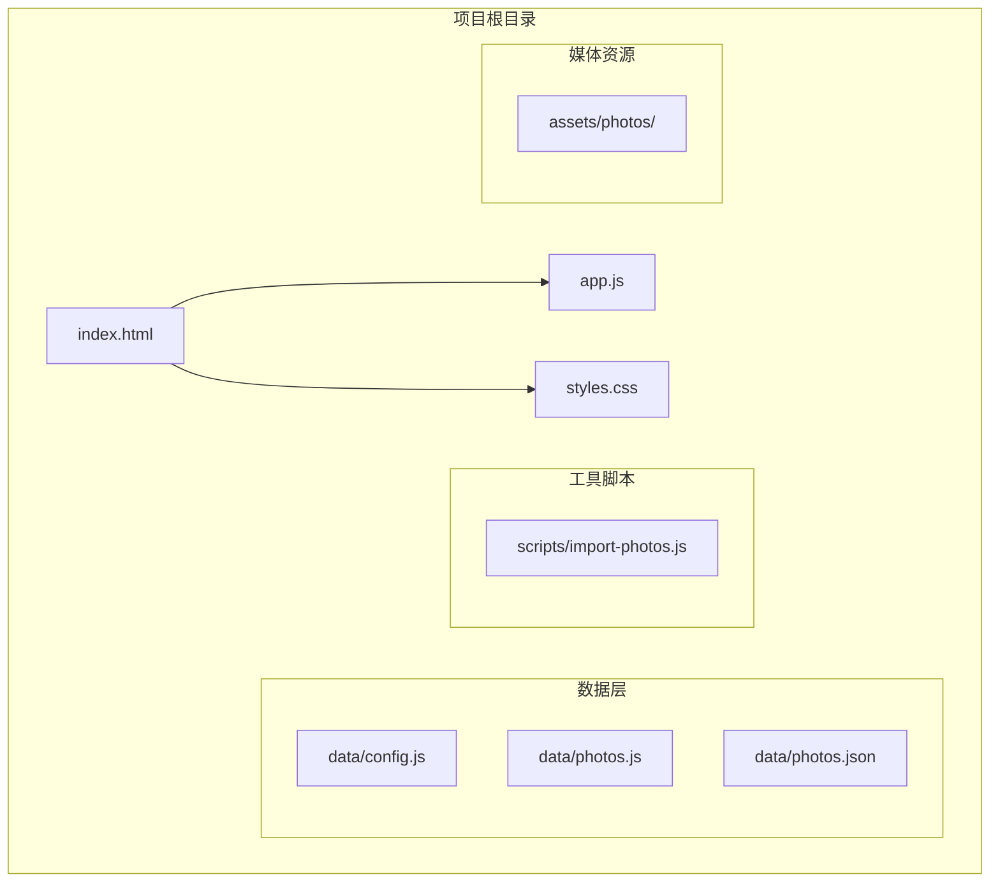
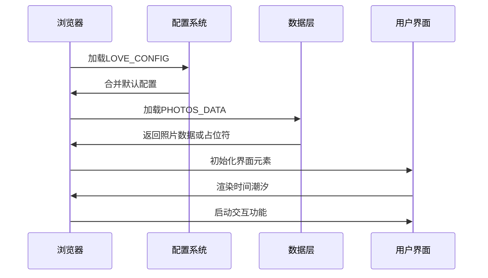
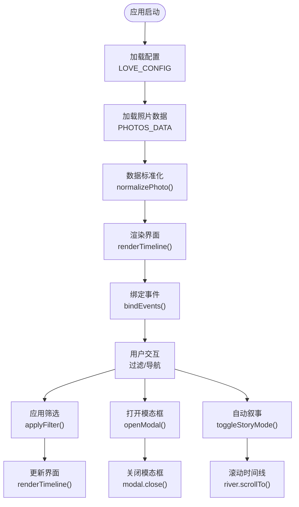
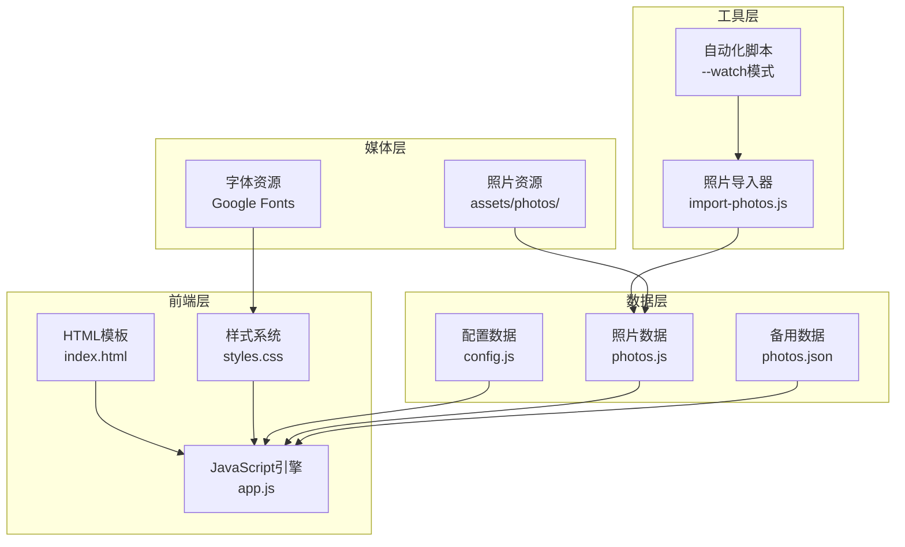
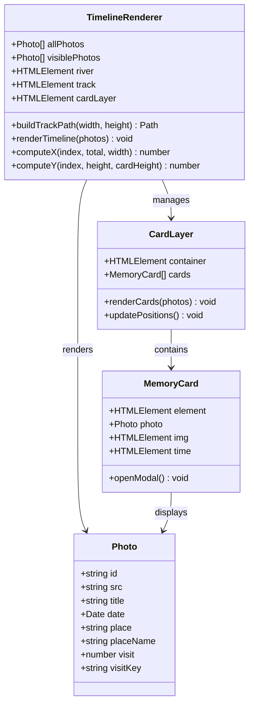
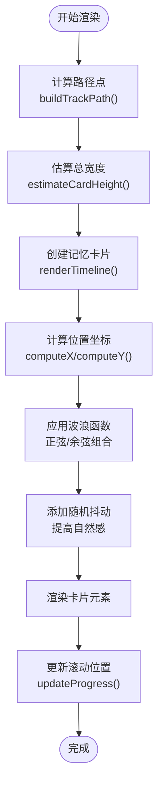
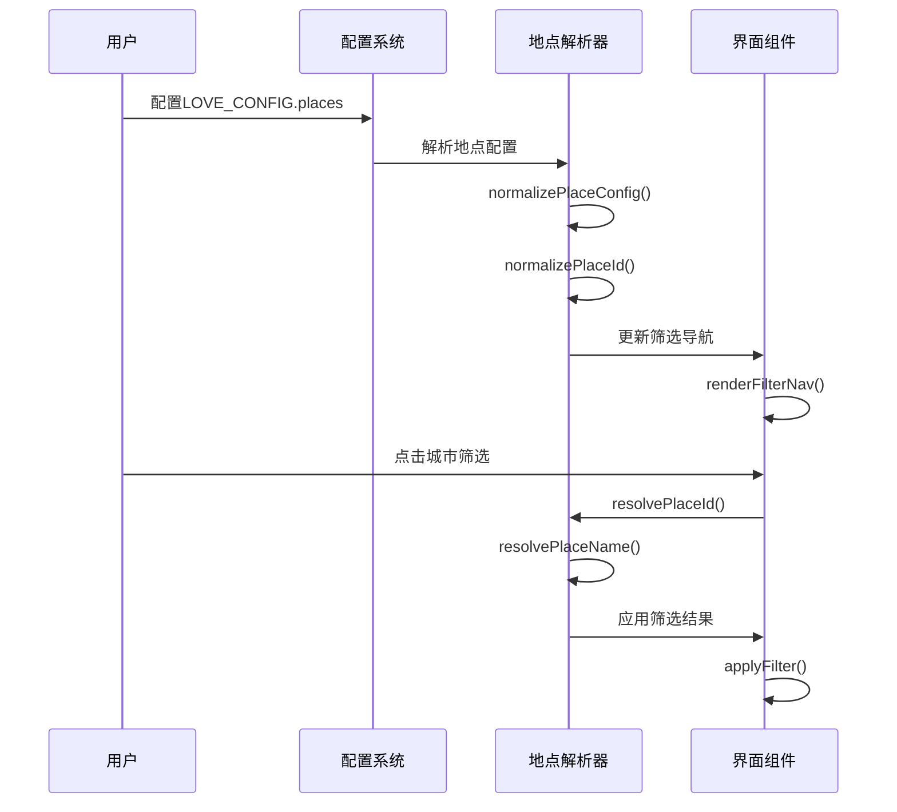
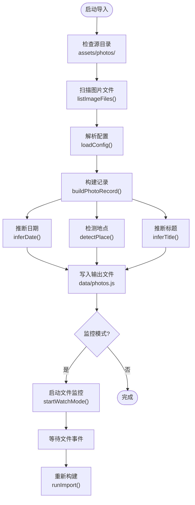
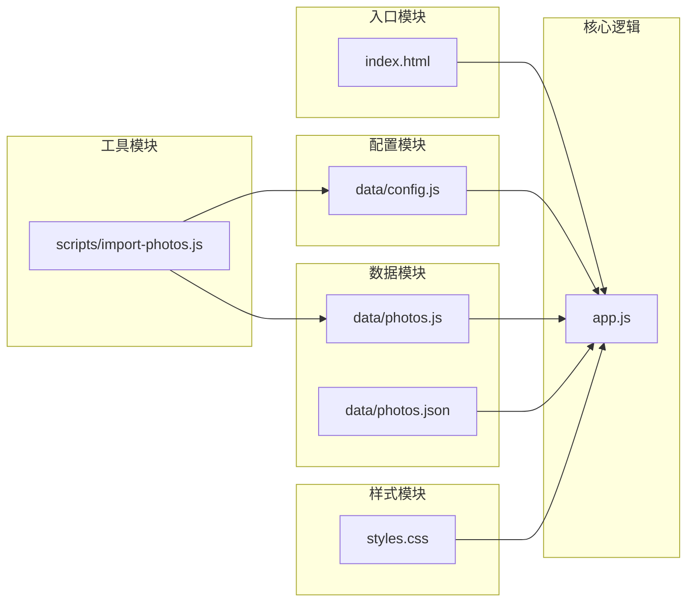
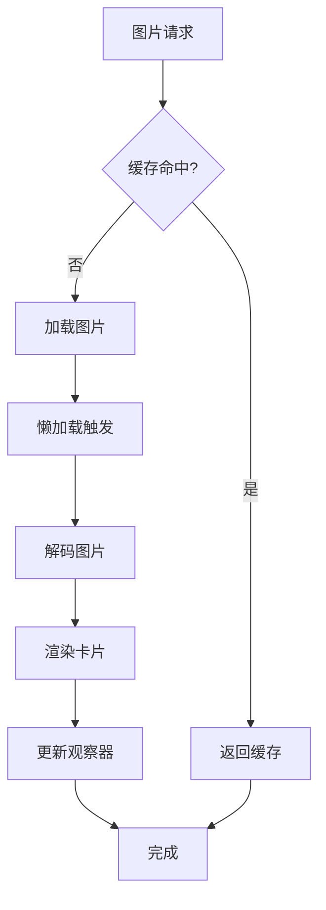

# 开发指南

<cite>
**本文档引用的文件**
- [README.md](file://README.md)
- [index.html](file://index.html)
- [app.js](file://app.js)
- [styles.css](file://styles.css)
- [data/config.js](file://data/config.js)
- [data/photos.js](file://data/photos.js)
- [data/photos.json](file://data/photos.json)
- [scripts/import-photos.js](file://scripts/import-photos.js)
</cite>

## 目录
1. [简介](#简介)
2. [项目结构](#项目结构)
3. [核心组件](#核心组件)
4. [架构概览](#架构概览)
5. [详细组件分析](#详细组件分析)
6. [依赖关系分析](#依赖关系分析)
7. [性能考虑](#性能考虑)
8. [故障排除指南](#故障排除指南)
9. [结论](#结论)
10. [附录](#附录)

## 简介

恋爱纪念站（Liquid Glass）是一个专为情侣设计的互动式纪念相册应用。该项目采用苹果风格的液态玻璃界面设计，通过"时间潮汐"的概念将500张珍贵照片以动态方式呈现，创造沉浸式的回忆体验。

### 核心特性
- **苹果风格液态玻璃界面**：使用现代CSS滤镜和渐变效果
- **时间潮汐叙事**：横向游走的记忆河道，而非传统相册陈列
- **智能照片管理**：自动导入、分类和标注功能
- **城市足迹追踪**：可视化展示旅行足迹和情感历程
- **随机时空对照**：自动抽取相隔最远的照片进行对比展示

## 项目结构

项目采用简洁的单页应用架构，主要文件组织如下：

**图表来源**
- [index.html:1-140](file://index.html#L1-L140)
- [app.js:1-690](file://app.js#L1-L690)
- [styles.css:1-899](file://styles.css#L1-L899)

### 文件组织策略

项目采用了清晰的分层架构：
- **静态资源层**：HTML模板和样式文件
- **数据配置层**：可定制的配置和照片数据
- **业务逻辑层**：核心JavaScript功能实现
- **自动化工具层**：照片导入和处理脚本

**章节来源**
- [README.md:1-87](file://README.md#L1-L87)
- [index.html:1-140](file://index.html#L1-L140)

## 核心组件

### 应用初始化系统

应用的核心初始化流程包括配置加载、数据准备和界面渲染三个主要阶段：

**图表来源**
- [app.js:71-89](file://app.js#L71-L89)
- [data/config.js:1-27](file://data/config.js#L1-L27)
- [data/photos.js:1-315](file://data/photos.js#L1-L315)

### 数据流架构

应用采用双向数据绑定和事件驱动的设计模式：

**图表来源**
- [app.js:91-105](file://app.js#L91-L105)
- [app.js:331-335](file://app.js#L331-L335)
- [app.js:455-460](file://app.js#L455-L460)

**章节来源**
- [app.js:14-89](file://app.js#L14-L89)
- [index.html:135-137](file://index.html#L135-L137)

## 架构概览

### 整体架构设计

项目采用响应式单页应用架构，结合了现代Web技术的最佳实践：

**图表来源**
- [index.html:1-140](file://index.html#L1-L140)
- [app.js:1-690](file://app.js#L1-L690)
- [scripts/import-photos.js:1-552](file://scripts/import-photos.js#L1-L552)

### 技术栈选择

项目的技术选型体现了对性能、可维护性和用户体验的综合考量：

| 层级 | 技术选择 | 设计考量 |
|------|----------|----------|
| **视图层** | HTML5 + CSS3 | 语义化标记，现代布局，动画支持 |
| **样式层** | CSS Grid + Flexbox | 响应式设计，原子化样式 |
| **逻辑层** | ES6+ JavaScript | 模块化，异步处理，现代语法 |
| **数据层** | JSON配置 + 动态加载 | 轻量级，易维护，可扩展 |
| **工具层** | Node.js脚本 | 自动化，批处理，文件系统操作 |

## 详细组件分析

### 时间潮汐渲染系统

时间潮汐是应用的核心视觉组件，实现了独特的"横向叙事"体验：

**图表来源**
- [app.js:337-376](file://app.js#L337-L376)
- [app.js:514-538](file://app.js#L514-L538)

#### 核心算法实现

时间潮汐的数学基础基于正弦波函数，创造出自然的起伏效果：

**图表来源**
- [app.js:378-418](file://app.js#L378-L418)
- [app.js:420-423](file://app.js#L420-L423)

**章节来源**
- [app.js:337-423](file://app.js#L337-L423)

### 城市足迹管理系统

应用提供了强大的城市足迹追踪功能，支持多种配置方式：

**图表来源**
- [app.js:619-660](file://app.js#L619-L660)
- [app.js:156-176](file://app.js#L156-L176)

#### 地点解析机制

地点解析系统支持多种输入格式和自动推断：

| 输入类型 | 解析规则 | 示例 |
|----------|----------|------|
| 配置文件 | 直接映射 | `{id: "beijing", name: "北京"}` |
| 文件夹名称 | 从路径解析 | `assets/photos/beijing1/` |
| 文件名信息 | 正则匹配 | `2026-01-23-beijing.jpg` |
| 手动标注 | 字段映射 | `place: "shanghai"` |

**章节来源**
- [app.js:604-660](file://app.js#L604-L660)
- [app.js:206-231](file://app.js#L206-L231)

### 照片导入自动化系统

照片导入系统提供了完整的自动化解决方案：

**图表来源**
- [scripts/import-photos.js:19-85](file://scripts/import-photos.js#L19-L85)
- [scripts/import-photos.js:87-135](file://scripts/import-photos.js#L87-L135)

#### 自动化规则

导入系统遵循严格的自动化规则：

1. **日期推断优先级**：文件名 > 修改时间
2. **地点识别优先级**：文件夹 > 配置映射 > 智能推断
3. **标题生成策略**：文件名清洗 > 地点记忆模板
4. **访问次数统计**：基于文件夹后缀数字

**章节来源**
- [scripts/import-photos.js:264-286](file://scripts/import-photos.js#L264-L286)
- [scripts/import-photos.js:458-489](file://scripts/import-photos.js#L458-L489)

## 依赖关系分析

### 模块依赖图

应用的模块间依赖关系相对简单，体现了良好的内聚性：

**图表来源**
- [index.html:135-137](file://index.html#L135-L137)
- [app.js:14-14](file://app.js#L14-L14)

### 外部依赖

项目保持最小化的外部依赖：

| 依赖类型 | 使用场景 | 版本要求 |
|----------|----------|----------|
| **浏览器API** | DOM操作、事件处理、本地存储 | 原生支持 |
| **网络资源** | Google Fonts字体服务 | CDN托管 |
| **Node.js模块** | 导入脚本开发 | 任意版本 |
| **第三方库** | 无 | 保持零依赖 |

**章节来源**
- [index.html:11-16](file://index.html#L11-L16)
- [scripts/import-photos.js:4-6](file://scripts/import-photos.js#L4-L6)

## 性能考虑

### 渲染性能优化

应用采用了多项性能优化策略：

#### 懒加载机制
- **图片懒加载**：IntersectionObserver实现延迟加载
- **虚拟滚动**：仅渲染可见区域内的卡片
- **CSS动画优化**：使用transform属性替代重排

#### 内存管理
- **事件委托**：减少事件监听器数量
- **定时器清理**：及时清理自动叙事定时器
- **DOM复用**：重用DOM元素而非频繁创建

### 网络性能优化

**图表来源**
- [app.js:41-51](file://app.js#L41-L51)
- [app.js:357-362](file://app.js#L357-L362)

### 移动端适配

应用针对移动设备进行了专门优化：

| 设备类型 | 适配策略 | 性能影响 |
|----------|----------|----------|
| **桌面端** | 完整动画，高分辨率图片 | 正常性能 |
| **平板端** | 中等动画，中等分辨率 | 轻微降级 |
| **手机端** | 简化动画，低分辨率图片 | 最小化降级 |

## 故障排除指南

### 常见问题诊断

#### 照片不显示问题

**症状**：页面空白或显示占位符
**排查步骤**：
1. 检查 `data/photos.js` 是否正确生成
2. 验证图片路径是否正确
3. 确认跨域访问权限设置

**解决方案**：
- 运行 `node scripts/import-photos.js --watch`
- 检查文件权限和路径大小写
- 确认图片格式受支持

#### 城市筛选失效

**症状**：城市筛选按钮无响应
**排查步骤**：
1. 检查 `LOVE_CONFIG.places` 配置
2. 验证地点ID格式一致性
3. 确认CSS类名匹配

**解决方案**：
- 确保地点ID使用连字符格式
- 检查配置文件语法错误
- 刷新页面重新加载配置

#### 自动导入功能异常

**症状**：照片导入脚本报错
**排查步骤**：
1. 检查Node.js版本兼容性
2. 验证文件系统权限
3. 确认依赖模块安装

**解决方案**：
- 更新Node.js到最新稳定版本
- 重新安装项目依赖
- 检查防火墙和安全软件设置

### 调试技巧

#### 开发者工具使用

1. **性能分析**：使用Chrome DevTools的Performance面板
2. **内存监控**：通过Memory面板检测内存泄漏
3. **网络分析**：监控图片加载和缓存行为
4. **移动端调试**：使用Device Emulation模式

#### 日志输出

应用提供了丰富的日志输出：
- 导入脚本：`[import-photos]` 前缀的日志
- 运行时错误：控制台错误信息
- 性能警告：浏览器开发者工具中的性能提示

**章节来源**
- [scripts/import-photos.js:87-135](file://scripts/import-photos.js#L87-L135)
- [app.js:462-490](file://app.js#L462-L490)

## 结论

恋爱纪念站项目展现了现代Web开发的最佳实践，通过精心设计的架构和优化的用户体验，成功地将技术与情感表达相结合。项目的主要优势包括：

### 技术优势
- **架构清晰**：层次分明，职责明确
- **性能优秀**：多项优化策略确保流畅体验
- **易于维护**：简洁的代码结构和文档

### 创新特色
- **独特的视觉设计**：液态玻璃风格的界面
- **智能数据处理**：自动化的照片导入和管理
- **情感化交互**：符合用户心理预期的操作流程

### 改进建议
- 可考虑添加离线缓存支持
- 增加更多个性化定制选项
- 优化大图加载的用户体验

该项目为类似的情感纪念应用提供了优秀的参考模板，其设计理念和技术实现值得在相关项目中借鉴和学习。

## 附录

### 开发环境搭建

#### 系统要求
- **操作系统**：Windows 10+ / macOS 10.15+ / Linux
- **浏览器**：Chrome 80+ / Firefox 74+ / Safari 13+
- **Node.js**：14+（仅用于照片导入）

#### 安装步骤
1. 克隆项目到本地
2. 将照片放入 `assets/photos/` 目录
3. 运行照片导入脚本
4. 在浏览器中打开 `index.html`

#### 开发工具推荐
- **代码编辑器**：VS Code + 相关插件
- **浏览器**：Chrome DevTools + 移动端模拟器
- **Node.js**：npm/yarn 包管理器

### 贡献指南

#### 代码规范
- 使用ES6+语法和现代JavaScript特性
- 遵循一致的缩进和命名约定
- 添加必要的注释和文档字符串
- 编写单元测试覆盖关键功能

#### 提交流程
1. Fork项目到个人仓库
2. 创建功能分支
3. 提交代码变更
4. 发起Pull Request
5. 等待代码审查和合并

#### 测试策略
- **单元测试**：核心函数的独立测试
- **集成测试**：模块间的协同测试
- **用户验收测试**：真实场景的功能验证
- **性能测试**：关键路径的性能基准

### 部署策略

#### 静态部署
- 适合GitHub Pages、Netlify等平台
- 无需服务器端处理
- 最简单的部署方式

#### 本地部署
- 直接通过文件系统访问
- 适合个人使用和小范围分享
- 无网络依赖

#### 自定义域名
- 支持HTTPS证书配置
- 可配置CDN加速
- 便于品牌化展示

### 版本管理

#### 发布流程
1. **版本标记**：语义化版本号
2. **变更日志**：记录重大改动
3. **测试验证**：确保向后兼容性
4. **文档更新**：同步API和配置说明
5. **发布部署**：推送至生产环境

#### 维护策略
- **安全更新**：定期更新依赖包
- **性能监控**：持续关注用户体验指标
- **用户反馈**：收集和响应用户需求
- **技术债务**：定期重构和优化