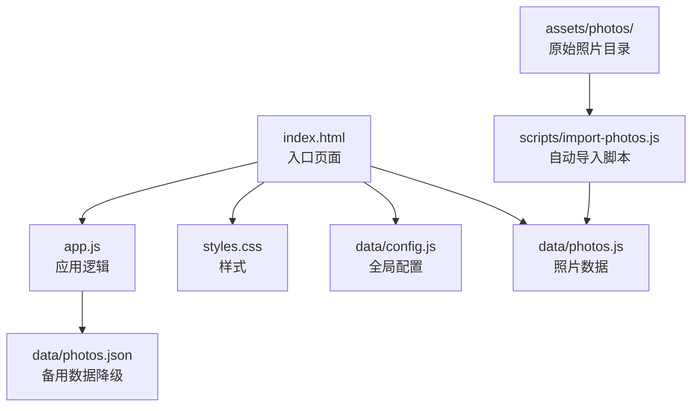
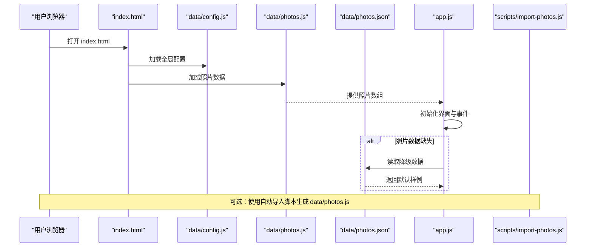
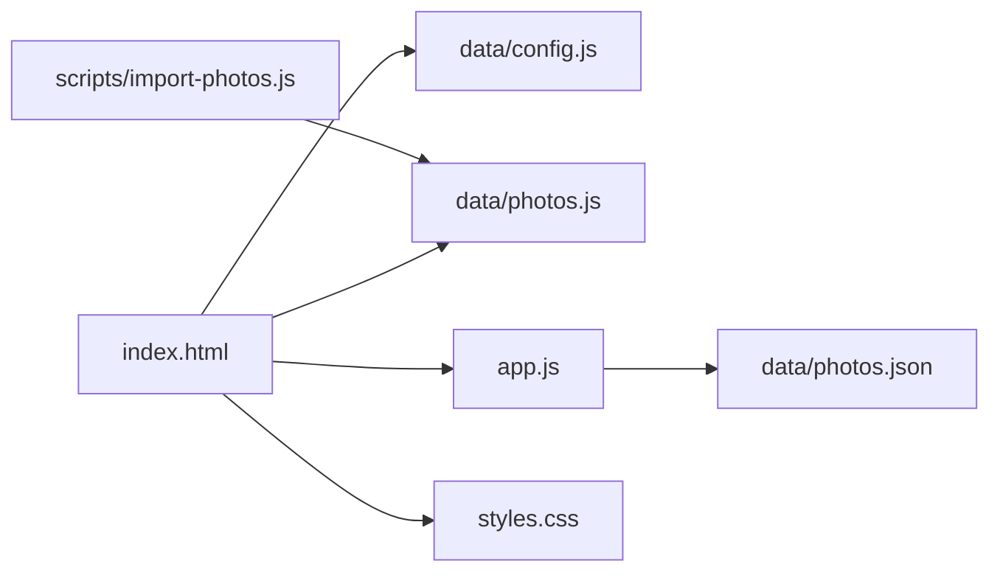

# 快速开始

<cite>
**本文引用的文件**
- [README.md](file://README.md)
- [index.html](file://index.html)
- [app.js](file://app.js)
- [data/config.js](file://data/config.js)
- [data/photos.js](file://data/photos.js)
- [data/photos.json](file://data/photos.json)
- [scripts/import-photos.js](file://scripts/import-photos.js)
- [styles.css](file://styles.css)
</cite>

## 目录
1. [简介](#简介)
2. [项目结构](#项目结构)
3. [核心组件](#核心组件)
4. [架构总览](#架构总览)
5. [详细组件解析](#详细组件解析)
6. [依赖关系分析](#依赖关系分析)
7. [性能注意事项](#性能注意事项)
8. [故障排除指南](#故障排除指南)
9. [结论](#结论)
10. [附录](#附录)

## 简介
本指南面向首次使用“恋爱纪念站”的用户，帮助你在最短时间内完成环境准备、安装与配置，并通过浏览器直接预览。你将学会：
- 浏览器兼容性要求与本地预览方式
- 完整安装步骤：下载项目、准备照片、配置基本信息
- 基本配置方法：startDate 设置、地点列表配置
- 照片导入的两种方式：手动填写与自动导入脚本
- 常见初始配置示例与最佳实践
- 新手常见问题排查与验证安装成功的方法

## 项目结构
项目采用前端静态站点架构，核心文件组织如下：
- 根目录包含入口页面、样式与应用逻辑
- data 目录存放配置与照片数据
- scripts 目录提供照片自动导入工具
- assets/photos 目录用于存放原始照片

图表来源
- [index.html](file://index.html)
- [app.js](file://app.js)
- [data/config.js](file://data/config.js)
- [data/photos.js](file://data/photos.js)
- [data/photos.json](file://data/photos.json)
- [scripts/import-photos.js](file://scripts/import-photos.js)

章节来源
- [index.html](file://index.html)
- [README.md](file://README.md)

## 核心组件
- 入口页面与资源加载
  - index.html 负责引入样式与脚本，加载配置与照片数据，并渲染界面骨架。
- 应用逻辑
  - app.js 负责读取配置、加载照片数据、构建时间线、交互事件绑定与动画效果。
- 数据层
  - data/config.js 提供全局配置（如开始日期、地点列表等）
  - data/photos.js 由自动导入脚本生成，包含每张照片的元信息
  - data/photos.json 作为降级回退数据源
- 自动导入工具
  - scripts/import-photos.js 支持扫描 assets/photos 下的照片，自动生成 data/photos.js 并统计地点访问次数

章节来源
- [index.html](file://index.html)
- [app.js](file://app.js)
- [data/config.js](file://data/config.js)
- [data/photos.js](file://data/photos.js)
- [data/photos.json](file://data/photos.json)
- [scripts/import-photos.js](file://scripts/import-photos.js)

## 架构总览
整体工作流如下：
- 浏览器加载 index.html
- 加载 data/config.js 与 data/photos.js
- app.js 初始化并渲染界面
- 若 data/photos.js 缺失或为空，则尝试加载 data/photos.json 作为降级数据
- 用户可通过自动导入脚本将 assets/photos 中的照片批量生成数据文件

图表来源
- [index.html](file://index.html)
- [app.js](file://app.js)
- [data/config.js](file://data/config.js)
- [data/photos.js](file://data/photos.js)
- [data/photos.json](file://data/photos.json)
- [scripts/import-photos.js](file://scripts/import-photos.js)

## 详细组件解析

### 浏览器兼容性与本地预览
- 本地预览
  - 直接用浏览器打开根目录下的 index.html 即可预览
  - 页面会默认从 data/config.js 与 data/photos.js 读取配置与照片数据
  - 若无可用照片数据，页面会自动生成占位图演示
- 浏览器要求
  - 使用现代浏览器即可，无需额外编译或打包
  - 项目使用 ES6+ 语法与现代 Web API（如 IntersectionObserver、fetch、Promise 等）

章节来源
- [README.md](file://README.md)
- [index.html](file://index.html)

### 安装与准备工作
- 步骤概览
  1) 准备照片目录
     - 在项目根目录创建 assets/photos/ 目录（若不存在）
     - 将你的照片放入该目录，建议按“地点-次数”命名子目录，如 hangzhou1、hangzhou2
  2) 配置基本信息
     - 在 data/config.js 中设置 startDate、地点列表等
  3) 导入照片
     - 方式一：手动填写 data/photos.js（不推荐）
     - 方式二：使用自动导入脚本（推荐）
- 自动导入脚本
  - 命令：node scripts/import-photos.js
  - 实时监听模式：node scripts/import-photos.js --watch
  - 生成结果：data/photos.js 与 PHOTOS_META（地点访问统计）

章节来源
- [README.md](file://README.md)
- [scripts/import-photos.js](file://scripts/import-photos.js)

### 基本配置方法
- 开始日期（在一起天数）
  - 在 data/config.js 的 startDate 字段设置起始日期
  - 页面会自动计算到今天的天数
- 地点列表（城市筛选）
  - 在 data/config.js 的 places 数组中添加地点项
  - 以后新增地点只需追加一项，无需改动 index.html 或 app.js
- 示例配置结构
  - 参考 README 中的示例对象，包含 startDate、targetCount、navAllLabel、places 等字段

章节来源
- [README.md](file://README.md)
- [data/config.js](file://data/config.js)

### 照片导入的两种方式
- 手动填写
  - 在 data/photos.js 中逐条填写每张照片的数据（id、src、title、date、place 等）
  - 适合少量照片或需要精细控制标题与日期的情况
- 自动导入脚本（推荐）
  - 自动识别文件名中的日期（YYYYMMDD / YYYY-MM-DD）、文件夹中的地点与访问次数
  - 自动生成 title、date、place、visit、visitKey 等字段
  - 支持实时监听模式，新增照片后自动重建数据文件
  - 生成 PHOTOS_META，包含每个地点的访问次数与 visitKey 列表

章节来源
- [README.md](file://README.md)
- [scripts/import-photos.js](file://scripts/import-photos.js)
- [data/photos.js](file://data/photos.js)

### 常见初始配置示例与最佳实践
- 初始配置示例
  - 在 data/config.js 中设置 startDate 与 places 列表
  - 示例参考 README 中的 window.LOVE_CONFIG 结构
- 最佳实践
  - 照片命名建议包含日期，便于自动识别
  - 文件夹命名建议使用地点拼音或中文，配合 places 映射
  - 控制单张照片尺寸与格式，建议 WebP/AVIF，长边不超过 1800px
  - 封面图尽量统一比例（3:4 或 4:5），提升视觉稳定性

章节来源
- [README.md](file://README.md)
- [data/config.js](file://data/config.js)

### 验证安装成功
- 预览页面
  - 打开 index.html，确认页面正常显示
  - 若无照片数据，页面会展示占位图演示
- 数据验证
  - 检查 data/photos.js 是否存在且非空
  - 若使用自动导入，确认命令执行后生成了 data/photos.js
- 功能验证
  - 确认“全部足迹”筛选与地点筛选按钮可用
  - 确认时间线滚动、自动叙事、随机时空对照等功能正常

章节来源
- [README.md](file://README.md)
- [index.html](file://index.html)
- [data/photos.js](file://data/photos.js)

## 依赖关系分析
- 运行时依赖
  - index.html 依赖 data/config.js 与 data/photos.js
  - app.js 依赖全局配置与照片数据，同时在无数据时回退到 data/photos.json
- 构建期依赖
  - scripts/import-photos.js 依赖 Node.js 环境，扫描 assets/photos 并生成 data/photos.js
- 样式与交互
  - styles.css 提供液态玻璃风格界面与动画效果
  - app.js 负责事件绑定、懒加载、进度条、自动叙事等

图表来源
- [index.html](file://index.html)
- [app.js](file://app.js)
- [data/config.js](file://data/config.js)
- [data/photos.js](file://data/photos.js)
- [data/photos.json](file://data/photos.json)
- [scripts/import-photos.js](file://scripts/import-photos.js)
- [styles.css](file://styles.css)

章节来源
- [index.html](file://index.html)
- [app.js](file://app.js)
- [data/config.js](file://data/config.js)
- [data/photos.js](file://data/photos.js)
- [data/photos.json](file://data/photos.json)
- [scripts/import-photos.js](file://scripts/import-photos.js)
- [styles.css](file://styles.css)

## 性能注意事项
- 图片体积与格式
  - 建议单图长边不超过 1800px，优先使用 WebP/AVIF
- 懒加载与滚动优化
  - app.js 使用 IntersectionObserver 实现图片懒加载，减少首屏压力
  - 时间线采用 SVG 路径与动态布局，滚动流畅
- 数据规模
  - targetCount 用于控制默认占位数量，合理设置可避免超大数据集导致的渲染压力

章节来源
- [README.md](file://README.md)
- [app.js](file://app.js)

## 故障排除指南
- 无法预览或空白页
  - 确认浏览器直接打开的是 index.html
  - 检查 data/config.js 与 data/photos.js 是否存在且可被正确加载
- 照片未显示
  - 若 data/photos.js 为空，页面会回退到 data/photos.json
  - 使用自动导入脚本生成 data/photos.js
- 文件路径错误
  - 确保 assets/photos 下的照片路径与 data/photos.js 中的 src 一致
  - 自动导入脚本会基于相对路径生成 src，避免硬编码绝对路径
- 照片格式不支持
  - 自动导入脚本支持常见图片格式（JPG/JPEG/PNG/WebP/AVIF/GIF/HEIC/HEIF）
  - 如遇特殊格式，建议转换为 WebP/AVIF
- 地点识别异常
  - 确保文件夹名称与 data/config.js 的 places 映射一致
  - 可通过自动导入脚本的“按文件夹尾号统计出行次数”功能辅助识别 visit
- 自动导入脚本无法运行
  - 确认已安装 Node.js
  - 在项目根目录执行 node scripts/import-photos.js
  - 实时监听模式需在终端保持运行状态

章节来源
- [README.md](file://README.md)
- [scripts/import-photos.js](file://scripts/import-photos.js)
- [data/photos.js](file://data/photos.js)

## 结论
通过本指南，你可以在几分钟内完成“恋爱纪念站”的安装与配置，并以浏览器直接预览的方式快速上手。推荐优先使用自动导入脚本，它能大幅简化照片数据的生成与维护；同时，合理的命名规范与图片格式选择有助于获得更佳的浏览体验。

## 附录
- 快速检查清单
  - 已创建 assets/photos/ 并放入照片
  - 已在 data/config.js 设置 startDate 与 places
  - 已运行自动导入脚本生成 data/photos.js
  - 已通过浏览器打开 index.html 验证页面显示
- 参考文件
  - README.md：项目说明与示例
  - index.html：入口页面
  - app.js：应用逻辑
  - data/config.js：全局配置
  - data/photos.js：照片数据
  - data/photos.json：降级数据
  - scripts/import-photos.js：自动导入脚本
  - styles.css：样式与动画