# 导入脚本

<cite>
**本文档引用的文件**
- [import-photos.js](file://scripts/import-photos.js)
- [config.js](file://data/config.js)
- [photos.js](file://data/photos.js)
- [photos.json](file://data/photos.json)
- [app.js](file://app.js)
- [README.md](file://README.md)
</cite>

## 目录
1. [简介](#简介)
2. [项目结构](#项目结构)
3. [核心组件](#核心组件)
4. [架构概览](#架构概览)
5. [详细组件分析](#详细组件分析)
6. [依赖分析](#依赖分析)
7. [性能考虑](#性能考虑)
8. [故障排除指南](#故障排除指南)
9. [结论](#结论)
10. [附录](#附录)

## 简介

这是一个专为恋爱纪念网站设计的照片导入脚本，基于 Node.js 开发。该脚本能够自动扫描照片目录，解析文件名中的元数据，根据配置文件进行地点映射，并生成前端可直接使用的 JavaScript 数据文件。

主要功能包括：
- 自动化照片导入和元数据提取
- 实时监控模式（watch mode）
- 文件夹映射机制
- 访问次数统计算法
- 错误处理和异常情况管理
- 批量处理和性能优化

## 项目结构

该项目采用模块化组织方式，核心文件分布如下：

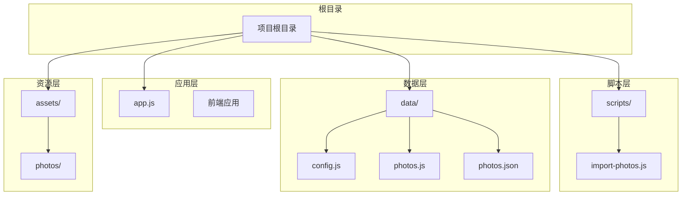

**图表来源**
- [import-photos.js:1-552](file://scripts/import-photos.js#L1-L552)
- [config.js:1-27](file://data/config.js#L1-L27)
- [photos.js:1-315](file://data/photos.js#L1-L315)

**章节来源**
- [README.md:1-87](file://README.md#L1-L87)
- [import-photos.js:8-11](file://scripts/import-photos.js#L8-L11)

## 核心组件

### 主要入口函数

脚本的核心执行流程由以下主要函数构成：

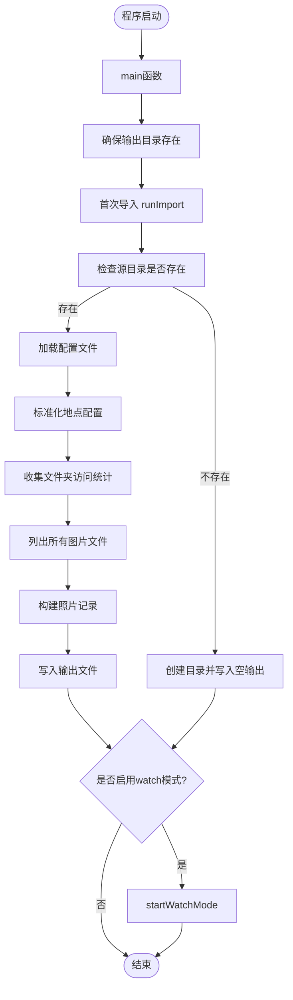

**图表来源**
- [import-photos.js:19-85](file://scripts/import-photos.js#L19-L85)
- [import-photos.js:87-135](file://scripts/import-photos.js#L87-L135)

### 命令行参数系统

脚本支持以下命令行参数：

| 参数 | 别名 | 描述 | 默认行为 |
|------|------|------|----------|
| `--watch` | `-w` | 启用实时监控模式，自动检测文件变化 | 关闭 |
| 无 | 无 | 执行一次性导入 | 执行一次性导入 |

**章节来源**
- [import-photos.js:14](file://scripts/import-photos.js#L14)
- [import-photos.js:15](file://scripts/import-photos.js#L15)

## 架构概览

### 整体工作流程

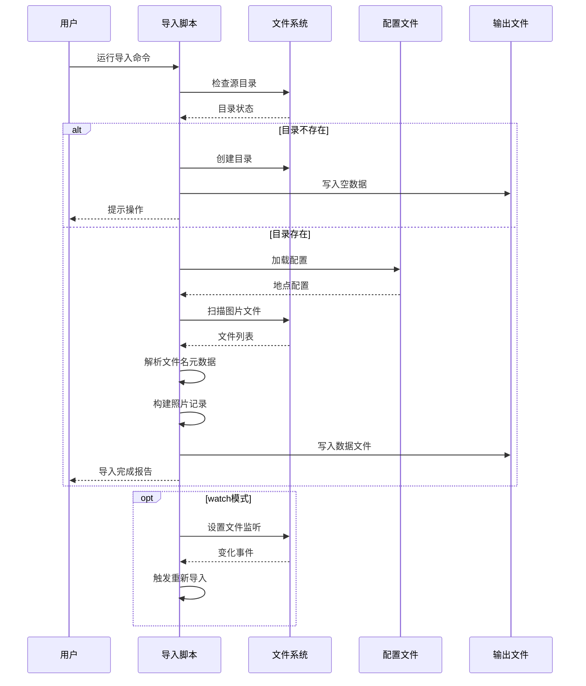

**图表来源**
- [import-photos.js:29-85](file://scripts/import-photos.js#L29-L85)
- [import-photos.js:87-135](file://scripts/import-photos.js#L87-L135)

## 详细组件分析

### 文件名解析规则

#### 拍摄日期提取算法

脚本采用双重策略提取拍摄日期：

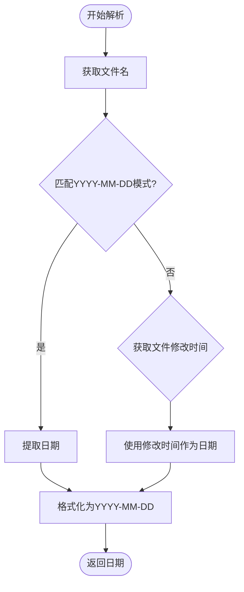

**图表来源**
- [import-photos.js:458-470](file://scripts/import-photos.js#L458-L470)

#### 标题信息提取流程

标题提取遵循以下优先级规则：

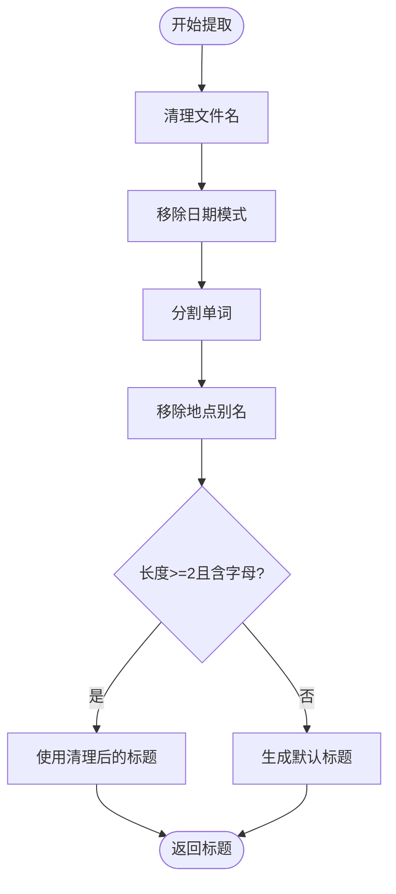

**图表来源**
- [import-photos.js:472-489](file://scripts/import-photos.js#L472-L489)

### 文件夹映射机制

#### 地点识别算法

脚本通过三层机制识别照片地点：

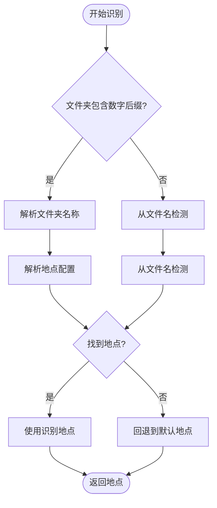

**图表来源**
- [import-photos.js:288-316](file://scripts/import-photos.js#L288-L316)
- [import-photos.js:318-338](file://scripts/import-photos.js#L318-L338)

#### 文件夹访问统计

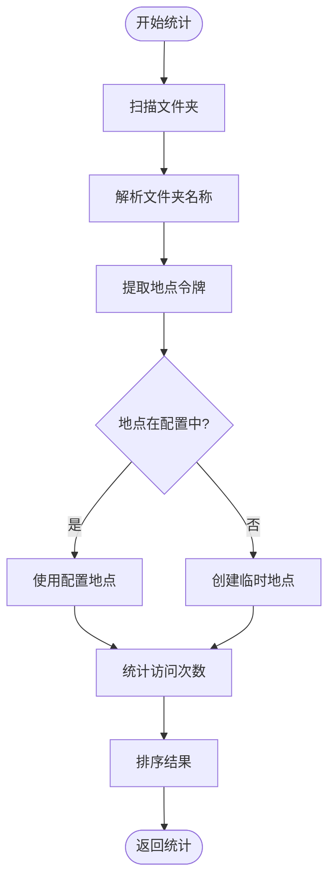

**图表来源**
- [import-photos.js:359-398](file://scripts/import-photos.js#L359-L398)

### 访问次数统计算法

#### 统计逻辑

访问次数统计采用集合去重机制：

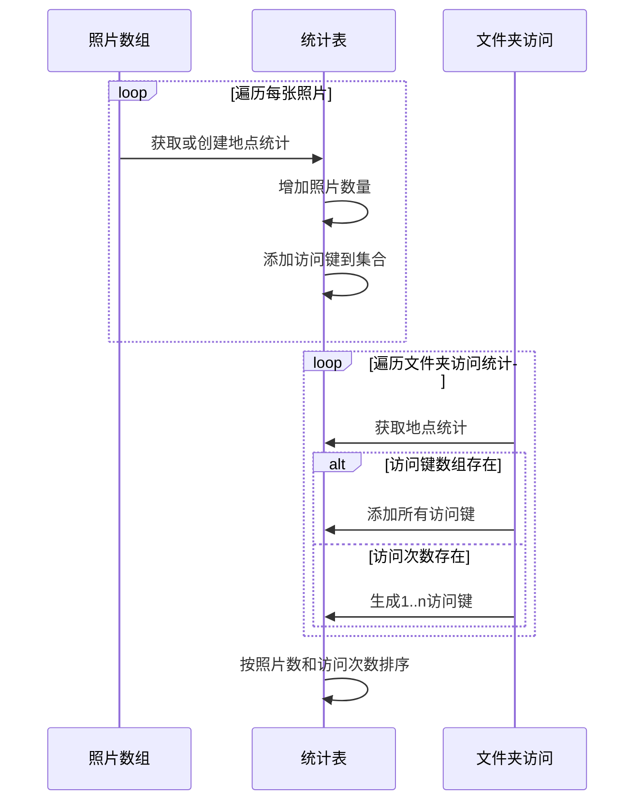

**图表来源**
- [import-photos.js:491-525](file://scripts/import-photos.js#L491-L525)

### 实时监控模式

#### 监控机制

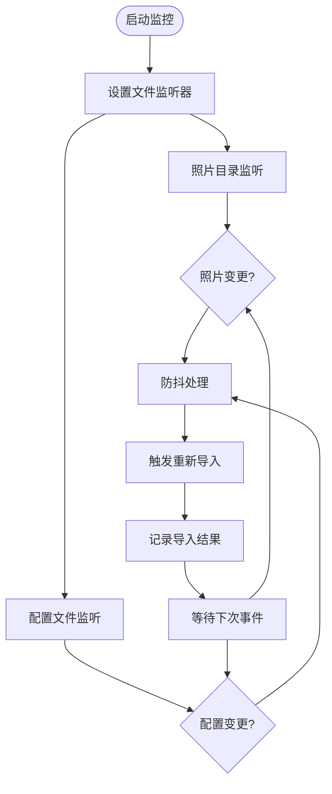

**图表来源**
- [import-photos.js:87-135](file://scripts/import-photos.js#L87-L135)
- [import-photos.js:171-180](file://scripts/import-photos.js#L171-L180)

**章节来源**
- [import-photos.js:87-135](file://scripts/import-photos.js#L87-L135)
- [import-photos.js:171-180](file://scripts/import-photos.js#L171-L180)

## 依赖分析

### 外部依赖

脚本使用以下 Node.js 内置模块：

| 模块 | 用途 | 使用场景 |
|------|------|----------|
| `fs` | 文件系统操作 | 目录创建、文件读写、文件监听 |
| `path` | 路径处理 | 路径拼接、规范化 |
| `vm` | 安全执行 | 配置文件沙箱执行 |

### 内部依赖关系

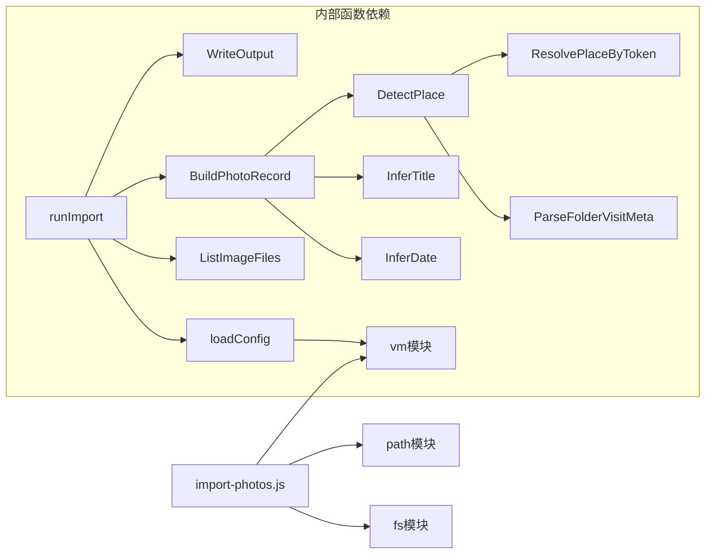

**图表来源**
- [import-photos.js:4-6](file://scripts/import-photos.js#L4-L6)
- [import-photos.js:190-204](file://scripts/import-photos.js#L190-L204)

**章节来源**
- [import-photos.js:4-6](file://scripts/import-photos.js#L4-L6)
- [import-photos.js:190-204](file://scripts/import-photos.js#L190-L204)

## 性能考虑

### 扫描算法优化

脚本采用迭代深度优先搜索算法遍历目录：

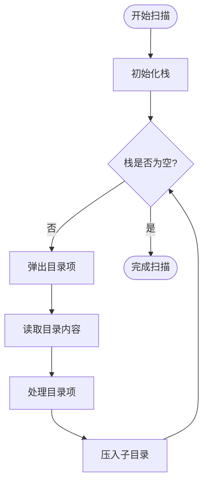

**图表来源**
- [import-photos.js:239-262](file://scripts/import-photos.js#L239-L262)

### 内存使用优化

- 使用生成器模式避免一次性加载大量文件
- 采用集合去重机制减少内存占用
- 防抖机制避免频繁重复处理

### 并发处理

- 文件监听采用异步事件驱动
- 防抖机制合并短时间内多次变更
- 配置文件使用沙箱执行避免阻塞

## 故障排除指南

### 常见问题及解决方案

#### 目录不存在问题

**症状**: 脚本提示需要创建目录
**解决**: 手动创建 `assets/photos/` 目录或将照片放入该目录

#### 配置文件加载失败

**症状**: 配置文件无法读取或解析
**解决**: 
1. 检查 `data/config.js` 格式是否正确
2. 确认 `window.LOVE_CONFIG` 对象定义完整
3. 验证地点配置的 `id` 和 `name` 字段

#### 文件名解析错误

**症状**: 日期或标题识别不准确
**解决**:
1. 确保文件名包含标准日期格式（YYYY-MM-DD）
2. 使用英文或拼音命名，避免特殊字符
3. 文件夹名称使用地点拼音+数字后缀

#### 监控模式失效

**症状**: watch 模式无法检测文件变化
**解决**:
1. 检查文件系统权限
2. 确认 Node.js 版本支持文件监听
3. 避免使用压缩工具直接修改文件

**章节来源**
- [import-photos.js:33-46](file://scripts/import-photos.js#L33-L46)
- [import-photos.js:140-151](file://scripts/import-photos.js#L140-L151)

### 错误处理机制

脚本实现了多层次的错误处理：

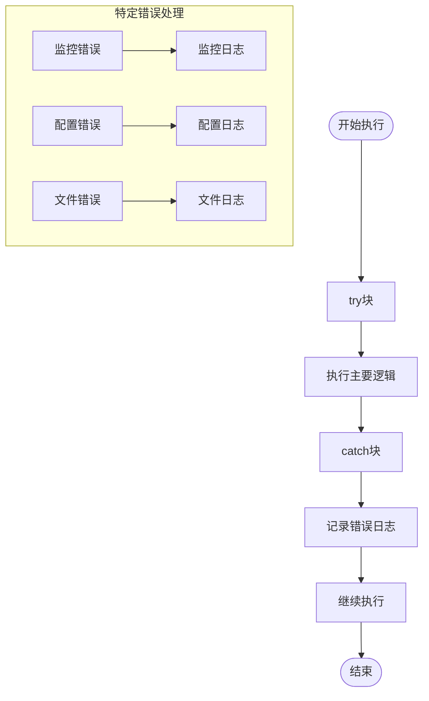

**图表来源**
- [import-photos.js:92-98](file://scripts/import-photos.js#L92-L98)
- [import-photos.js:146-150](file://scripts/import-photos.js#L146-L150)

## 结论

这个照片导入脚本提供了完整的自动化解决方案，具有以下优势：

1. **智能化元数据提取**：自动解析文件名中的日期、标题和地点信息
2. **灵活的配置系统**：通过配置文件集中管理地点信息
3. **实时监控能力**：支持 watch 模式自动检测文件变化
4. **强大的统计功能**：提供访问次数和地点分布统计
5. **健壮的错误处理**：完善的异常处理和恢复机制

建议用户根据实际需求调整配置文件，合理命名照片文件，充分利用 watch 模式提高工作效率。

## 附录

### 命令行使用示例

```bash
# 基础导入
node scripts/import-photos.js

# 实时监控模式
node scripts/import-photos.js --watch
# 或
node scripts/import-photos.js -w
```

### 文件命名规范

推荐使用以下命名格式：
- `YYYY-MM-DD-标题.jpg`
- `YYYYMMDD-标题.jpg`
- `地点编号-序号.jpg`

### 部署建议

1. **自动化导入**：结合定时任务定期执行导入脚本
2. **备份策略**：定期备份 `data/photos.js` 文件
3. **监控告警**：设置文件系统监控防止意外删除
4. **版本控制**：将配置文件纳入版本控制系统