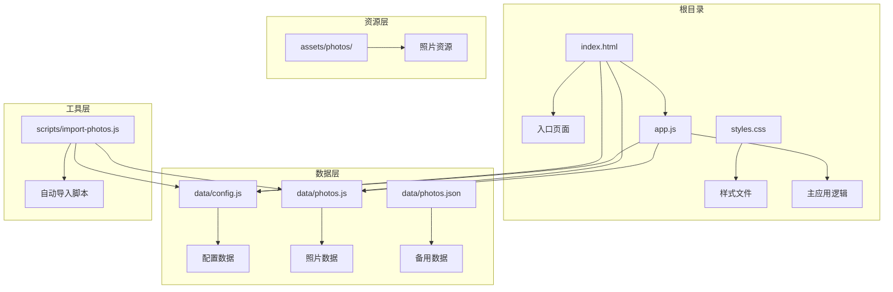
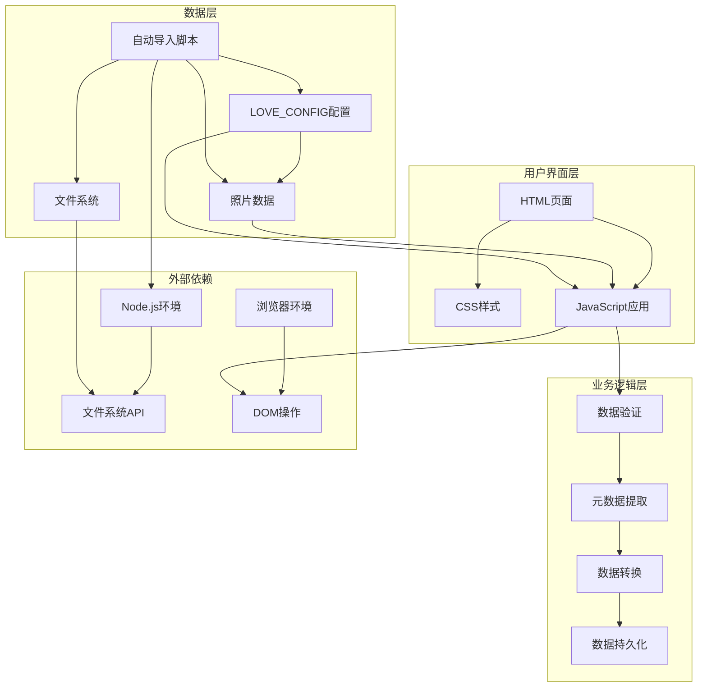
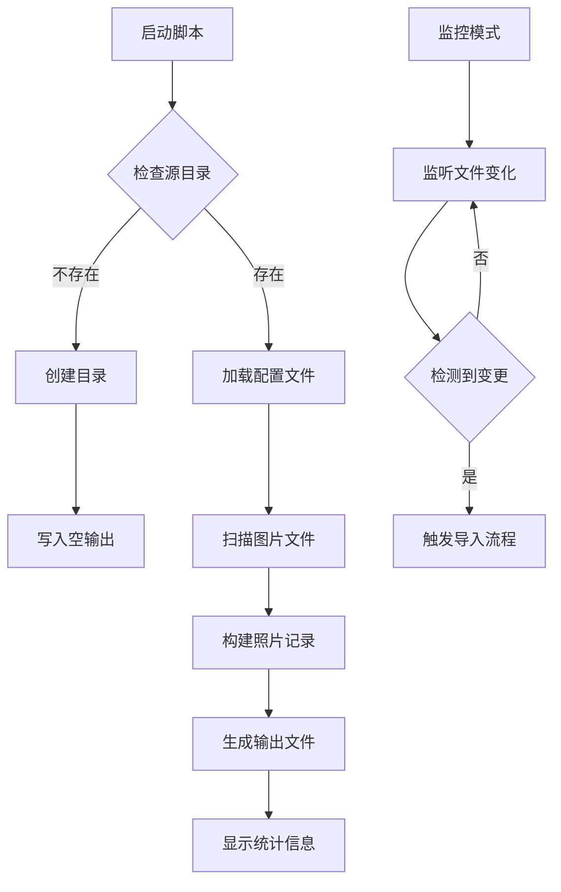
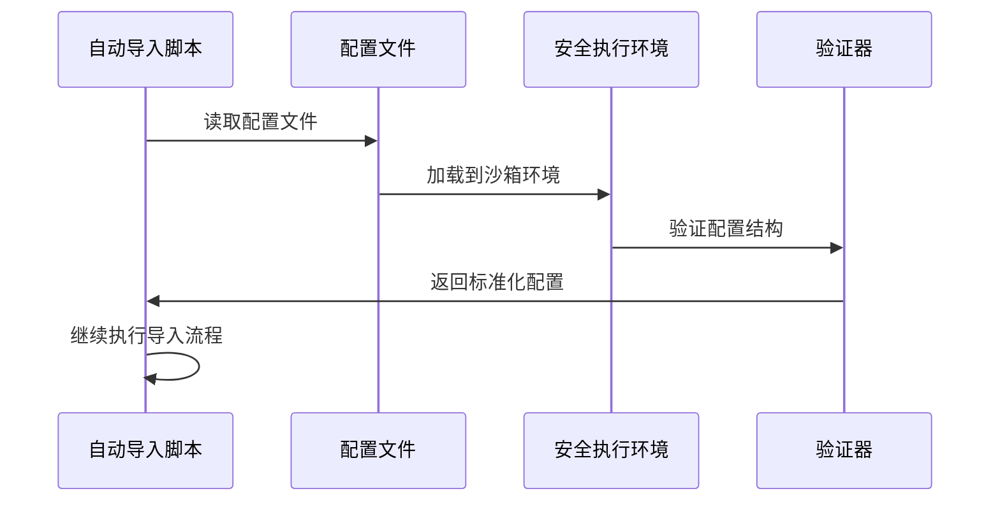
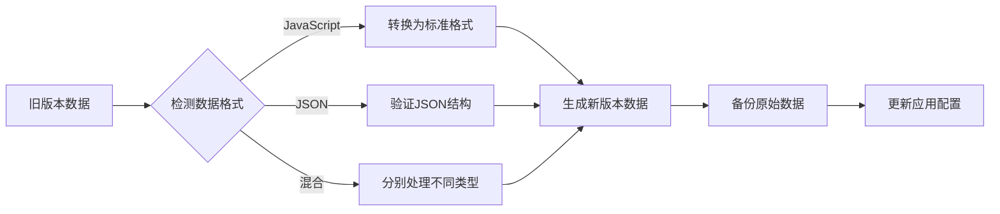
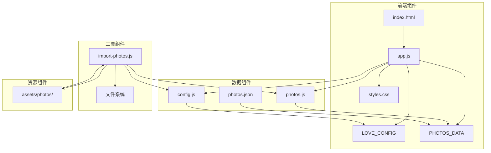

# 数据管理

<cite>
**本文档引用的文件**
- [config.js](file://data/config.js)
- [photos.js](file://data/photos.js)
- [photos.json](file://data/photos.json)
- [import-photos.js](file://scripts/import-photos.js)
- [app.js](file://app.js)
- [index.html](file://index.html)
- [README.md](file://README.md)
- [styles.css](file://styles.css)
</cite>

## 目录
1. [简介](#简介)
2. [项目结构](#项目结构)
3. [核心组件](#核心组件)
4. [架构概览](#架构概览)
5. [详细组件分析](#详细组件分析)
6. [依赖关系分析](#依赖关系分析)
7. [性能考虑](#性能考虑)
8. [故障排除指南](#故障排除指南)
9. [结论](#结论)
10. [附录](#附录)

## 简介

恋爱纪念站是一个基于Web技术的纪念相册管理系统，采用苹果风格的液态玻璃设计。该系统通过自动化脚本实现照片数据的智能导入和管理，支持实时监控模式，能够自动识别照片元数据并生成美观的时间线展示。

系统的核心特点包括：
- 自动化照片导入和元数据识别
- 实时监控模式支持动态更新
- 城市足迹统计和访问次数计算
- 时间线可视化展示
- 响应式设计和流畅动画效果

## 项目结构

项目采用模块化的文件组织方式，主要分为以下几个部分：



**图表来源**
- [index.html:135-137](file://index.html#L135-L137)
- [app.js:14](file://app.js#L14)
- [import-photos.js:8-11](file://scripts/import-photos.js#L8-L11)

**章节来源**
- [index.html:1-140](file://index.html#L1-L140)
- [README.md:1-87](file://README.md#L1-L87)

## 核心组件

### LOVES_CONFIG 配置系统

LOVE_CONFIG 是整个系统的核心配置对象，负责管理应用的各种参数设置。

#### 配置对象结构

| 字段名 | 类型 | 必需 | 描述 | 默认值 |
|--------|------|------|------|--------|
| startDate | string | 是 | 相恋开始日期，用于计算在一起天数 | 无 |
| targetCount | number | 否 | 目标照片数量，用于生成占位数据 | 500 |
| navAllLabel | string | 否 | 导航栏"全部足迹"标签文本 | "全部足迹" |
| places | array | 是 | 地点配置数组，定义城市筛选选项 | 空数组 |

#### 地点配置规范

每个地点配置项支持多种格式：

```javascript
// 字符串格式
{id: "hongkong", name: "香港"}

// 对象格式
{id: "guangzhou", name: "广州", aliases: ["广州", "穗"]}

// 简化格式
"hongkong"
```

**章节来源**
- [config.js:1-27](file://data/config.js#L1-L27)
- [app.js:619-652](file://app.js#L619-L652)

### 照片数据标准格式

系统支持两种照片数据格式：JavaScript格式和JSON格式。

#### JavaScript格式 (PHOTOS_DATA)

```javascript
window.PHOTOS_DATA = [
  {
    id: "foshan-0001",           // 唯一标识符
    src: "assets/photos/foshan1/2025-12-29-帮程湖玲弄装备墙.jpg", // 照片路径
    title: "帮程湖玲弄装备墙",   // 标题
    date: "2025-12-29",          // 日期
    place: "foshan",             // 地点ID
    placeName: "佛山",           // 地点名称
    visit: 1,                    // 访问次数
    visitKey: "foshan#1"         // 访问键值
  }
];
```

#### JSON格式

```javascript
[
  {
    id: "sample-1",
    src: "https://picsum.photos/seed/first-memory/840/1120",
    title: "第一次正式约会",
    date: "2022-05-25",
    note: "那天其实有点紧张，但很确定你很特别。",
    phase: "first"
  }
]
```

**章节来源**
- [photos.js:4-255](file://data/photos.js#L4-L255)
- [photos.json:1-67](file://data/photos.json#L1-L67)

## 架构概览

系统采用前后端分离的架构设计，前端负责数据展示和用户交互，后端脚本负责数据处理和导入。



**图表来源**
- [app.js:1-690](file://app.js#L1-L690)
- [import-photos.js:1-552](file://scripts/import-photos.js#L1-L552)

## 详细组件分析

### 自动导入脚本 (import-photos.js)

自动导入脚本是系统的核心组件，负责将照片文件自动转换为标准的数据格式。

#### 主要功能特性

1. **文件监控模式**：支持实时监控照片目录变化
2. **智能元数据提取**：从文件名和路径自动提取日期、地点信息
3. **配置驱动**：基于LOVE_CONFIG进行地点映射和规范化
4. **错误处理**：完善的异常捕获和用户反馈机制

#### 核心算法流程



**图表来源**
- [import-photos.js:19-85](file://scripts/import-photos.js#L19-L85)
- [import-photos.js:87-135](file://scripts/import-photos.js#L87-L135)

#### 文件名解析规则

系统支持以下文件名格式：

| 格式类型 | 示例 | 解析规则 |
|----------|------|----------|
| 日期格式 | `2025-12-29-001.jpg` | YYYY-MM-DD优先 |
| 简化日期 | `20251229-001.jpg` | YYYYMMDD格式 |
| 带描述 | `2025-12-29-帮程湖玲弄装备墙.jpg` | 清洗后作为标题 |
| 城市+次数 | `foshan1/2025-12-29-001.jpg` | 自动识别地点和访问次数 |

**章节来源**
- [import-photos.js:264-286](file://scripts/import-photos.js#L264-L286)
- [import-photos.js:458-470](file://scripts/import-photos.js#L458-L470)

### 数据验证和错误处理机制

系统实现了多层次的数据验证和错误处理机制：

#### 配置验证



**图表来源**
- [import-photos.js:190-204](file://scripts/import-photos.js#L190-L204)

#### 错误处理策略

1. **文件监控异常**：捕获文件系统监听错误并优雅降级
2. **配置加载失败**：使用默认配置继续运行
3. **导入过程异常**：记录错误信息但不中断整体流程
4. **用户反馈**：通过控制台输出详细的错误信息

**章节来源**
- [import-photos.js:92-98](file://scripts/import-photos.js#L92-L98)
- [import-photos.js:140-150](file://scripts/import-photos.js#L140-L150)

### 数据迁移和版本升级

系统提供了灵活的数据迁移机制：

#### 迁移策略

1. **配置兼容性**：支持多种配置格式的自动转换
2. **数据格式转换**：JavaScript格式和JSON格式的双向转换
3. **版本向后兼容**：旧版数据结构的自动适配
4. **增量更新**：支持部分数据的增量导入和更新

#### 版本升级流程



**图表来源**
- [app.js:91-105](file://app.js#L91-L105)
- [app.js:135-154](file://app.js#L135-L154)

## 依赖关系分析

系统各组件之间的依赖关系如下：



**图表来源**
- [index.html:135-137](file://index.html#L135-L137)
- [app.js:14](file://app.js#L14)
- [import-photos.js:8-11](file://scripts/import-photos.js#L8-L11)

**章节来源**
- [app.js:18-40](file://app.js#L18-L40)
- [import-photos.js:190-204](file://scripts/import-photos.js#L190-L204)

## 性能考虑

系统在设计时充分考虑了性能优化：

### 图片懒加载
- 使用Intersection Observer API实现智能懒加载
- 支持异步解码和渐进式渲染
- 减少初始页面加载时间

### 内存管理
- 动态计算卡片高度，避免不必要的重排
- 使用虚拟滚动减少DOM节点数量
- 及时清理定时器和事件监听器

### 缓存策略
- 配置数据缓存在内存中
- 图片资源利用浏览器缓存
- 避免重复的DOM查询和计算

## 故障排除指南

### 常见问题及解决方案

#### 1. 照片无法导入
**症状**：运行导入脚本后没有生成数据文件
**解决方案**：
- 检查照片文件是否在assets/photos/目录下
- 确认文件扩展名是否在支持列表中
- 验证配置文件格式是否正确

#### 2. 地点识别错误
**症状**：照片地点显示为"其他"
**解决方案**：
- 检查文件夹命名是否符合约定格式
- 确认LOVE_CONFIG中的地点配置是否完整
- 验证文件夹名称是否包含中文地名

#### 3. 实时监控失效
**症状**：添加新照片后不会自动更新
**解决方案**：
- 检查Node.js版本是否支持文件监控
- 确认脚本权限是否足够
- 查看控制台是否有错误提示

#### 4. 页面显示异常
**症状**：页面布局错乱或功能异常
**解决方案**：
- 刷新浏览器缓存
- 检查网络连接是否正常
- 确认所有必需文件都已正确加载

**章节来源**
- [import-photos.js:33-46](file://scripts/import-photos.js#L33-L46)
- [import-photos.js:140-150](file://scripts/import-photos.js#L140-L150)

## 结论

恋爱纪念站数据管理系统通过精心设计的架构和智能化的数据处理机制，为用户提供了便捷的照片管理和展示体验。系统的主要优势包括：

1. **自动化程度高**：从照片导入到数据生成的全流程自动化
2. **配置灵活**：支持多种配置格式和灵活的地点管理
3. **用户体验佳**：流畅的界面交互和美观的视觉效果
4. **扩展性强**：模块化设计便于功能扩展和维护

未来可以考虑的功能增强方向：
- 支持更多照片格式和元数据类型
- 增强数据备份和同步机制
- 提供更丰富的统计分析功能
- 优化移动端浏览体验

## 附录

### 数据备份和恢复最佳实践

#### 备份策略
1. **定期备份**：建议每周进行一次完整的数据备份
2. **版本控制**：使用Git或其他版本控制系统管理配置文件
3. **多地点存储**：将备份文件存储在不同的物理位置
4. **自动化备份**：设置定时任务自动执行备份操作

#### 恢复流程
1. **验证备份完整性**：检查备份文件的完整性和可用性
2. **停止服务**：在恢复过程中暂停相关服务
3. **逐步恢复**：先恢复配置文件，再恢复照片数据
4. **验证恢复结果**：确认系统功能正常运行

### 更新流程

#### 系统更新
1. **检查更新**：定期检查是否有新的版本发布
2. **备份当前版本**：在更新前做好完整的数据备份
3. **测试更新**：在测试环境中验证更新的兼容性
4. **执行更新**：按照官方文档执行更新操作

#### 数据更新
1. **增量导入**：使用自动导入脚本进行增量更新
2. **手动调整**：对导入结果进行必要的手动调整
3. **验证数据**：检查数据的完整性和准确性
4. **清理缓存**：清除浏览器缓存确保新数据生效