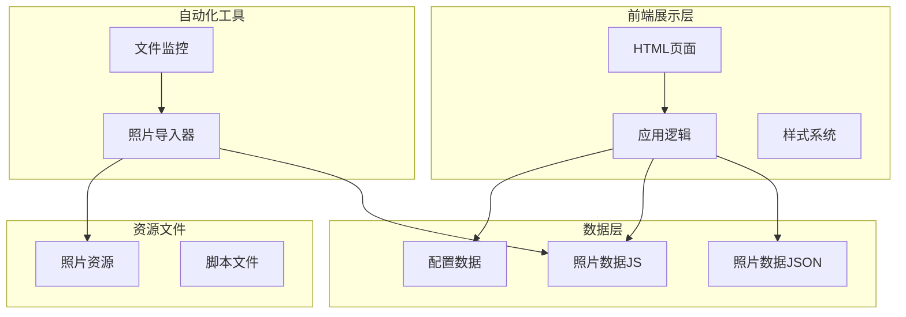
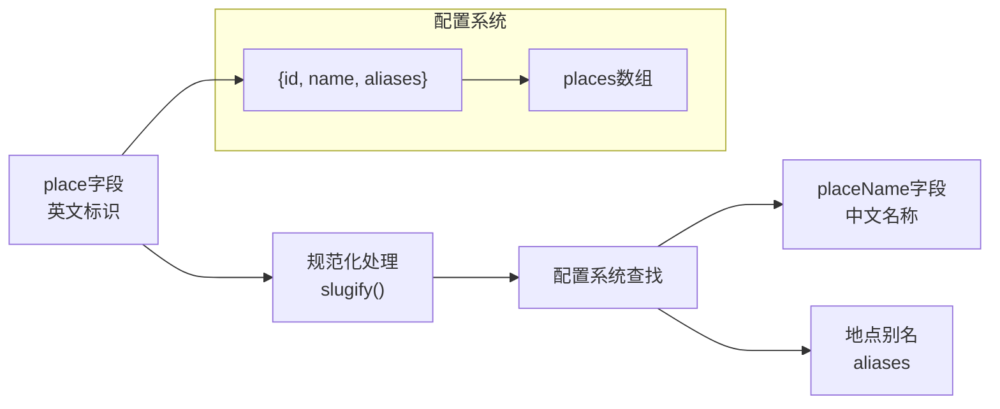
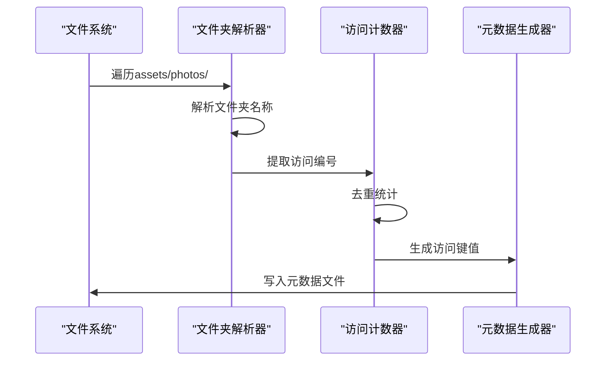
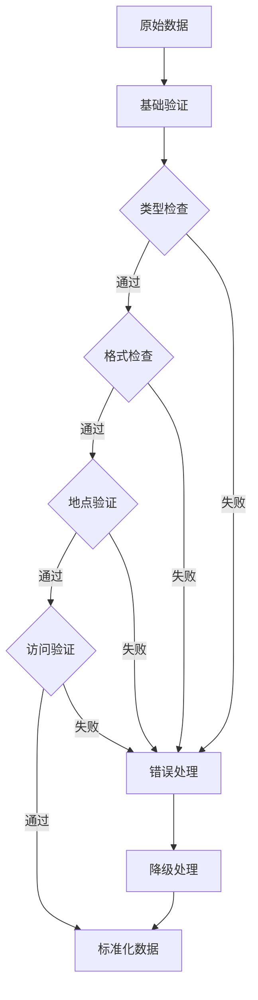
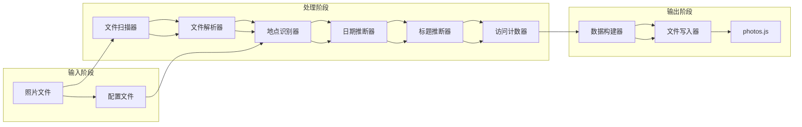
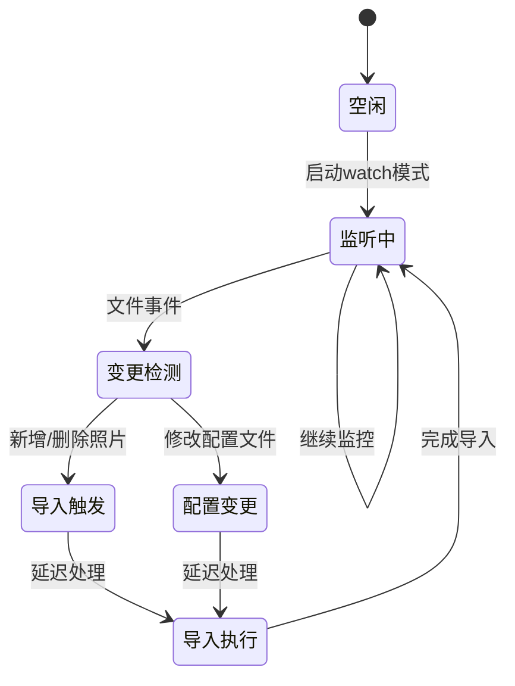
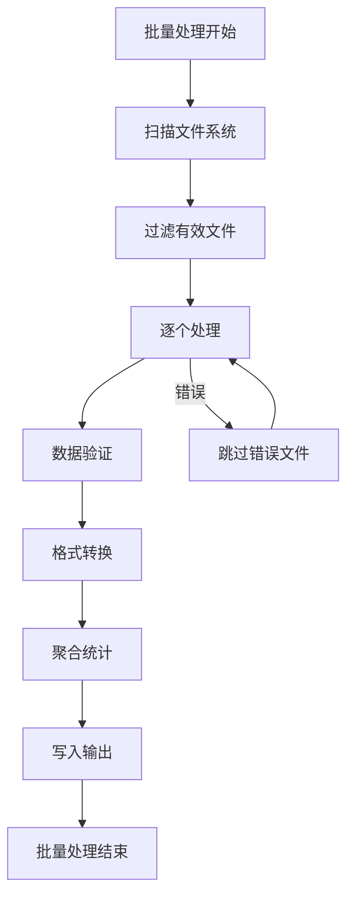
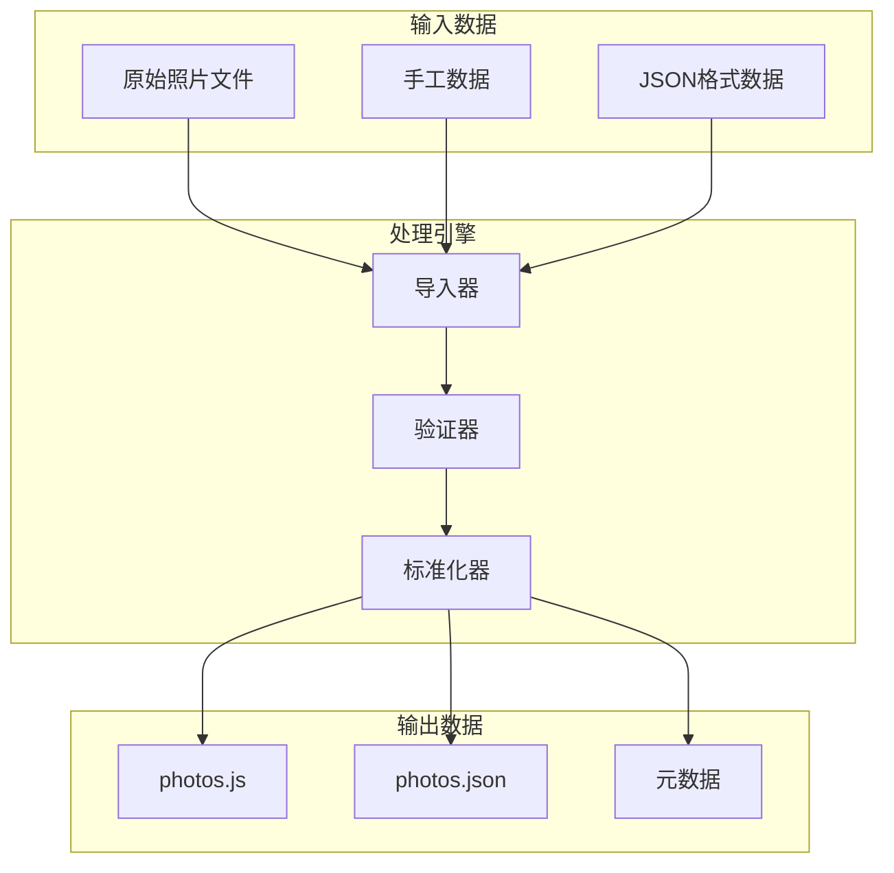

# 照片数据结构

<cite>
**本文档引用的文件**
- [data/photos.js](file://data/photos.js)
- [data/config.js](file://data/config.js)
- [scripts/import-photos.js](file://scripts/import-photos.js)
- [app.js](file://app.js)
- [data/photos.json](file://data/photos.json)
- [README.md](file://README.md)
- [index.html](file://index.html)
</cite>

## 目录
1. [简介](#简介)
2. [项目结构概览](#项目结构概览)
3. [核心数据结构定义](#核心数据结构定义)
4. [字段规范详解](#字段规范详解)
5. [place字段与配置系统的关联机制](#place字段与配置系统的关联机制)
6. [visit字段的统计逻辑](#visit字段的统计逻辑)
7. [数据验证与错误处理](#数据验证与错误处理)
8. [数据生成流程](#数据生成流程)
9. [数据转换与批量处理](#数据转换与批量处理)
10. [数据结构图](#数据结构图)
11. [使用指南](#使用指南)
12. [故障排除](#故障排除)

## 简介

本项目是一个基于Web的照片记忆管理系统，采用"液态玻璃"设计风格，通过时间轴的方式展示恋爱历程中的珍贵回忆。系统的核心是标准化的照片数据结构，支持自动化的照片导入、智能识别和统计功能。

## 项目结构概览

项目采用模块化架构，主要包含以下核心组件：



**图表来源**
- [index.html:1-140](file://index.html#L1-L140)
- [app.js:1-690](file://app.js#L1-L690)
- [scripts/import-photos.js:1-552](file://scripts/import-photos.js#L1-L552)

**章节来源**
- [index.html:1-140](file://index.html#L1-L140)
- [README.md:1-87](file://README.md#L1-L87)

## 核心数据结构定义

### 标准照片对象结构

系统支持两种主要的照片数据格式：

#### 标准照片对象（PHOTOS_DATA）

```javascript
{
  id: "string",           // 唯一标识符
  src: "string",          // 图片路径
  title: "string",        // 标题信息
  date: "string",         // 拍摄日期
  place: "string",        // 地点标识
  placeName: "string",    // 地点名称
  visit: number,          // 访问计数
  visitKey: "string"      // 访问键值
}
```

#### 元数据对象（PHOTOS_META）

```javascript
{
  folderVisits: [
    {
      place: "string",
      placeName: "string", 
      visitCount: number,
      visitKeys: ["string"]
    }
  ]
}
```

#### 备选照片对象（photos.json）

```javascript
{
  id: "string",
  src: "string",
  title: "string", 
  date: "string",
  note: "string",
  phase: "string"
}
```

**章节来源**
- [data/photos.js:4-255](file://data/photos.js#L4-L255)
- [data/photos.js:256-315](file://data/photos.js#L256-L315)
- [data/photos.json:1-67](file://data/photos.json#L1-L67)

## 字段规范详解

### id字段（唯一标识符）

**数据类型**: 字符串
**格式要求**: `{placeId}-{index}` 格式
**取值范围**: 必须唯一且符合命名规范
**生成规则**: 
- 自动化生成：`{placeInfo.id}-{String(index + 1).padStart(4, "0")}`
- 手动输入：必须确保全局唯一性

**示例**: `"foshan-0001"`, `"hangzhou-0003"`

### src字段（图片路径）

**数据类型**: 字符串
**格式要求**: 相对路径或绝对URL
**取值范围**: 有效的图片资源路径
**生成规则**:
- 自动化生成：相对路径 `assets/photos/{folder}/{filename}`
- 手动输入：支持本地路径或远程URL

**示例**: `"assets/photos/foshan1/2025-12-29-帮程湖玲弄装备墙.jpg"`

### title字段（标题信息）

**数据类型**: 字符串
**格式要求**: UTF-8编码，长度>=2
**取值范围**: 任意非空字符串
**生成规则**:
- 文件名清洗：移除日期和地点关键词
- 自动标题：`"{placeName}记忆 {index}"`

**示例**: `"帮程湖玲弄装备墙"`, `"杭州记忆 003"`

### date字段（拍摄日期）

**数据类型**: 字符串（ISO 8601格式）
**格式要求**: `YYYY-MM-DD`
**取值范围**: 有效日期范围
**生成规则**:
- 文件名识别：优先匹配 `YYYY-MM-DD` 或 `YYYYMMDD` 格式
- 文件属性：使用文件修改时间作为后备方案

**示例**: `"2025-12-29"`, `"2026-01-10"`

### place字段（地点标识）

**数据类型**: 字符串
**格式要求**: 小写字母和连字符组合
**取值范围**: 必须存在于配置系统中
**生成规则**:
- 文件夹识别：从 `assets/photos/{place}/` 中提取
- 配置映射：通过配置系统进行中文翻译

**示例**: `"foshan"`, `"hangzhou"`, `"hongkong"`

### placeName字段（地点名称）

**数据类型**: 字符串
**格式要求**: 中文名称
**取值范围**: 配置系统中定义的地点名称
**生成规则**: 通过place字段映射到配置系统中的中文名称

**示例**: `"佛山"`, `"杭州"`, `"香港"`

### visit字段（访问计数）

**数据类型**: 数字
**格式要求**: 正整数
**取值范围**: 1及以上
**生成规则**:
- 文件夹尾号识别：`{city}{number}` 格式
- 默认值：1

**示例**: `1`, `2`, `3`

### visitKey字段（访问键值）

**数据类型**: 字符串
**格式要求**: `{placeId}#{visit}` 格式
**取值范围**: 唯一标识每次访问
**生成规则**: `{placeInfo.id}#${visit}`

**示例**: `"foshan#1"`, `"hangzhou#2"`

**章节来源**
- [scripts/import-photos.js:264-286](file://scripts/import-photos.js#L264-L286)
- [app.js:107-133](file://app.js#L107-L133)

## place字段与配置系统的关联机制

### 配置系统结构

配置系统通过 `LOVE_CONFIG` 对象管理所有地点信息：

```javascript
{
  startDate: "2025-11-15",     // 开始日期
  targetCount: 500,           // 目标数量
  navAllLabel: "全部足迹",    // 导航标签
  places: [                  // 地点列表
    { id: "hongkong", name: "香港" },
    { id: "guangzhou", name: "广州" },
    // ... 更多地点
  ]
}
```

### 关联映射机制



**图表来源**
- [data/config.js:1-27](file://data/config.js#L1-L27)
- [scripts/import-photos.js:206-237](file://scripts/import-photos.js#L206-L237)
- [app.js:604-617](file://app.js#L604-L617)

### 地点识别算法

系统采用多级识别策略：

1. **文件夹优先**：从路径中提取地点标识
2. **配置映射**：通过配置系统进行翻译
3. **文件名识别**：从文件名中提取中文地点
4. **默认分配**：按索引循环分配

**章节来源**
- [scripts/import-photos.js:288-316](file://scripts/import-photos.js#L288-L316)
- [app.js:206-231](file://app.js#L206-L231)

## visit字段的统计逻辑

### 文件夹访问统计

系统通过文件夹命名模式自动统计访问次数：



**图表来源**
- [scripts/import-photos.js:359-398](file://scripts/import-photos.js#L359-L398)
- [scripts/import-photos.js:491-525](file://scripts/import-photos.js#L491-L525)

### 访问键值生成规则

| 文件夹名称 | 访问编号 | visitKey |
|-----------|----------|----------|
| `foshan` | 1 | `foshan#1` |
| `foshan1` | 1 | `foshan#1` |
| `foshan2` | 2 | `foshan#2` |
| `hangzhou3` | 3 | `hangzhou#3` |

### 统计重置规则

- **按文件夹计次**：每个文件夹代表一次独立访问
- **跨文件夹累加**：同一地点不同文件夹分别计数
- **空文件夹处理**：即使无照片也计入访问次数

**章节来源**
- [scripts/import-photos.js:318-338](file://scripts/import-photos.js#L318-L338)
- [scripts/import-photos.js:377-388](file://scripts/import-photos.js#L377-L388)

## 数据验证与错误处理

### 输入验证规则

系统实现了多层次的数据验证：



### 错误处理机制

| 错误类型 | 处理方式 | 降级策略 |
|---------|---------|---------|
| 缺失字段 | 使用默认值 | 自动生成或设置为"其他" |
| 无效日期 | 使用文件时间 | 设置为开始日期 |
| 未知地点 | 循环分配 | 分配到配置列表末尾 |
| 访问异常 | 设为默认值 | 设置为1 |

### 异常恢复策略

```javascript
function normalizeVisitValue(value, fallback = 1) {
  const n = Number.parseInt(value, 10);
  if (!Number.isFinite(n) || n <= 0) return fallback;
  return n;
}

function normalizePlaceId(value) {
  if (value === null || value === undefined) return "";
  return String(value)
    .trim()
    .toLowerCase()
    .replace(/\s+/g, "-");
}
```

**章节来源**
- [app.js:662-666](file://app.js#L662-L666)
- [app.js:654-660](file://app.js#L654-L660)
- [scripts/import-photos.js:527-531](file://scripts/import-photos.js#L527-L531)

## 数据生成流程

### 自动导入流程



**图表来源**
- [scripts/import-photos.js:19-85](file://scripts/import-photos.js#L19-L85)
- [scripts/import-photos.js:239-286](file://scripts/import-photos.js#L239-L286)

### 监控模式工作流



**图表来源**
- [scripts/import-photos.js:87-135](file://scripts/import-photos.js#L87-L135)

**章节来源**
- [scripts/import-photos.js:19-85](file://scripts/import-photos.js#L19-L85)
- [scripts/import-photos.js:87-135](file://scripts/import-photos.js#L87-L135)

## 数据转换与批量处理

### 文件格式转换

系统支持多种数据格式的相互转换：

| 输入格式 | 输出格式 | 转换工具 |
|---------|---------|---------|
| 照片文件夹 | JS数据文件 | import-photos.js |
| JSON数据 | JS数据文件 | 手动转换 |
| 手工数据 | JS数据文件 | 手动编辑 |

### 批量处理策略



### 性能优化措施

- **增量更新**：仅处理变更的文件
- **并发处理**：多文件并行处理
- **内存管理**：大文件分批处理
- **缓存机制**：中间结果缓存

**章节来源**
- [scripts/import-photos.js:239-262](file://scripts/import-photos.js#L239-L262)
- [scripts/import-photos.js:491-525](file://scripts/import-photos.js#L491-L525)

## 数据结构图

### 核心数据模型

```mermaid
erDiagram
PHOTO {
string id PK
string src
string title
string date
string place
string placeName
number visit
string visitKey
}
PLACE {
string id PK
string name
string[] aliases
}
VISIT_SUMMARY {
string place PK
string placeName
number visitCount
string[] visitKeys
}
CONFIG {
string startDate
number targetCount
string navAllLabel
PLACE[] places
}
PHOTO }o|--|| PLACE : "属于"
PHOTO }o|--o{ VISIT_SUMMARY : "统计"
CONFIG ||--o{ PLACE : "包含"
```

**图表来源**
- [data/photos.js:4-255](file://data/photos.js#L4-L255)
- [data/config.js:1-27](file://data/config.js#L1-L27)
- [data/photos.js:256-315](file://data/photos.js#L256-L315)

### 数据流转图



**图表来源**
- [scripts/import-photos.js:29-85](file://scripts/import-photos.js#L29-L85)
- [app.js:91-105](file://app.js#L91-L105)

## 使用指南

### 创建标准照片对象

1. **基本字段填充**
   - `id`: 唯一标识符（推荐使用 `{place}-{index}` 格式）
   - `src`: 图片路径（相对路径或URL）
   - `title`: 标题信息（建议包含地点和时间信息）
   - `date`: ISO格式日期（YYYY-MM-DD）

2. **地点配置**
   - 在 `data/config.js` 中添加地点信息
   - `place` 字段必须与配置中的 `id` 匹配
   - `placeName` 字段自动从配置映射

3. **访问统计**
   - 文件夹命名：`{city}{number}` 形式
   - 支持多个访问：`foshan1`, `foshan2`, `foshan3`
   - visit字段自动推断

### 示例数据格式

#### 单张照片示例

```javascript
{
  id: "foshan-0001",
  src: "assets/photos/foshan1/2025-12-29-帮程湖玲弄装备墙.jpg",
  title: "帮程湖玲弄装备墙",
  date: "2025-12-29",
  place: "foshan",
  placeName: "佛山",
  visit: 1,
  visitKey: "foshan#1"
}
```

#### 地点配置示例

```javascript
{
  places: [
    { id: "foshan", name: "佛山" },
    { id: "hangzhou", name: "杭州" },
    { id: "hongkong", name: "香港" }
  ]
}
```

### 自动化导入步骤

1. **准备照片**
   ```
   assets/photos/
   ├── foshan1/
   │   ├── 2025-12-29-001.jpg
   │   └── 2025-12-29-002.jpg
   └── hangzhou2/
       ├── 2026-01-10-001.jpg
       └── 2026-01-10-002.jpg
   ```

2. **运行导入命令**
   ```bash
   node scripts/import-photos.js
   ```

3. **启用实时监控**
   ```bash
   node scripts/import-photos.js --watch
   ```

**章节来源**
- [README.md:31-87](file://README.md#L31-L87)
- [scripts/import-photos.js:19-27](file://scripts/import-photos.js#L19-L27)

## 故障排除

### 常见问题及解决方案

#### 照片无法显示

**问题症状**: 照片路径错误导致图片不显示

**解决方法**:
1. 检查 `src` 字段是否为有效路径
2. 确认文件存在且可访问
3. 验证文件权限设置

#### 地点识别错误

**问题症状**: 地点显示为"其他"或识别错误

**解决方法**:
1. 检查 `data/config.js` 中的地点配置
2. 确保 `place` 字段与配置中的 `id` 完全匹配
3. 验证文件夹命名格式

#### 访问统计异常

**问题症状**: 访问次数统计不正确

**解决方法**:
1. 检查文件夹命名是否符合 `{city}{number}` 格式
2. 确认文件夹中包含有效照片
3. 验证数字部分是否为正整数

### 调试工具

系统提供了多种调试和监控工具：

```javascript
// 启用详细日志
console.log("[import-photos] 城市分布: " + lines);

// 监控文件变化
watchPath(SOURCE_DIR, true, (eventType, filename) => {
  console.log(`[import-photos] 文件变化: ${eventType} ${filename}`);
});

// 错误处理
try {
  runImport({ reason });
} catch (error) {
  console.error(`[import-photos] 自动导入失败: ${error.message}`);
}
```

### 性能优化建议

1. **文件组织**
   - 按地点和时间合理组织文件夹结构
   - 控制单个文件夹中的照片数量（建议不超过100张）

2. **格式优化**
   - 使用WebP或AVIF格式以减小文件大小
   - 控制图片分辨率（建议不超过1800px长边）

3. **监控设置**
   - 在生产环境中谨慎使用 `--watch` 模式
   - 定期检查磁盘空间和文件句柄限制

**章节来源**
- [scripts/import-photos.js:87-135](file://scripts/import-photos.js#L87-L135)
- [scripts/import-photos.js:92-98](file://scripts/import-photos.js#L92-L98)