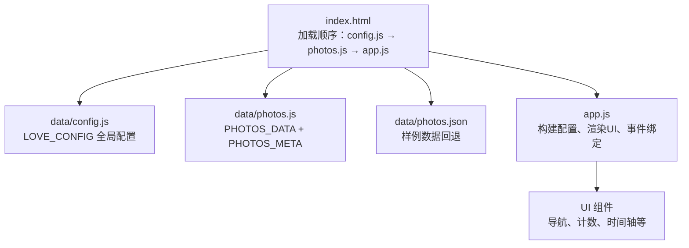
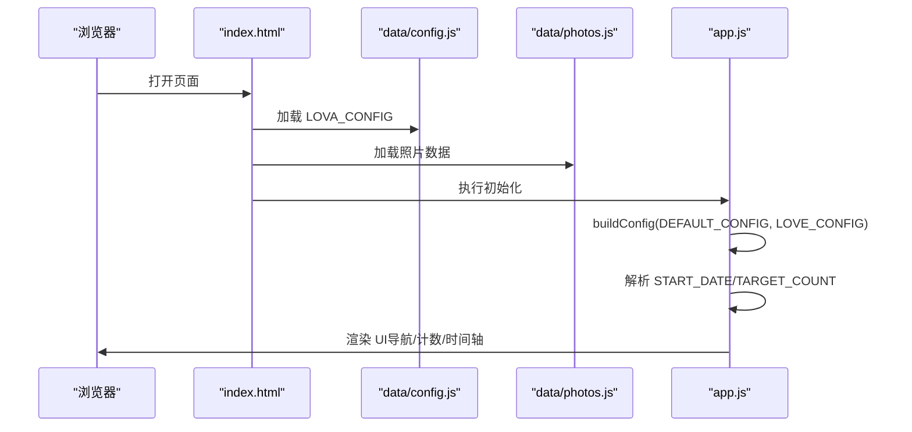
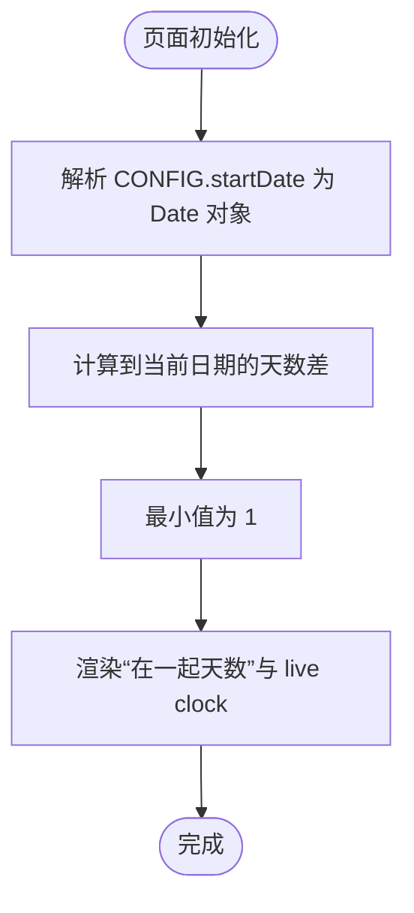
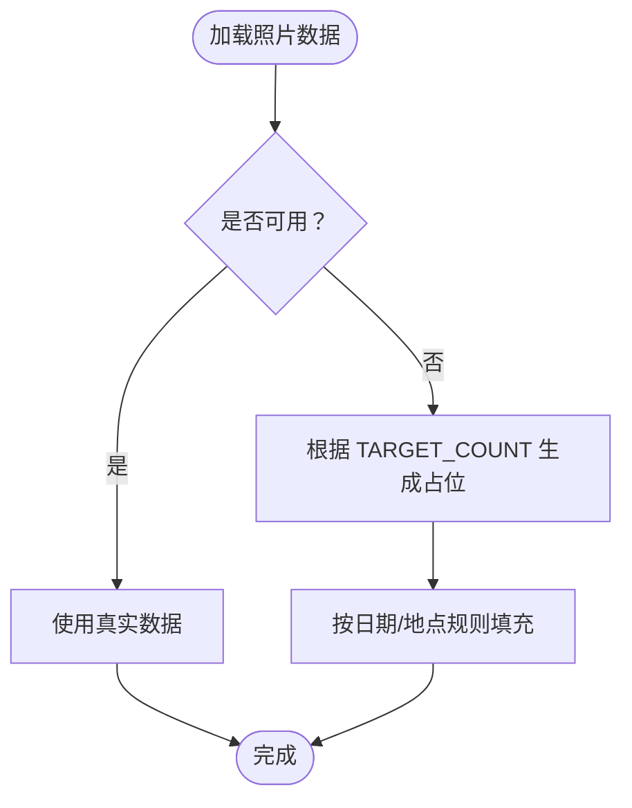
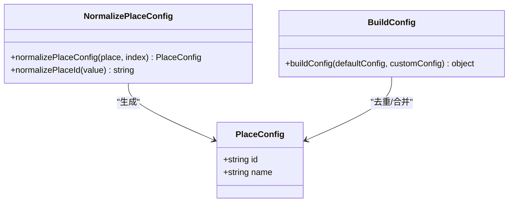
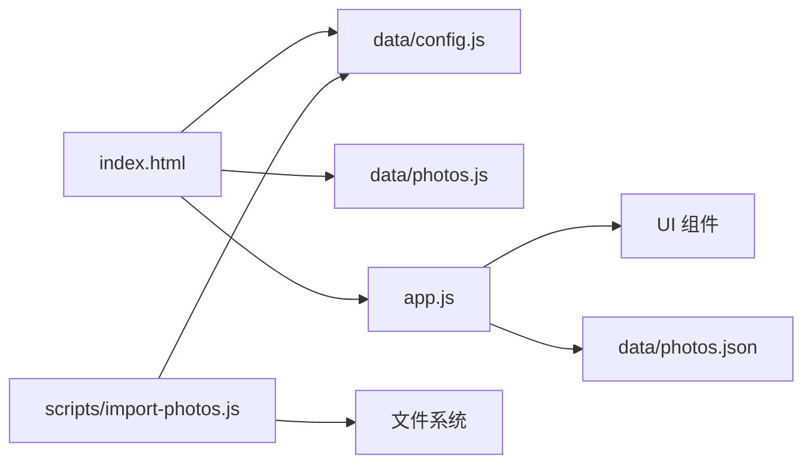

# 配置系统

<cite>
**本文引用的文件**
- [data/config.js](file://data/config.js)
- [app.js](file://app.js)
- [index.html](file://index.html)
- [README.md](file://README.md)
- [data/photos.js](file://data/photos.js)
- [data/photos.json](file://data/photos.json)
- [scripts/import-photos.js](file://scripts/import-photos.js)
</cite>

## 目录
1. [简介](#简介)
2. [项目结构](#项目结构)
3. [核心组件](#核心组件)
4. [架构总览](#架构总览)
5. [详细组件分析](#详细组件分析)
6. [依赖分析](#依赖分析)
7. [性能考量](#性能考量)
8. [故障排查指南](#故障排查指南)
9. [结论](#结论)
10. [附录](#附录)

## 简介
本文件面向“恋爱纪念站”项目的配置系统，聚焦 LOVA_CONFIG 全局配置对象的结构、字段作用机制与运行时行为，重点解释以下方面：
- startDate 如何影响“在一起天数”的计算逻辑
- targetCount 如何控制照片展示策略与占位生成
- navAllLabel 如何自定义导航“全部足迹”标签
- places 数组的配置格式、id 与 name 的命名规则及使用场景
- 配置项默认值、最佳实践与扩展建议
- 配置修改后的缓存策略与生效机制
- 配置系统与 UI 组件的绑定关系与动态更新能力
- 配置扩展与自定义的指导方案

## 项目结构
该站点采用“前端静态页面 + 可选数据注入”的轻量架构：
- 配置入口：data/config.js 定义 LOVA_CONFIG
- 数据入口：data/photos.js 或 data/photos.json 提供照片元数据
- 运行时：app.js 合并默认配置与用户配置，驱动 UI 渲染与交互
- 页面：index.html 加载配置与数据脚本，渲染界面

图表来源
- [index.html:135-137](file://index.html#L135-L137)
- [data/config.js:1-27](file://data/config.js#L1-L27)
- [data/photos.js:1-315](file://data/photos.js#L1-L315)
- [data/photos.json:1-67](file://data/photos.json#L1-L67)
- [app.js:14-89](file://app.js#L14-L89)

章节来源
- [index.html:135-137](file://index.html#L135-L137)
- [data/config.js:1-27](file://data/config.js#L1-L27)
- [app.js:14-89](file://app.js#L14-L89)

## 核心组件
- LOVA_CONFIG 全局配置对象：位于 data/config.js，通过 window.LOVE_CONFIG 注入，作为运行时配置源。
- 默认配置 DEFAULT_CONFIG：位于 app.js，定义各字段的默认值与合并策略。
- 配置合并器 buildConfig：将用户自定义配置与默认配置合并，并规范化 places 列表。
- 关键运行时变量：
  - START_DATE：基于 CONFIG.startDate 解析出的 Date 对象，用于“在一起天数”计算
  - TARGET_COUNT：用于占位照片生成的阈值
  - CONFIG：最终生效的配置对象

章节来源
- [data/config.js:1-27](file://data/config.js#L1-L27)
- [app.js:1-12](file://app.js#L1-L12)
- [app.js:14-16](file://app.js#L14-L16)
- [app.js:619-635](file://app.js#L619-L635)

## 架构总览
配置系统的核心流程如下：
- 页面加载时先加载 data/config.js，再加载 data/photos.js，最后执行 app.js
- app.js 中通过 buildConfig 合并 DEFAULT_CONFIG 与 window.LOVE_CONFIG
- 合并后的 CONFIG 决定 UI 导航、地点映射、占位生成等行为
- UI 组件通过 CONFIG 动态渲染，如“全部足迹”标签、地点筛选按钮、时间统计等

图表来源
- [index.html:135-137](file://index.html#L135-L137)
- [data/config.js:1-27](file://data/config.js#L1-L27)
- [data/photos.js:1-315](file://data/photos.js#L1-L315)
- [app.js:14-89](file://app.js#L14-L89)

## 详细组件分析

### LOVA_CONFIG 结构与字段详解
- 字段：startDate、targetCount、navAllLabel、places
- 作用范围：决定“在一起天数”起算点、“照片展示策略”阈值、“导航标签”文案、以及“地点筛选”基础

章节来源
- [data/config.js:1-27](file://data/config.js#L1-L27)
- [app.js:1-12](file://app.js#L1-L12)

### startDate：影响“在一起天数”的计算逻辑
- 解析与使用：
  - app.js 将 CONFIG.startDate 转换为 Date 对象，作为起算基准
  - 初始化时立即计算“在一起天数”，并实时更新 live clock
- 计算方式：
  - 使用 dayDiff(start, end) 计算到当前日期的天数差
  - 保证最小值为 1，避免除零或负值
- 影响范围：
  - 天数显示、live clock 计时、时间跨度统计

图表来源
- [app.js:14-16](file://app.js#L14-L16)
- [app.js:71-89](file://app.js#L71-L89)
- [app.js:668-677](file://app.js#L668-L677)

章节来源
- [app.js:14-16](file://app.js#L14-L16)
- [app.js:71-89](file://app.js#L71-L89)
- [app.js:668-677](file://app.js#L668-L677)

### targetCount：控制照片展示策略
- 作用机制：
  - 当未加载到有效照片数据时，系统根据 TARGET_COUNT 生成占位照片
  - 生成策略：以 START_DATE 为基点，按固定间隔推移日期，循环分配地点
- 生效条件：
  - 当 window.PHOTOS_DATA 不存在或为空时触发
  - 通过 fetch 读取 data/photos.json 失败时回退生成
- 最佳实践：
  - 保持与实际照片数量一致或略高，确保时间线密度合理
  - 若照片较多，可适当提高 targetCount 以维持视觉连贯性

图表来源
- [app.js:91-105](file://app.js#L91-L105)
- [app.js:135-154](file://app.js#L135-L154)

章节来源
- [app.js:91-105](file://app.js#L91-L105)
- [app.js:135-154](file://app.js#L135-L154)

### navAllLabel：自定义导航标签
- 作用位置：顶部导航“全部足迹”按钮的文案
- 渲染逻辑：renderFilterNav 会读取 CONFIG.navAllLabel，若为空则回退为默认文案
- 动态更新：修改 LOVA_CONFIG 后需刷新页面以重新渲染导航

章节来源
- [app.js:156-176](file://app.js#L156-L176)
- [data/config.js:5](file://data/config.js#L5)

### places 数组：配置格式、命名规则与使用场景
- 配置格式：
  - 支持对象形式：{ id, name }；或字符串形式：字符串会被规范化为 id/name
  - 支持别名：normalizePlaceConfig 允许通过 id/key/code/name/label 等字段派生 id 与 name
- 命名规则：
  - id：通过 normalizePlaceId 将原始值转为小写、去除空白、空格替换为连字符
  - name：若未提供则回退为 id 或原始字符串
- 使用场景：
  - 地点筛选：places 决定导航按钮列表与过滤逻辑
  - 地点映射：照片中的 place 字段与 places.id/name 匹配，决定 UI 展示名称
  - 文件夹识别：导入脚本 parseFolderVisitInfo 从文件夹名提取 cityId 与 visit
- 规范化与去重：
  - buildConfig 会对 places 去重，仅保留 id 唯一的条目

图表来源
- [app.js:619-635](file://app.js#L619-L635)
- [app.js:637-652](file://app.js#L637-L652)
- [app.js:654-660](file://app.js#L654-L660)

章节来源
- [app.js:619-635](file://app.js#L619-L635)
- [app.js:637-652](file://app.js#L637-L652)
- [app.js:654-660](file://app.js#L654-L660)

### 配置项默认值与最佳实践
- 默认值（来自 DEFAULT_CONFIG）：
  - startDate: "2022-05-20"
  - targetCount: 500
  - navAllLabel: "全部足迹"
  - places: 默认包含少量地点（如香港、广州、南京、上海、杭州）
- 最佳实践：
  - startDate 应为两人关系的重要起点，确保“在一起天数”有意义
  - targetCount 与照片数量匹配，避免过少导致时间线稀疏，过多导致渲染压力
  - places 保持 id 唯一且语义清晰，便于导入脚本与 UI 识别
  - navAllLabel 可根据语言与品牌风格调整，建议简洁易懂

章节来源
- [app.js:1-12](file://app.js#L1-L12)
- [README.md:8-14](file://README.md#L8-L14)

### 配置修改后的缓存策略与生效机制
- 生效机制：
  - 页面加载时，app.js 仅在初始化阶段执行一次 buildConfig
  - 修改 LOVA_CONFIG 后需刷新页面以重新合并配置
- 缓存策略：
  - 照片数据通过 fetch 读取 data/photos.json，设置 cache: "no-store" 以避免缓存
  - 未检测到照片数据时，系统生成占位数据，不依赖浏览器缓存
- 建议：
  - 开发调试时可手动刷新页面验证配置变更
  - 生产环境建议在部署前确认配置正确，避免频繁刷新带来的性能损耗

章节来源
- [app.js:96-104](file://app.js#L96-L104)
- [index.html:135-137](file://index.html#L135-L137)

### 配置系统与 UI 组件的绑定关系与动态更新能力
- 绑定关系：
  - 导航筛选：renderFilterNav 根据 places 与 navAllLabel 动态生成按钮
  - 计数统计：daysTogether、photoCount、placeCount、memorySpan 等由 CONFIG 驱动
  - 地点映射：resolvePlaceId/resolvePlaceName 将照片 place 映射为 UI 名称
- 动态更新能力：
  - 当前实现为一次性渲染，修改 LOVA_CONFIG 需刷新页面
  - 若需热更新，可在应用层增加监听与重新渲染逻辑（超出当前范围）

章节来源
- [app.js:156-176](file://app.js#L156-L176)
- [app.js:248-281](file://app.js#L248-L281)
- [app.js:604-617](file://app.js#L604-L617)

### 配置扩展与自定义指导
- places 扩展：
  - 新增地点只需在 LOVA_CONFIG.places 中追加对象，无需改动 HTML 或 JS
  - 导入脚本会读取 places 并据此识别文件夹中的地点与访问次数
- 导入脚本联动：
  - scripts/import-photos.js 会读取 data/config.js 中的 places，用于文件夹识别与地点映射
  - 支持文件夹尾号识别访问次数（如 foshan1、foshan2）
- 命名建议：
  - id 使用连字符分隔的小写英文或拼音，避免特殊字符
  - name 使用直观中文名称，便于 UI 展示
- 扩展点提示：
  - 可在 LOVA_CONFIG 中增加更多字段（如主题色、字体、动画参数），通过 app.js 的 buildConfig 合并
  - 若需要动态更新，可在应用层增加事件监听与重新渲染逻辑

章节来源
- [README.md:12-14](file://README.md#L12-L14)
- [scripts/import-photos.js:48-50](file://scripts/import-photos.js#L48-L50)
- [scripts/import-photos.js:318-338](file://scripts/import-photos.js#L318-L338)

## 依赖分析
- 配置依赖链：
  - index.html 依赖 data/config.js 与 data/photos.js/app.js 的加载顺序
  - app.js 依赖 window.LOVE_CONFIG 与 window.PHOTOS_DATA/PHOTOS_META
  - 导入脚本 scripts/import-photos.js 依赖 data/config.js 与文件系统
- 耦合与内聚：
  - 配置与 UI 解耦：CONFIG 作为单一事实来源，降低耦合
  - places 的规范化与去重提升内聚，减少重复与冲突
- 外部依赖：
  - fetch 读取 data/photos.json，受网络与缓存策略影响
  - Node 环境下的导入脚本依赖文件系统与 VM 上下文

图表来源
- [index.html:135-137](file://index.html#L135-L137)
- [app.js:96-105](file://app.js#L96-L105)
- [scripts/import-photos.js:48-50](file://scripts/import-photos.js#L48-L50)

章节来源
- [index.html:135-137](file://index.html#L135-L137)
- [app.js:96-105](file://app.js#L96-L105)
- [scripts/import-photos.js:48-50](file://scripts/import-photos.js#L48-L50)

## 性能考量
- 配置合并成本低：buildConfig 仅在初始化阶段执行一次，开销可忽略
- UI 渲染优化：时间轴卡片采用懒加载与路径绘制，避免一次性渲染大量 DOM
- 数据回退策略：无照片数据时生成占位，避免长时间等待
- 建议：
  - 控制 places 数量，避免过多筛选按钮影响首屏渲染
  - 合理设置 targetCount，平衡视觉密度与性能

## 故障排查指南
- “在一起天数”异常：
  - 检查 CONFIG.startDate 是否为合法日期字符串
  - 确认浏览器时区设置与期望一致
- 导航“全部足迹”标签未变化：
  - 确认 navAllLabel 已正确设置
  - 刷新页面以重新渲染导航
- 地点筛选无效：
  - 检查 places 中是否存在与照片 place 匹配的 id
  - 确认 normalizePlaceId 规则是否符合预期
- 照片未显示或占位过多：
  - 确认 data/photos.js 是否存在且格式正确
  - 检查 targetCount 设置是否过大
- 导入脚本未识别地点：
  - 检查文件夹命名是否包含地点关键词或尾号
  - 确认 data/config.js 中 places 是否包含对应 id

章节来源
- [app.js:14-16](file://app.js#L14-L16)
- [app.js:156-176](file://app.js#L156-L176)
- [app.js:604-617](file://app.js#L604-L617)
- [scripts/import-photos.js:318-338](file://scripts/import-photos.js#L318-L338)

## 结论
本配置系统通过 LOVA_CONFIG 将“日期起点、展示策略、导航标签、地点映射”等关键参数集中管理，配合 app.js 的合并与规范化逻辑，实现了简洁、可扩展且易于维护的配置体系。通过 places 的标准化与导入脚本的联动，用户可以轻松扩展地点、自定义标签并获得一致的 UI 表现。建议在生产环境中提前校验配置，确保“在一起天数”与地点映射准确，以获得最佳用户体验。

## 附录
- 相关文件路径与职责：
  - data/config.js：定义 LOVA_CONFIG
  - app.js：合并配置、解析日期与计数、渲染 UI
  - index.html：页面加载顺序与 UI 结构
  - data/photos.js：照片数据与元信息
  - data/photos.json：样例数据（回退）
  - scripts/import-photos.js：自动导入与地点识别