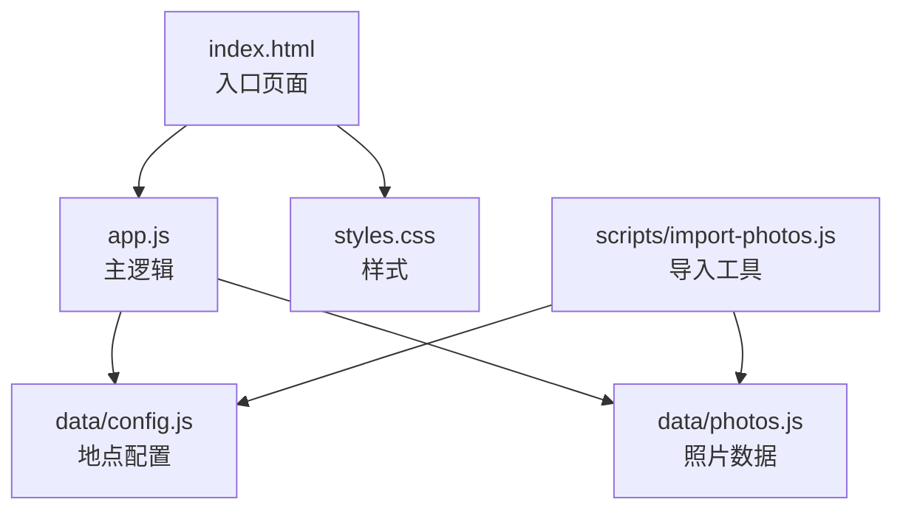
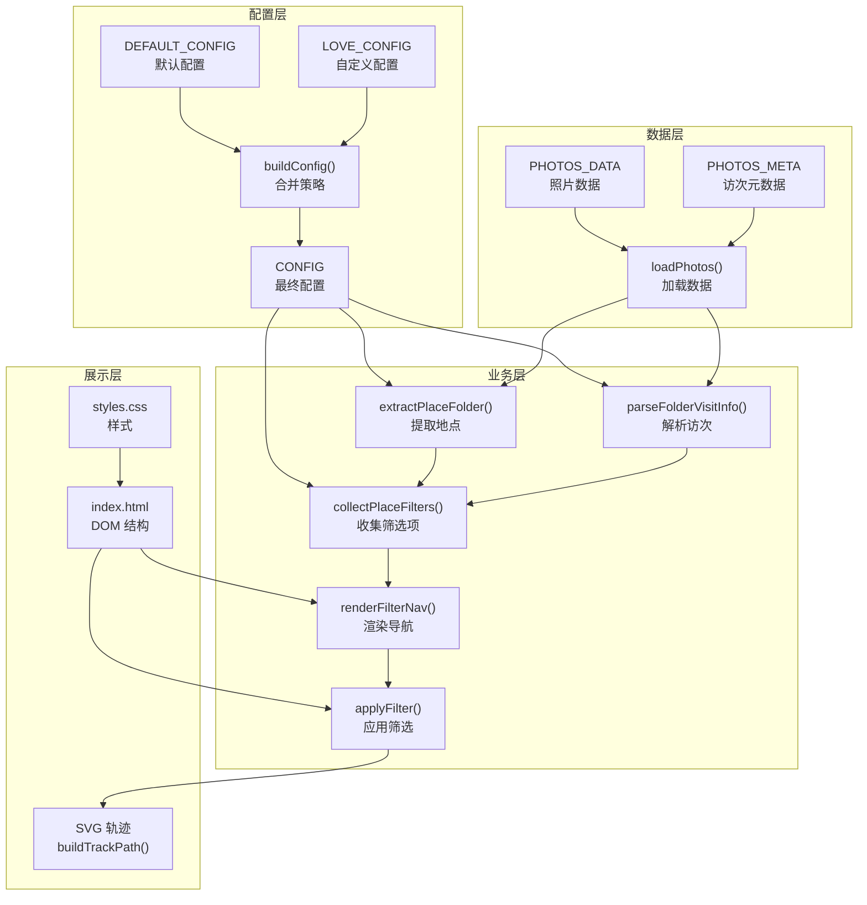
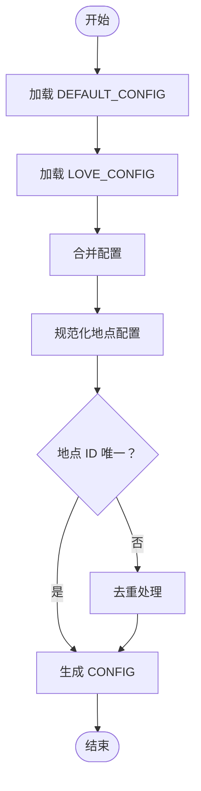
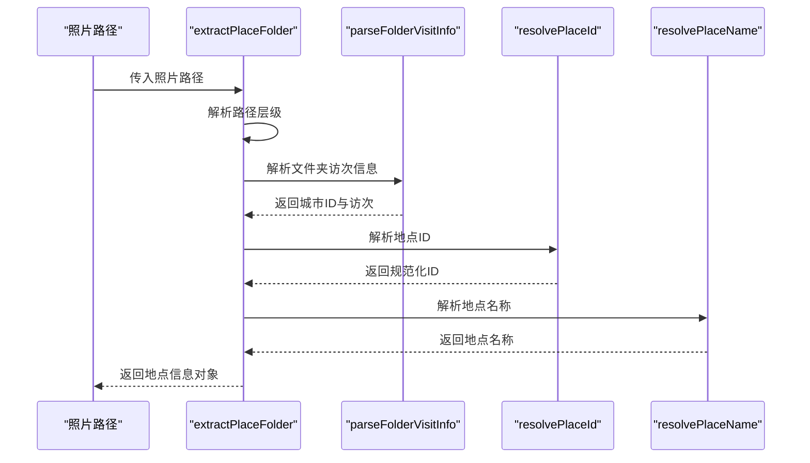
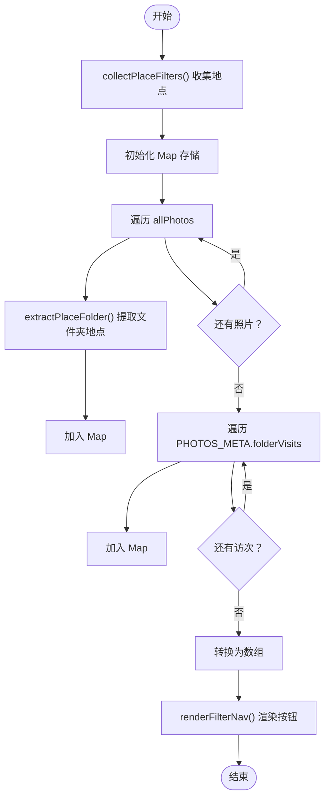
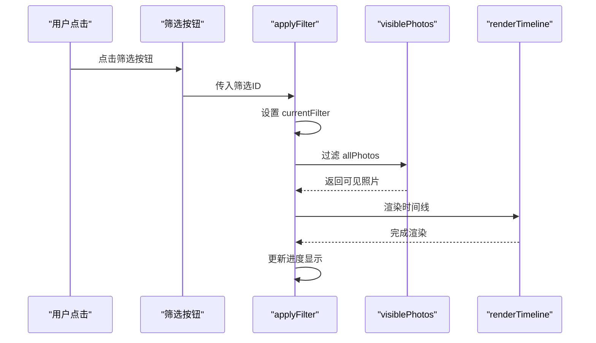
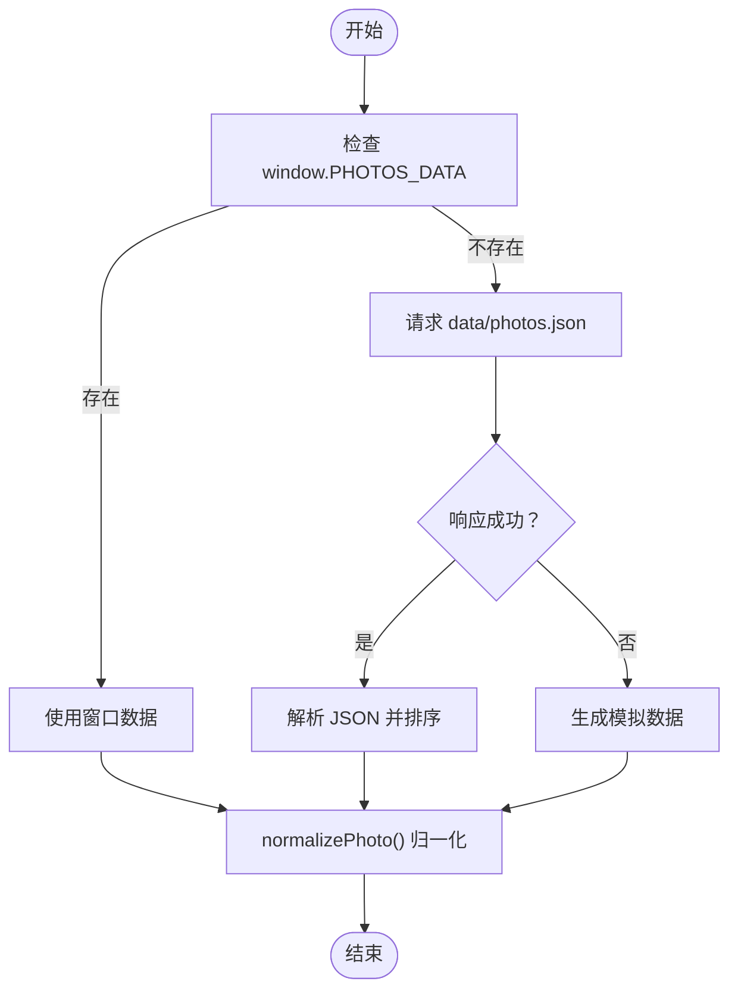
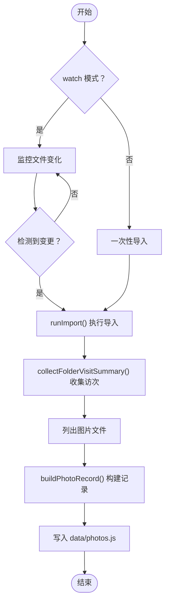
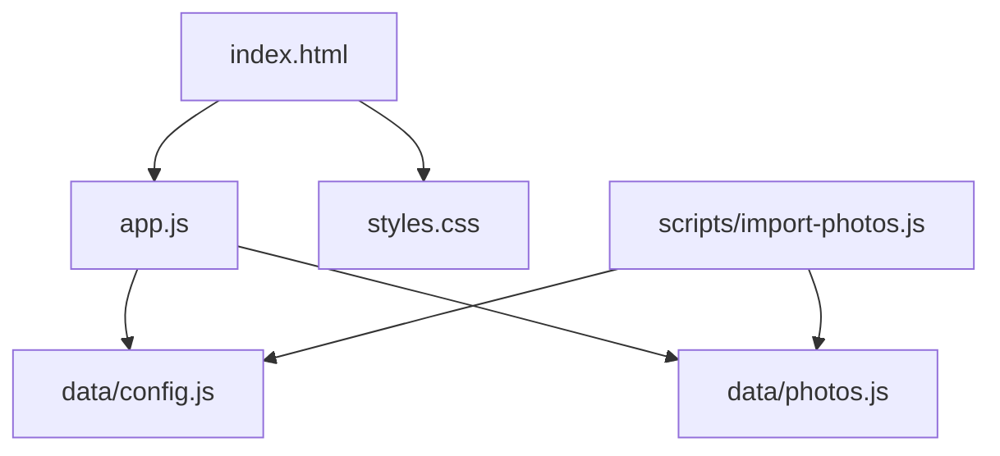

# 地点筛选系统

<cite>
**本文档引用的文件**
- [app.js](file://app.js)
- [config.js](file://data/config.js)
- [photos.js](file://data/photos.js)
- [index.html](file://index.html)
- [styles.css](file://styles.css)
- [import-photos.js](file://scripts/import-photos.js)
- [README.md](file://README.md)
</cite>

## 目录
1. [简介](#简介)
2. [项目结构](#项目结构)
3. [核心组件](#核心组件)
4. [架构总览](#架构总览)
5. [详细组件分析](#详细组件分析)
6. [依赖关系分析](#依赖关系分析)
7. [性能考虑](#性能考虑)
8. [故障排除指南](#故障排除指南)
9. [结论](#结论)
10. [附录](#附录)

## 简介
本系统是一个基于 Web 的恋爱纪念站，采用“液态玻璃”风格界面，通过时间轴展示照片流。其核心功能包括：
- 地点配置管理：通过 CONFIG 对象统一管理地点配置，支持默认配置与自定义配置的合并策略
- 智能分类：从照片路径中提取地点信息，解析访次信息，支持文件夹命名约定
- 动态筛选导航：根据照片数据动态生成筛选按钮，支持全量与按地点筛选
- 筛选应用与 UI 更新：实时应用筛选并更新时间线布局与进度显示

系统还提供了自动导入工具，可从本地照片目录自动生成数据文件，简化了数据接入流程。

## 项目结构
项目采用前端单页应用架构，主要文件组织如下：
- 根目录：入口页面 index.html、主逻辑 app.js、样式 styles.css
- 数据目录 data：配置文件 config.js、照片数据 photos.js、备用 JSON 数据 photos.json
- 脚本目录 scripts：照片导入工具 import-photos.js
- 文档：README.md

**图表来源**
- [index.html:1-140](file://index.html#L1-L140)
- [app.js:1-690](file://app.js#L1-L690)
- [config.js:1-27](file://data/config.js#L1-L27)
- [photos.js:1-315](file://data/photos.js#L1-L315)
- [import-photos.js:1-552](file://scripts/import-photos.js#L1-L552)

**章节来源**
- [index.html:1-140](file://index.html#L1-L140)
- [app.js:1-690](file://app.js#L1-L690)

## 核心组件
本系统的核心组件围绕 CONFIG 对象、地点提取与解析、筛选导航生成与应用展开。以下是对这些组件的深入分析。

**章节来源**
- [app.js:1-12](file://app.js#L1-L12)
- [app.js:14-16](file://app.js#L14-L16)
- [app.js:619-635](file://app.js#L619-L635)
- [app.js:206-231](file://app.js#L206-L231)
- [app.js:233-246](file://app.js#L233-L246)
- [app.js:156-176](file://app.js#L156-L176)
- [app.js:178-204](file://app.js#L178-L204)
- [app.js:331-335](file://app.js#L331-L335)

## 架构总览
系统采用“配置驱动 + 数据驱动”的架构模式：
- 配置层：通过 DEFAULT_CONFIG 与自定义 LOVE_CONFIG 合并生成 CONFIG
- 数据层：从 window.PHOTOS_DATA 或网络接口加载照片数据
- 业务层：地点提取与解析、筛选导航生成、筛选应用与 UI 更新
- 展示层：HTML 结构、CSS 样式、SVG 轨迹绘制

**图表来源**
- [app.js:1-12](file://app.js#L1-L12)
- [app.js:14-16](file://app.js#L14-L16)
- [app.js:619-635](file://app.js#L619-L635)
- [app.js:91-105](file://app.js#L91-L105)
- [app.js:206-231](file://app.js#L206-L231)
- [app.js:233-246](file://app.js#L233-L246)
- [app.js:178-204](file://app.js#L178-L204)
- [app.js:156-176](file://app.js#L156-L176)
- [app.js:331-335](file://app.js#L331-L335)
- [index.html:1-140](file://index.html#L1-L140)
- [styles.css:1-899](file://styles.css#L1-L899)

## 详细组件分析

### CONFIG 对象构建与合并策略
CONFIG 对象是系统配置的核心，负责统一管理地点配置与全局参数。其构建过程如下：
- 默认配置 DEFAULT_CONFIG 提供基础参数与地点列表
- 自定义配置 LOVE_CONFIG 可覆盖默认配置
- buildConfig 函数执行合并策略，确保地点配置的唯一性与规范化

**图表来源**
- [app.js:1-12](file://app.js#L1-L12)
- [app.js:14-16](file://app.js#L14-L16)
- [app.js:619-635](file://app.js#L619-L635)
- [app.js:637-652](file://app.js#L637-L652)

**章节来源**
- [app.js:1-12](file://app.js#L1-L12)
- [app.js:14-16](file://app.js#L14-L16)
- [app.js:619-635](file://app.js#L619-L635)
- [app.js:637-652](file://app.js#L637-L652)

### 智能分类逻辑：extractPlaceFolder 与 parseFolderVisitInfo
系统通过文件夹命名约定自动识别地点与访次信息：
- extractPlaceFolder：从照片路径中提取地点信息，解析访次编号
- parseFolderVisitInfo：解析文件夹名称中的城市标识与访次编号

**图表来源**
- [app.js:206-231](file://app.js#L206-L231)
- [app.js:233-246](file://app.js#L233-L246)
- [app.js:604-617](file://app.js#L604-L617)

**章节来源**
- [app.js:206-231](file://app.js#L206-L231)
- [app.js:233-246](file://app.js#L233-L246)
- [app.js:604-617](file://app.js#L604-L617)

### 筛选导航的动态生成：renderFilterNav 与 collectPlaceFilters
系统根据照片数据动态生成筛选导航：
- collectPlaceFilters：遍历照片与访次元数据，收集所有地点并去重
- renderFilterNav：根据收集的地点生成筛选按钮，设置当前激活状态

**图表来源**
- [app.js:178-204](file://app.js#L178-L204)
- [app.js:156-176](file://app.js#L156-L176)

**章节来源**
- [app.js:178-204](file://app.js#L178-L204)
- [app.js:156-176](file://app.js#L156-L176)

### applyFilter 的筛选逻辑与 UI 状态更新
筛选应用过程包括：
- 设置当前筛选值
- 过滤可见照片集合
- 重新渲染时间线
- 更新进度显示

**图表来源**
- [app.js:331-335](file://app.js#L331-L335)
- [app.js:337-376](file://app.js#L337-L376)

**章节来源**
- [app.js:331-335](file://app.js#L331-L335)
- [app.js:337-376](file://app.js#L337-L376)

### 数据加载与照片归一化
系统支持从多种数据源加载照片数据，并进行统一归一化处理：
- 优先使用 window.PHOTOS_DATA
- 其次尝试从 data/photos.json 加载
- 最后生成模拟数据作为兜底

**图表来源**
- [app.js:91-105](file://app.js#L91-L105)
- [app.js:107-133](file://app.js#L107-L133)

**章节来源**
- [app.js:91-105](file://app.js#L91-L105)
- [app.js:107-133](file://app.js#L107-L133)

### 导入工具与数据生成
导入工具支持从本地照片目录自动生成数据文件：
- 监控文件变化（watch 模式）
- 解析文件夹访次信息
- 生成照片数据与访次元数据
- 输出到 data/photos.js

**图表来源**
- [import-photos.js:19-85](file://scripts/import-photos.js#L19-L85)
- [import-photos.js:359-398](file://scripts/import-photos.js#L359-L398)
- [import-photos.js:264-286](file://scripts/import-photos.js#L264-L286)

**章节来源**
- [import-photos.js:19-85](file://scripts/import-photos.js#L19-L85)
- [import-photos.js:359-398](file://scripts/import-photos.js#L359-L398)
- [import-photos.js:264-286](file://scripts/import-photos.js#L264-L286)

## 依赖关系分析
系统各模块之间的依赖关系清晰，遵循单一职责原则：
- app.js 依赖 data/config.js 与 data/photos.js
- index.html 依赖 app.js 与 styles.css
- import-photos.js 依赖 data/config.js 与本地文件系统

**图表来源**
- [app.js:1-690](file://app.js#L1-L690)
- [index.html:1-140](file://index.html#L1-L140)
- [config.js:1-27](file://data/config.js#L1-L27)
- [photos.js:1-315](file://data/photos.js#L1-L315)
- [import-photos.js:1-552](file://scripts/import-photos.js#L1-L552)

**章节来源**
- [app.js:1-690](file://app.js#L1-L690)
- [index.html:1-140](file://index.html#L1-L140)
- [config.js:1-27](file://data/config.js#L1-L27)
- [photos.js:1-315](file://data/photos.js#L1-L315)
- [import-photos.js:1-552](file://scripts/import-photos.js#L1-L552)

## 性能考虑
- 懒加载：使用 IntersectionObserver 实现图片懒加载，减少初始渲染压力
- 时间线布局：通过 SVG 轨迹与动态尺寸计算，优化长列表渲染性能
- 数据缓存：CONFIG 对象在初始化时构建一次，避免重复计算
- 访次统计：使用 Set 去重访次键，降低内存占用

[本节提供一般性指导，无需特定文件分析]

## 故障排除指南
常见问题与解决方案：
- 照片未显示：检查 data/photos.js 是否正确生成，确认路径与文件名符合约定
- 筛选无效：确认 CONFIG.places 中包含对应地点 ID，检查 normalizePlaceId 规范化结果
- 访次统计异常：验证文件夹命名是否符合 foshan1、foshan2 等约定
- 导入工具报错：检查 Node.js 版本与权限，确认 assets/photos 目录存在且可读

**章节来源**
- [README.md:1-87](file://README.md#L1-L87)
- [import-photos.js:1-552](file://scripts/import-photos.js#L1-L552)

## 结论
该地点筛选系统通过配置驱动与智能分类实现了高度可扩展的地点管理与筛选功能。其设计遵循单一职责与数据驱动原则，具备良好的可维护性与扩展性。通过合理的性能优化与错误处理机制，系统能够在大规模数据场景下保持流畅的用户体验。

[本节为总结性内容，无需特定文件分析]

## 附录

### 地点配置最佳实践
- 配置格式规范
  - 使用 id 与 name 字段，id 应为小写连字符形式
  - name 为中文显示名称
  - 支持字符串简写与对象配置两种形式
- 地点 ID 映射规则
  - normalizePlaceId 将输入标准化为小写连字符形式
  - resolvePlaceId 支持按 id 或 name 匹配
  - 未匹配时返回原始值或回退值
- 访次统计算法
  - normalizeVisitValue 将访次值规范化为正整数
  - visitKey 采用 "placeId#visit" 格式
  - 收集阶段使用 Set 去重，确保访次唯一性

**章节来源**
- [app.js:637-652](file://app.js#L637-L652)
- [app.js:604-617](file://app.js#L604-L617)
- [app.js:662-666](file://app.js#L662-L666)
- [app.js:283-324](file://app.js#L283-L324)

### 扩展新地点与自定义筛选行为
- 新增地点
  - 在 data/config.js 的 places 数组中添加新地点
  - 文件夹命名建议使用 city1、city2 等约定
  - 导入工具会自动识别并生成访次元数据
- 自定义筛选行为
  - 修改 navAllLabel 可调整“全部足迹”标签文本
  - 通过自定义 LOVE_CONFIG 覆盖默认配置
  - 如需扩展筛选维度，可在 collectPlaceFilters 中增加过滤条件

**章节来源**
- [README.md:12-29](file://README.md#L12-L29)
- [config.js:1-27](file://data/config.js#L1-L27)
- [app.js:156-176](file://app.js#L156-L176)