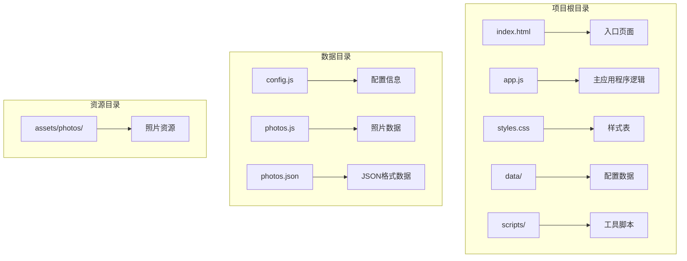
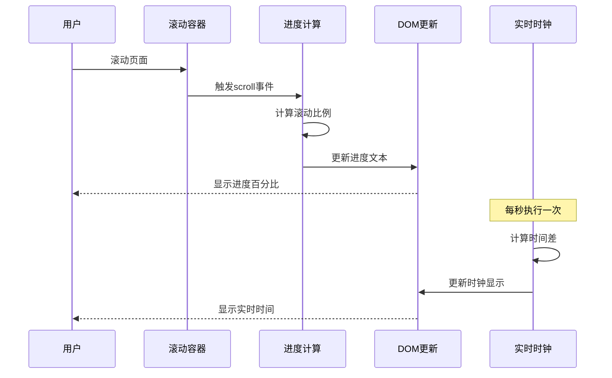
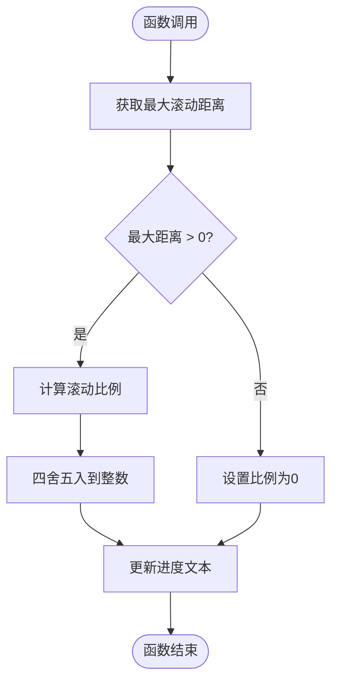
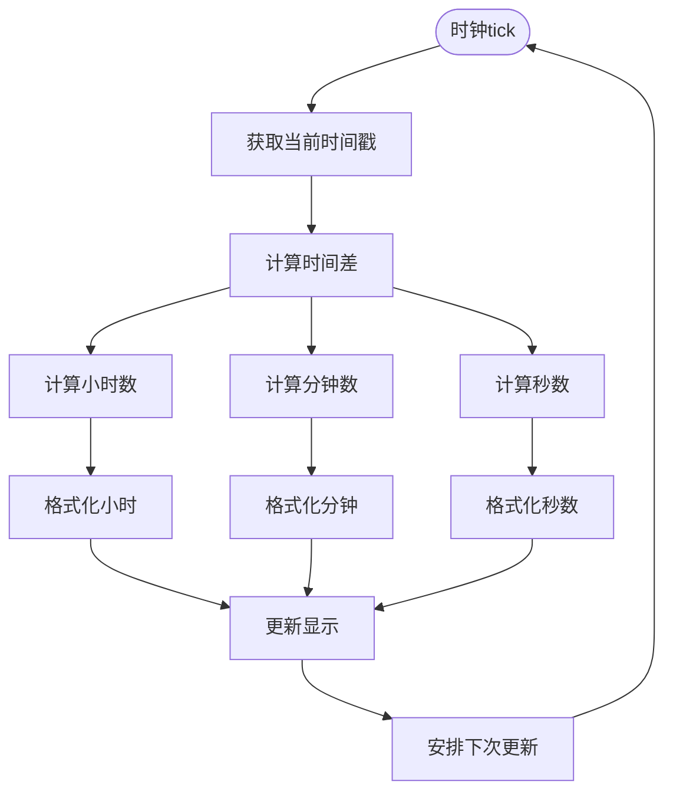
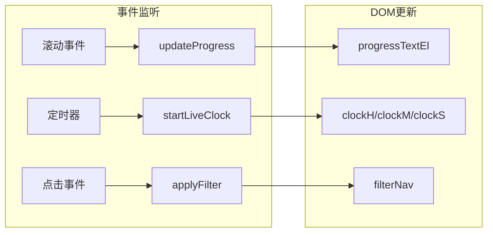
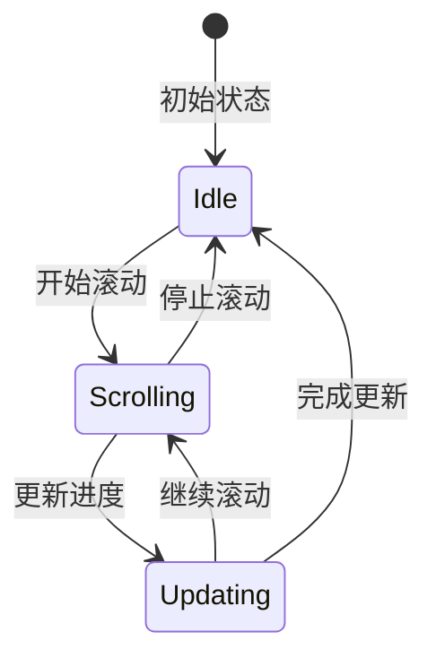
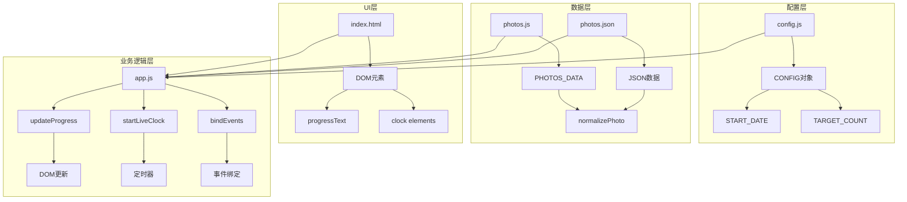
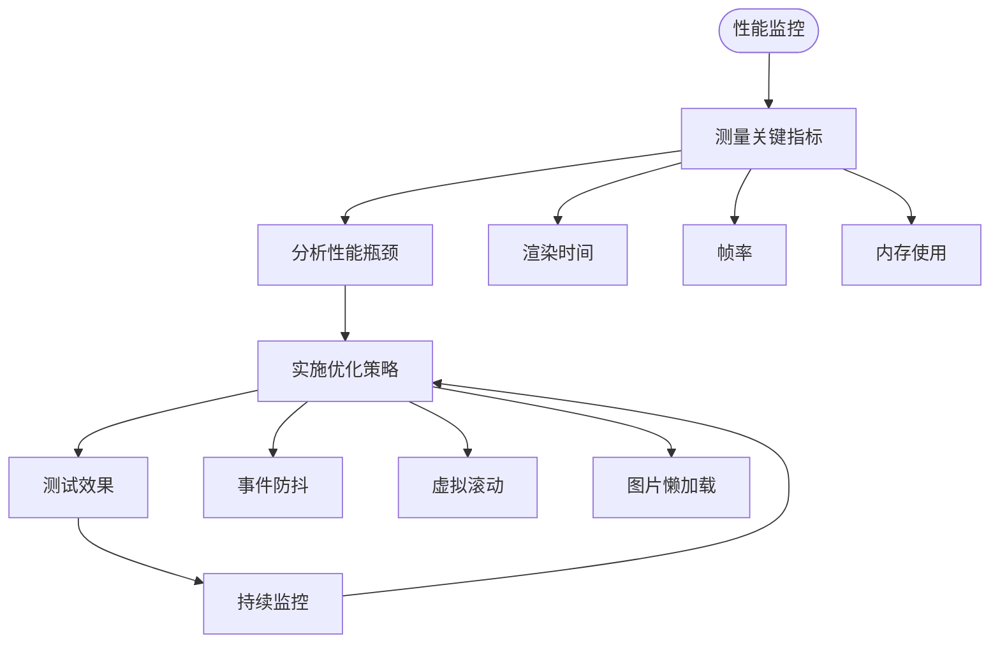

# 实时进度跟踪

<cite>
**本文档引用的文件**
- [app.js](file://app.js)
- [index.html](file://index.html)
- [styles.css](file://styles.css)
- [config.js](file://data/config.js)
- [photos.js](file://data/photos.js)
- [photos.json](file://data/photos.json)
</cite>

## 目录
1. [简介](#简介)
2. [项目结构](#项目结构)
3. [核心组件](#核心组件)
4. [架构概览](#架构概览)
5. [详细组件分析](#详细组件分析)
6. [依赖关系分析](#依赖关系分析)
7. [性能考虑](#性能考虑)
8. [故障排除指南](#故障排除指南)
9. [结论](#结论)

## 简介

实时进度跟踪功能是"我们的时间潮汐"项目中的一个核心特性，它提供了动态的滚动进度显示和实时时钟功能。该功能通过监听滚动事件来计算当前视口在时间轴上的位置，并以百分比形式显示进度。同时，系统还集成了实时时钟，显示从指定开始日期到现在的时间差。

该项目采用现代化的Web技术栈，使用原生JavaScript实现，无需任何外部依赖。界面采用苹果风格的液态玻璃设计，营造出优雅的视觉体验。

## 项目结构

项目采用清晰的模块化组织结构，主要文件分布如下：



**图表来源**
- [index.html:1-140](file://index.html#L1-L140)
- [app.js:1-690](file://app.js#L1-L690)

**章节来源**
- [index.html:1-140](file://index.html#L1-L140)
- [app.js:1-690](file://app.js#L1-L690)

## 核心组件

实时进度跟踪功能由以下核心组件构成：

### 进度显示组件
- **进度文本元素** (`#progressText`): 显示当前滚动进度百分比
- **滚动容器** (`#river`): 主要的横向滚动区域
- **进度计算函数** (`updateProgress`): 计算并更新进度显示

### 实时时钟组件
- **时钟元素** (`#clockH`, `#clockM`, `#clockS`): 分别显示小时、分钟、秒
- **时钟启动函数** (`startLiveClock`): 初始化并启动实时时钟
- **时间差计算** (`Date.now() - START_DATE.getTime()`): 计算时间差

### 数据管理组件
- **配置系统** (`CONFIG`, `START_DATE`, `TARGET_COUNT`): 应用程序配置
- **照片数据加载** (`loadPhotos`): 动态加载照片数据
- **进度统计** (`collectPlaceStats`): 收集地点统计数据

**章节来源**
- [app.js:540-602](file://app.js#L540-L602)
- [index.html:104-112](file://index.html#L104-L112)
- [config.js:1-27](file://data/config.js#L1-L27)

## 架构概览

系统的整体架构采用事件驱动的设计模式，通过DOM事件监听器响应用户交互：



**图表来源**
- [app.js:476](file://app.js#L476)
- [app.js:540-544](file://app.js#L540-L544)
- [app.js:588-602](file://app.js#L588-L602)

## 详细组件分析

### updateProgress 函数详解

`updateProgress` 函数是进度跟踪的核心算法实现：

#### 计算逻辑分析



**图表来源**
- [app.js:540-544](file://app.js#L540-L544)

#### 精确计算步骤

1. **最大滚动距离计算**：
   ```javascript
   const max = river.scrollWidth - river.clientWidth;
   ```
   - `scrollWidth`: 滚动内容的总宽度
   - `clientWidth`: 可见区域的宽度
   - 结果为可以滚动的最大距离

2. **滚动比例计算**：
   ```javascript
   const ratio = max > 0 ? river.scrollLeft / max : 0;
   ```
   - `scrollLeft`: 当前已滚动的距离
   - 防止除零错误，确保比例在0-1范围内

3. **百分比转换**：
   ```javascript
   Math.round(ratio * 100)
   ```
   - 将小数比例转换为整数百分比
   - 使用四舍五入确保显示精度

#### 性能优化策略

- **避免重复计算**：直接使用DOM属性值，减少额外的DOM查询
- **边界条件处理**：当容器为空或不可滚动时返回0%
- **数值稳定性**：使用`Math.round`确保显示结果的稳定性

**章节来源**
- [app.js:540-544](file://app.js#L540-L544)

### startLiveClock 函数详解

`startLiveClock` 函数实现了精确的实时时钟功能：

#### 时间差计算逻辑



**图表来源**
- [app.js:588-602](file://app.js#L588-L602)

#### 数字格式化实现

时钟采用两位数格式化，使用`padStart(2, "0")`确保数字显示的一致性：

- **小时计算**：`(totalSecs % 86400) / 3600`
- **分钟计算**：`(totalSecs % 3600) / 60`
- **秒计算**：`totalSecs % 60`

#### 实时更新机制

- **初始调用**：立即执行一次以避免首帧延迟
- **定时更新**：每1000毫秒（1秒）更新一次
- **持续运行**：使用`setInterval`确保时钟持续运行

**章节来源**
- [app.js:588-602](file://app.js#L588-L602)

### 事件监听和DOM更新策略

#### 事件绑定机制

系统采用事件委托和直接绑定相结合的方式：



**图表来源**
- [app.js:476](file://app.js#L476)
- [app.js:462-490](file://app.js#L462-L490)

#### DOM更新优化

- **最小化DOM操作**：只更新必要的元素
- **批量更新**：在单个事件循环内完成所有DOM操作
- **防抖处理**：避免过于频繁的DOM更新

**章节来源**
- [app.js:462-490](file://app.js#L462-L490)

### 进度文本显示逻辑

进度文本的显示采用了简洁直观的设计理念：

#### 显示格式规范

- **单位**：百分比符号（%）
- **精度**：整数百分比（不显示小数部分）
- **更新时机**：每次滚动事件触发时更新

#### 用户反馈设计



**图表来源**
- [app.js:540-544](file://app.js#L540-L544)

#### 视觉设计特点

- **位置**：固定在右上角，不影响主要内容
- **透明度**：半透明背景，保持内容可见性
- **字体**：使用等宽字体，便于快速识别

**章节来源**
- [index.html:104-112](file://index.html#L104-L112)
- [styles.css:463-473](file://styles.css#L463-L473)

## 依赖关系分析

### 核心依赖关系



**图表来源**
- [config.js:1-27](file://data/config.js#L1-L27)
- [photos.js:1-315](file://data/photos.js#L1-L315)
- [index.html:1-140](file://index.html#L1-L140)
- [app.js:1-690](file://app.js#L1-L690)

### 数据流分析

系统采用单向数据流设计，确保数据的一致性和可预测性：

1. **配置加载**：从config.js加载用户配置
2. **数据获取**：从photos.js或photos.json获取照片数据
3. **DOM渲染**：根据数据渲染UI元素
4. **事件处理**：响应用户交互事件
5. **状态更新**：更新相应的DOM元素

**章节来源**
- [app.js:14-16](file://app.js#L14-L16)
- [app.js:71-89](file://app.js#L71-L89)

## 性能考虑

### 高频更新优化策略

#### 1. 事件节流和防抖

对于滚动事件，虽然浏览器已经内置了节流机制，但仍需注意：

- **避免昂贵操作**：在updateProgress中只进行必要的计算
- **缓存DOM查询**：将常用的DOM元素存储在变量中
- **批量更新**：在单个事件循环内完成所有DOM操作

#### 2. 内存管理

- **定时器清理**：确保不再需要时清除setInterval
- **事件监听器移除**：在适当时候移除不需要的事件监听器
- **图片懒加载**：使用IntersectionObserver实现智能懒加载

#### 3. 渲染优化

- **CSS硬件加速**：利用transform和opacity属性触发GPU加速
- **减少重排重绘**：批量修改样式属性
- **虚拟滚动**：对于大量数据，考虑实现虚拟滚动

### 性能监控建议



## 故障排除指南

### 常见问题及解决方案

#### 1. 进度条不显示或显示异常

**可能原因**：
- DOM元素未正确加载
- 滚动容器高度为0
- JavaScript执行顺序问题

**解决方法**：
- 确保在DOM完全加载后再初始化
- 检查CSS样式是否影响了元素尺寸
- 验证元素选择器的正确性

#### 2. 时钟显示错误

**可能原因**：
- 时间计算错误
- 格式化问题
- 定时器冲突

**解决方法**：
- 验证START_DATE配置的正确性
- 检查padStart方法的兼容性
- 确保只有一个时钟实例运行

#### 3. 性能问题

**可能原因**：
- 频繁的DOM操作
- 大量的事件监听器
- 图片加载阻塞

**解决方法**：
- 实施事件节流
- 优化DOM操作批次
- 使用IntersectionObserver替代传统监听器

**章节来源**
- [app.js:540-544](file://app.js#L540-L544)
- [app.js:588-602](file://app.js#L588-L602)

## 结论

实时进度跟踪功能通过简洁高效的算法实现了精确的滚动进度计算和实时时间显示。该功能展现了现代Web开发的最佳实践，包括：

1. **算法简洁性**：使用基础的数学运算实现复杂的UI效果
2. **性能优化**：通过事件节流和DOM优化确保流畅的用户体验
3. **可维护性**：清晰的代码结构和注释便于后续维护
4. **用户体验**：直观的进度显示和实时反馈提升用户参与度

该实现为类似的进度跟踪需求提供了优秀的参考模板，可以在保持性能的同时提供丰富的用户交互体验。