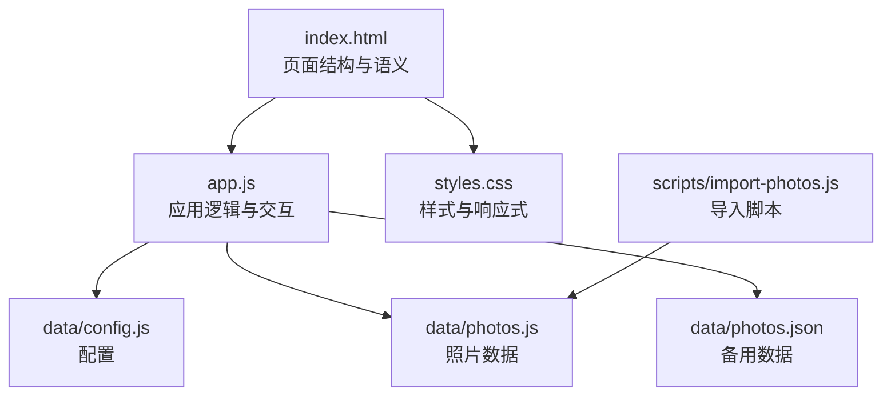
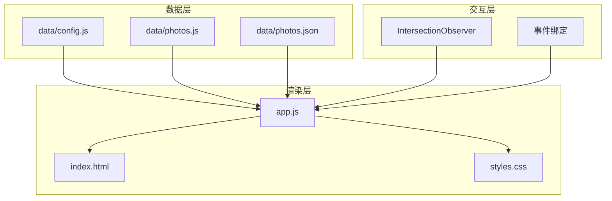
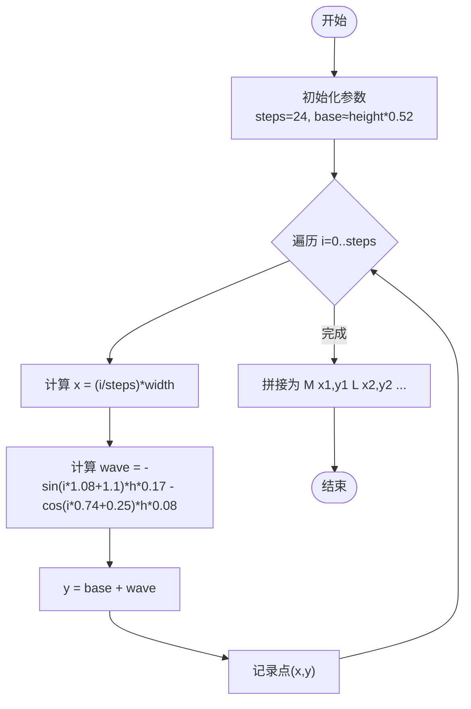
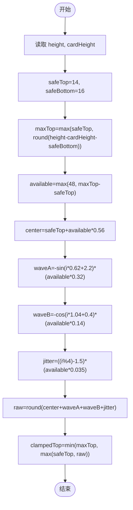
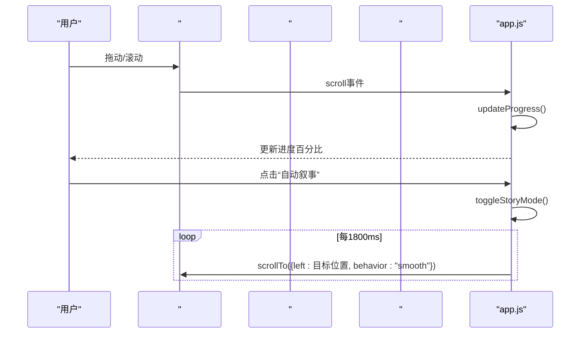
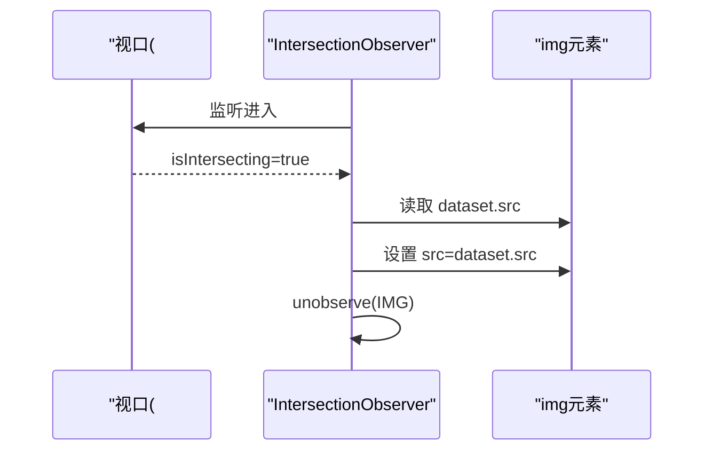
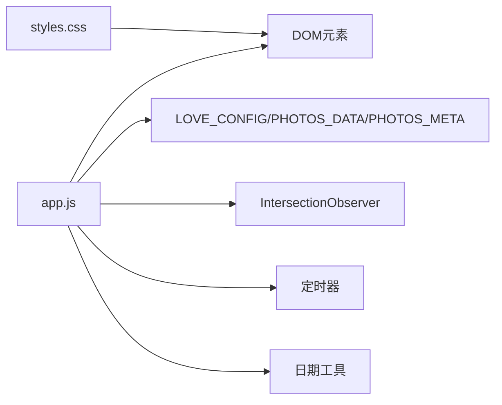

# 时间潮汐浏览

<cite>
**本文档引用的文件**
- [index.html](file://index.html)
- [app.js](file://app.js)
- [styles.css](file://styles.css)
- [data/config.js](file://data/config.js)
- [data/photos.js](file://data/photos.js)
- [data/photos.json](file://data/photos.json)
- [scripts/import-photos.js](file://scripts/import-photos.js)
</cite>

## 目录
1. [简介](#简介)
2. [项目结构](#项目结构)
3. [核心组件](#核心组件)
4. [架构总览](#架构总览)
5. [详细组件分析](#详细组件分析)
6. [依赖关系分析](#依赖关系分析)
7. [性能考量](#性能考量)
8. [故障排查指南](#故障排查指南)
9. [结论](#结论)
10. [附录](#附录)

## 简介
本项目实现了一个“时间潮汐”横向浏览体验，将500张照片按照时间顺序与地点分布，通过液态玻璃风格的SVG波浪轨迹进行可视化排列。用户可以横向滑动浏览，自动叙事模式可自动播放，支持城市筛选、精选轮播、随机时空对照等功能。本文档深入解析横向滚动体验的实现原理，包括SVG路径绘制算法与波浪形轨迹生成；详解卡片布局算法，包括computeX与computeY函数的数学计算逻辑及卡片在时间轴上的动态定位机制；阐述懒加载机制（Intersection Observer）与图片预加载策略；说明响应式设计如何适配不同屏幕尺寸（卡片尺寸估算与高度计算）；并提供性能优化建议与移动端适配方案。

## 项目结构
项目采用前端三件套组织：HTML页面负责结构与语义，CSS负责视觉与响应式，JavaScript负责交互与数据处理。数据层通过配置文件与照片数据文件提供城市与照片元数据，脚本工具负责从本地资源目录导入照片并生成数据文件。

图表来源
- [index.html:1-140](file://index.html#L1-L140)
- [app.js:1-120](file://app.js#L1-L120)
- [styles.css:1-120](file://styles.css#L1-L120)
- [data/config.js:1-27](file://data/config.js#L1-L27)
- [data/photos.js:1-315](file://data/photos.js#L1-L315)
- [data/photos.json:1-67](file://data/photos.json#L1-L67)
- [scripts/import-photos.js:137-188](file://scripts/import-photos.js#L137-L188)

章节来源
- [index.html:1-140](file://index.html#L1-L140)
- [app.js:1-120](file://app.js#L1-L120)
- [styles.css:1-120](file://styles.css#L1-L120)

## 核心组件
- 时间轴容器与SVG轨迹
  - 容器元素：#river（横向滚动区域），#track（SVG轨迹），#cardLayer（卡片层）
  - 轨迹绘制：buildTrackPath(width, height) 基于正弦/余弦波生成平滑曲线
  - 卡片定位：computeX(index,total,width) 计算横向位置，computeY(index,height,cardHeight) 计算纵向位置
- 懒加载与预加载
  - 使用 IntersectionObserver 观察卡片中的图片，进入视口时才设置真实 src
  - 图片属性：loading="lazy"、decoding="async"
- 响应式设计
  - 使用 clamp()、aspect-ratio、scroll-snap 等现代CSS特性
  - 针对不同断点调整宽度、高度与网格布局
- 自动叙事与进度反馈
  - toggleStoryMode() 自动滚动至不同百分比位置
  - updateProgress() 实时显示滚动进度百分比

章节来源
- [app.js:337-376](file://app.js#L337-L376)
- [app.js:378-394](file://app.js#L378-L394)
- [app.js:396-418](file://app.js#L396-L418)
- [app.js:41-51](file://app.js#L41-L51)
- [styles.css:475-553](file://styles.css#L475-L553)

## 架构总览
整体架构由“数据层-渲染层-交互层”组成：
- 数据层：配置与照片数据（config.js、photos.js、photos.json）
- 渲染层：HTML结构（index.html）、SVG轨迹与卡片布局（app.js）、样式（styles.css）
- 交互层：事件绑定、自动叙事、懒加载、筛选与模态框

图表来源
- [data/config.js:1-27](file://data/config.js#L1-L27)
- [data/photos.js:1-315](file://data/photos.js#L1-L315)
- [data/photos.json:1-67](file://data/photos.json#L1-L67)
- [index.html:1-140](file://index.html#L1-L140)
- [styles.css:1-120](file://styles.css#L1-L120)
- [app.js:1-120](file://app.js#L1-L120)

## 详细组件分析

### SVG轨迹绘制与波浪形轨迹生成
- 轨迹生成算法
  - 步数steps=24，沿X方向均匀采样，Y方向叠加两个不同频率与振幅的正弦/余弦波，形成“先向下趋势再更强更短波长”的波浪效果
  - 基线base位于画布垂直中心附近，确保卡片在波峰与波谷之间自然起伏
- 关键实现位置
  - 轨迹路径构建：buildTrackPath(width, height)
  - 轨迹渲染：renderTimeline中设置SVG viewBox 与 path d 属性
- 数学要点
  - X坐标线性插值：x = (i/steps) * width
  - Y坐标叠加波形：wave = -sin(i*1.08+1.1)*height*0.17 - cos(i*0.74+0.25)*height*0.08
  - 最终Y = base + wave，base≈height*0.52

图表来源
- [app.js:378-394](file://app.js#L378-L394)

章节来源
- [app.js:378-394](file://app.js#L378-L394)
- [app.js:337-376](file://app.js#L337-L376)

### 卡片布局算法：computeX 与 computeY 的数学逻辑
- computeX：等间距横向定位
  - 公式：padding + (index/(total-1)) * (width - padding*2)，其中padding=80px
  - 当total<=1时返回固定左边界，避免除零
- computeY：纵向安全带内波动定位
  - 安全上边距safeTop=14px，安全下边距safeBottom=16px
  - 可用空间available=max(48, maxTop - safeTop)，maxTop=min(高度-卡片高-安全底, 高度-安全顶)
  - 中心线center=safeTop + available*0.56
  - 波动A=-sin(index*0.62+2.2)*(available*0.32)，波动B=-cos(index*1.04+0.4)*(available*0.14)
  - 随机抖动jitter=((index%4)-1.5)*(available*0.035)
  - 最终top=min(maxTop, max(safeTop, round(center+A+B+jitter)))
- 卡片尺寸估算
  - estimateCardHeight()：cardWidth=clamp(120, window.innerWidth*0.09, 168)，cardHeight=round(cardWidth*4/3)
  - CSS中也使用了clamp与aspect-ratio保证比例与缩放

图表来源
- [app.js:403-418](file://app.js#L403-L418)
- [app.js:420-423](file://app.js#L420-L423)
- [styles.css:515-517](file://styles.css#L515-L517)

章节来源
- [app.js:396-418](file://app.js#L396-L418)
- [app.js:420-423](file://app.js#L420-L423)
- [styles.css:515-517](file://styles.css#L515-L517)

### 横向滚动与动态定位机制
- 总宽度计算：renderTimeline中根据照片数量与常量步长计算总宽度，最小4200px
- 卡片创建：为每张照片创建按钮元素，设置绝对定位的left/top
- 滚动事件：绑定到#river的scroll事件，实时更新进度百分比
- 自动叙事：toggleStoryMode()按固定步数平滑滚动到目标位置

图表来源
- [app.js:476-538](file://app.js#L476-L538)
- [app.js:540-544](file://app.js#L540-L544)

章节来源
- [app.js:337-376](file://app.js#L337-L376)
- [app.js:476-544](file://app.js#L476-L544)

### 懒加载机制与图片预加载策略
- Intersection Observer
  - 观察根容器#river，rootMargin为220px，进入视口时才设置img的真实src
  - 设置img.dataset.src为占位src，首次进入时替换为真实src并取消观察
- 图片属性优化
  - loading="lazy"、decoding="async" 提升首屏与滚动性能
- 预加载策略
  - 通过延迟加载减少初始渲染压力，结合自动叙事与滚动进度，逐步加载可见区域

图表来源
- [app.js:41-51](file://app.js#L41-L51)
- [app.js:350-372](file://app.js#L350-L372)

章节来源
- [app.js:41-51](file://app.js#L41-L51)
- [app.js:350-372](file://app.js#L350-L372)

### 响应式设计与移动端适配
- 布局与尺寸
  - clamp() 用于在不同视口宽度下限制卡片宽度与字体大小
  - aspect-ratio 固定卡片宽高比，保证视觉一致性
  - scroll-snap-type 与 scroll-snap-align 支持卡片对齐与滑动体验
- 断点适配
  - 920px断点：网格布局调整、轨迹宽度降低、对比区布局变化
  - 640px断点：高度降低、轨迹宽度进一步降低、对比面板单列布局、隐藏分割线
- 卡片尺寸估算
  - estimateCardHeight() 结合窗口宽度计算卡片宽度，再按4:3换算高度
  - CSS中同样使用clamp与aspect-ratio保障在小屏设备上的可读性与比例

章节来源
- [styles.css:475-553](file://styles.css#L475-L553)
- [styles.css:806-899](file://styles.css#L806-L899)
- [app.js:420-423](file://app.js#L420-L423)

### 数据与配置
- 配置项
  - startDate：起始日期，用于“在一起天数”计算
  - targetCount：期望照片数量（用于生成模拟数据）
  - places：城市列表，用于地点映射与筛选
- 照片数据
  - 优先使用PHOTOS_DATA（由photos.js注入），否则尝试加载photos.json，最后回退到生成模拟数据
  - normalizePhoto() 统一化字段（id、src、title、date、place、placeName、visit、visitKey）

章节来源
- [data/config.js:1-27](file://data/config.js#L1-L27)
- [data/photos.js:1-315](file://data/photos.js#L1-L315)
- [data/photos.json:1-67](file://data/photos.json#L1-L67)
- [app.js:91-105](file://app.js#L91-L105)
- [app.js:107-133](file://app.js#L107-L133)

## 依赖关系分析
- app.js 依赖
  - DOM元素：#river、#track、#cardLayer、#progressText、#filterNav、#compareBtn、#storyToggle、#photoModal 等
  - 数据：LOVE_CONFIG（来自data/config.js）、PHOTOS_DATA（来自data/photos.js）、PHOTOS_META（来自data/photos.js）
  - 工具：IntersectionObserver、定时器、日期工具函数
- 样式依赖
  - CSS类名与选择器与HTML结构强耦合（如.memory-card、.track、.card-layer）
  - 响应式断点与布局依赖媒体查询

图表来源
- [app.js:1-120](file://app.js#L1-L120)
- [styles.css:1-120](file://styles.css#L1-L120)

章节来源
- [app.js:1-120](file://app.js#L1-L120)
- [styles.css:1-120](file://styles.css#L1-L120)

## 性能考量
- 渲染性能
  - 仅在必要时重建SVG与卡片层，避免重复绘制
  - 使用requestAnimationFrame或合理节流（当前scroll事件直接更新，建议在高频滚动场景增加节流）
- 懒加载与内存
  - IntersectionObserver + lazy decoding 减少初始渲染与内存占用
  - 进入视口后立即取消观察，避免无意义的回调
- 动画与滚动
  - 自动叙事使用平滑滚动，建议在移动端禁用或降频
  - 滚动事件处理建议节流，避免频繁重排
- 图片优化
  - 使用合适的图片尺寸与格式，配合懒加载与解码异步
  - 对移动端可考虑更小的占位图或骨架屏

[本节为通用性能建议，不直接分析具体文件]

## 故障排查指南
- 照片未显示
  - 检查 IntersectionObserver 是否可用，确认#river存在且有滚动条
  - 确认图片的dataset.src是否正确传入，进入视口后是否被替换为真实src
- 轨迹不完整或卡片错位
  - 检查renderTimeline中totalWidth与track.width是否一致
  - 确认computeX与computeY的输入参数（index、total、width、height、cardHeight）
- 自动叙事无效
  - 检查toggleStoryMode中scrollWidth与clientWidth的差值是否大于0
  - 确认scrollTo的behavior与浏览器兼容性
- 响应式异常
  - 检查媒体查询断点与CSS类名是否匹配
  - 确认estimateCardHeight与CSS clamp/aspect-ratio的计算一致性

章节来源
- [app.js:41-51](file://app.js#L41-L51)
- [app.js:337-376](file://app.js#L337-L376)
- [app.js:396-418](file://app.js#L396-L418)
- [app.js:514-538](file://app.js#L514-L538)
- [styles.css:806-899](file://styles.css#L806-L899)

## 结论
本项目通过SVG波浪轨迹与卡片动态定位，实现了沉浸式的“时间潮汐”横向浏览体验。借助IntersectionObserver实现高效懒加载，结合响应式设计与现代CSS特性，确保在桌面与移动设备上均具备良好的可读性与交互流畅度。通过模块化的数据层与渲染层分离，系统具备良好的扩展性与可维护性。

[本节为总结性内容，不直接分析具体文件]

## 附录
- 代码示例路径（不展示具体代码，仅提供路径）
  - 轨迹构建：[buildTrackPath:378-394](file://app.js#L378-L394)
  - 卡片定位：[computeX:396-401](file://app.js#L396-L401)、[computeY:403-418](file://app.js#L403-L418)、[estimateCardHeight:420-423](file://app.js#L420-L423)
  - 滚动事件处理：[bindEvents:462-490](file://app.js#L462-L490)、[updateProgress:540-544](file://app.js#L540-L544)
  - 自动叙事：[toggleStoryMode:514-538](file://app.js#L514-L538)
  - 懒加载：[IntersectionObserver 初始化:41-51](file://app.js#L41-L51)、[图片懒加载触发:350-372](file://app.js#L350-L372)
  - 响应式断点：[920px断点:807-846](file://styles.css#L807-L846)、[640px断点:848-899](file://styles.css#L848-L899)