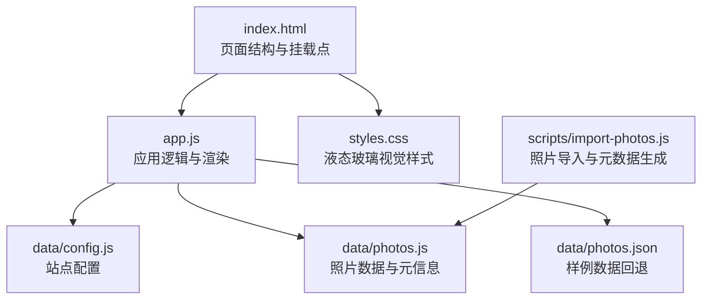
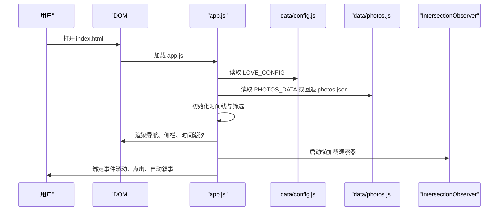
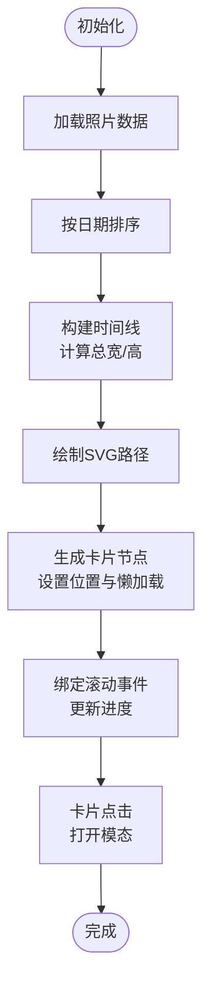
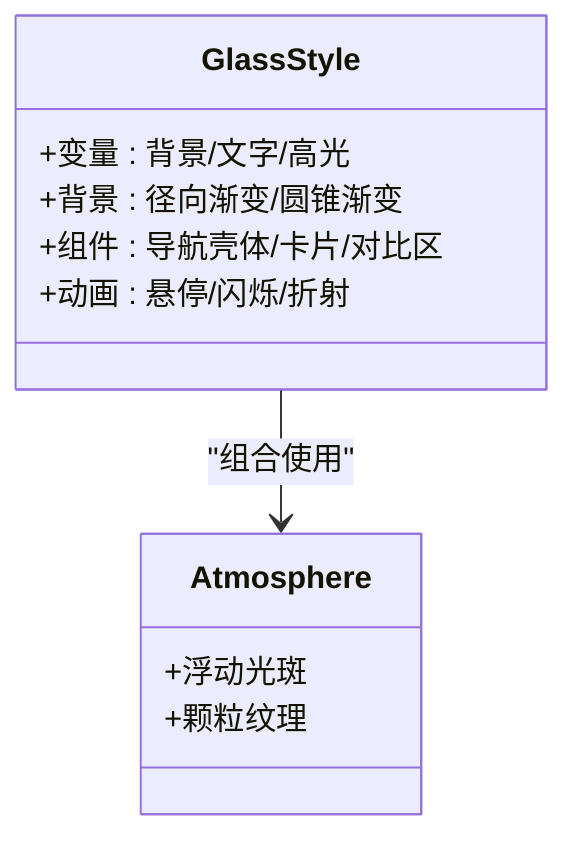
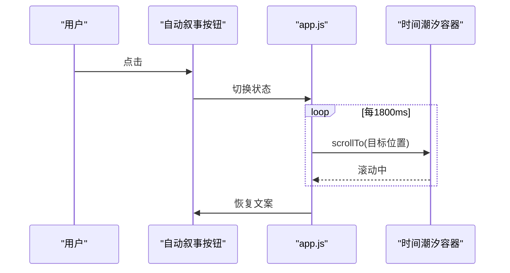
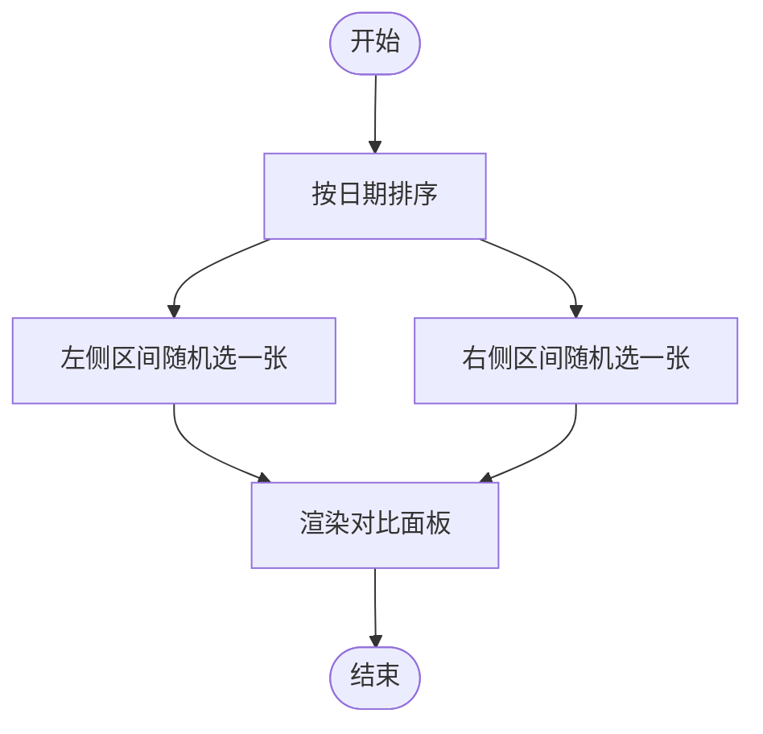
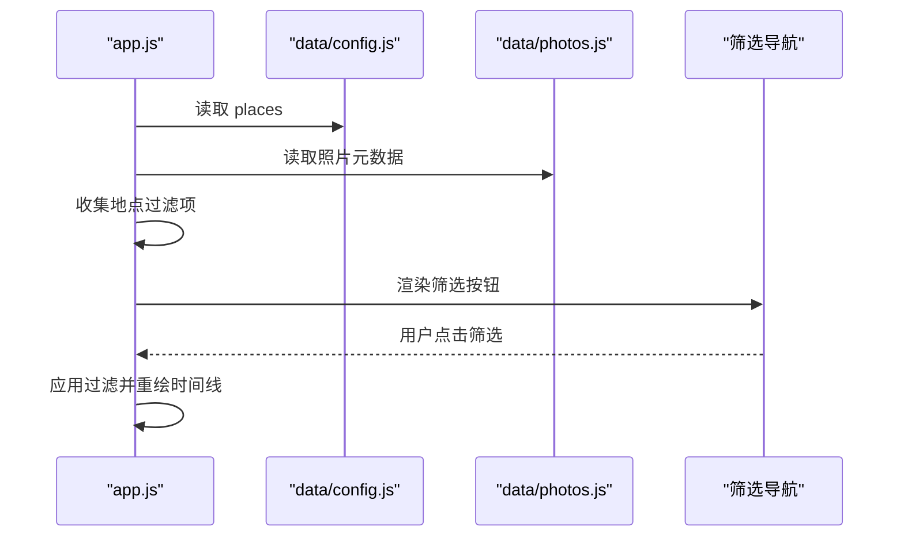
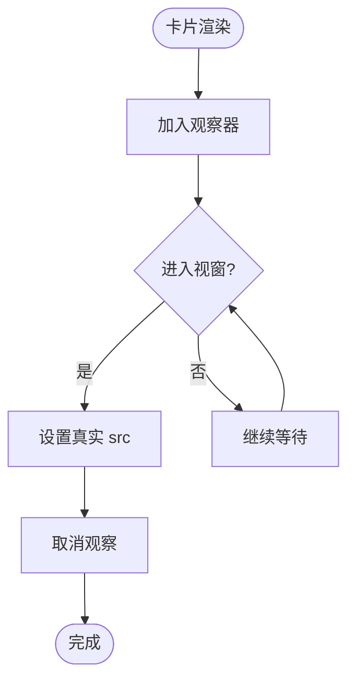
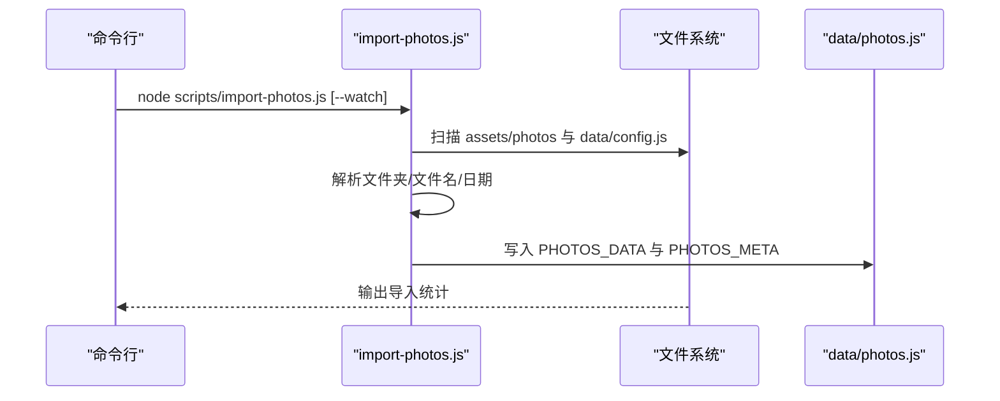
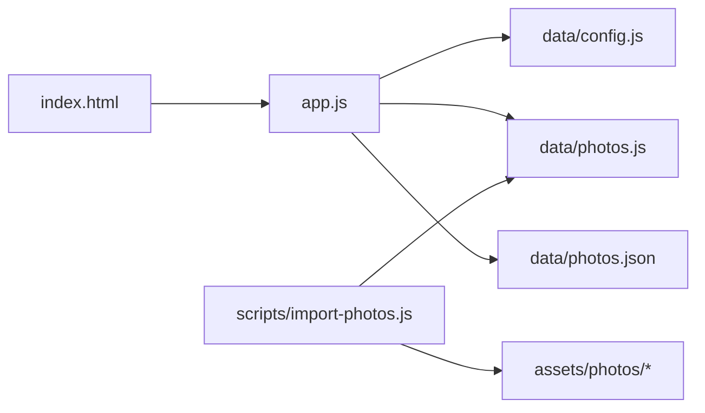

# 核心功能

<cite>
**本文引用的文件**
- [index.html](file://index.html)
- [app.js](file://app.js)
- [styles.css](file://styles.css)
- [data/config.js](file://data/config.js)
- [data/photos.js](file://data/photos.js)
- [data/photos.json](file://data/photos.json)
- [scripts/import-photos.js](file://scripts/import-photos.js)
- [README.md](file://README.md)
</cite>

## 目录
1. [简介](#简介)
2. [项目结构](#项目结构)
3. [核心组件](#核心组件)
4. [架构总览](#架构总览)
5. [详细组件分析](#详细组件分析)
6. [依赖关系分析](#依赖关系分析)
7. [性能考量](#性能考量)
8. [故障排查指南](#故障排查指南)
9. [结论](#结论)
10. [附录](#附录)

## 简介
恋爱纪念站是一个以“液态玻璃”风格呈现的个人纪念空间，围绕“时间潮汐”的横向叙事体验，提供自动叙事、随机时空对照、地点筛选、照片懒加载等核心能力。项目通过前端纯静态资源即可运行，支持一键导入照片并自动生成结构化数据，便于快速搭建属于自己的纪念站。

## 项目结构
项目采用“HTML + CSS + JS + 数据脚本”的轻量架构，核心入口为 index.html，逻辑集中在 app.js，样式集中在 styles.css；照片元数据由 data/photos.js 提供，可通过 scripts/import-photos.js 脚本从 assets/photos 目录批量导入生成。

图表来源
- [index.html:1-140](file://index.html#L1-L140)
- [app.js:1-690](file://app.js#L1-L690)
- [styles.css:1-899](file://styles.css#L1-L899)
- [data/config.js:1-27](file://data/config.js#L1-L27)
- [data/photos.js:1-315](file://data/photos.js#L1-L315)
- [data/photos.json:1-67](file://data/photos.json#L1-L67)
- [scripts/import-photos.js:1-552](file://scripts/import-photos.js#L1-L552)

章节来源
- [index.html:1-140](file://index.html#L1-L140)
- [README.md:1-87](file://README.md#L1-L87)

## 核心组件
- 时间潮汐浏览体验：基于 SVG 路径绘制的“记忆河道”，卡片沿波形路径横向排列，支持滚动进度显示与自动叙事。
- 液态玻璃界面设计：通过 backdrop-filter、渐变与阴影组合，营造通透、柔和的视觉氛围。
- 自动叙事模式：定时平滑滚动至下一个阶段，提供沉浸式浏览体验。
- 随机时空对照：按时间分布抽取两张相隔较远的照片进行对比展示。
- 地点筛选系统：根据配置与照片元数据动态生成筛选标签，支持全量与按城市过滤。
- 照片懒加载：基于 IntersectionObserver 的延迟加载，提升首屏性能与滚动流畅度。
- 照片导入与元数据生成：自动解析文件夹、文件名与日期，生成结构化数据与访次统计。

章节来源
- [app.js:71-89](file://app.js#L71-L89)
- [app.js:331-376](file://app.js#L331-L376)
- [app.js:425-442](file://app.js#L425-L442)
- [app.js:462-490](file://app.js#L462-L490)
- [app.js:41-51](file://app.js#L41-L51)
- [scripts/import-photos.js:29-85](file://scripts/import-photos.js#L29-L85)

## 架构总览
应用初始化流程：读取配置与照片数据，构建时间线，渲染筛选导航与侧栏摘要，绑定事件，启动自动叙事与懒加载观察器。

图表来源
- [index.html:135-137](file://index.html#L135-L137)
- [app.js:14-16](file://app.js#L14-L16)
- [app.js:71-89](file://app.js#L71-L89)
- [app.js:41-51](file://app.js#L41-L51)

## 详细组件分析

### 时间潮汐浏览体验
- 数据准备：从 window.PHOTOS_DATA 或回退到 data/photos.json 获取照片列表，并按日期排序。
- 时间线渲染：计算总宽度与高度，绘制 SVG 路径作为“河道”，卡片层承载记忆卡片。
- 布局算法：卡片 X 坐标按均匀分布计算，Y 坐标使用正弦/余弦叠加抖动，形成波浪起伏与轻微随机性。
- 进度反馈：滚动时计算百分比并在右上角显示。
- 交互行为：点击卡片弹出模态查看详情；滚动时更新进度文本。

图表来源
- [app.js:91-105](file://app.js#L91-L105)
- [app.js:337-376](file://app.js#L337-L376)
- [app.js:378-418](file://app.js#L378-L418)
- [app.js:540-544](file://app.js#L540-L544)
- [app.js:455-460](file://app.js#L455-L460)

章节来源
- [app.js:91-105](file://app.js#L91-L105)
- [app.js:337-376](file://app.js#L337-L376)
- [app.js:378-418](file://app.js#L378-L418)
- [app.js:540-544](file://app.js#L540-L544)
- [app.js:455-460](file://app.js#L455-L460)

### 液态玻璃界面设计
- 视觉基色与透明度：通过 CSS 变量定义背景、文字与高光色彩，配合半透明与模糊滤镜。
- 背景氛围：使用多个径向渐变与圆锥渐变叠加，营造柔和的背景光晕。
- 组件样式：导航壳体、卡片、对比区块均采用玻璃材质的渐变、描边与毛玻璃模糊。
- 动画与过渡：卡片悬停放大与阴影变化、时间进度闪烁、对比区块折射动画等，增强交互表现力。

图表来源
- [styles.css:1-15](file://styles.css#L1-L15)
- [styles.css:27-32](file://styles.css#L27-L32)
- [styles.css:53-127](file://styles.css#L53-L127)
- [styles.css:129-140](file://styles.css#L129-L140)
- [styles.css:555-626](file://styles.css#L555-L626)
- [styles.css:790-800](file://styles.css#L790-L800)

章节来源
- [styles.css:1-15](file://styles.css#L1-L15)
- [styles.css:27-32](file://styles.css#L27-L32)
- [styles.css:53-127](file://styles.css#L53-L127)
- [styles.css:129-140](file://styles.css#L129-L140)
- [styles.css:555-626](file://styles.css#L555-L626)
- [styles.css:790-800](file://styles.css#L790-L800)

### 自动叙事模式
- 触发方式：点击“自动叙事”按钮切换状态。
- 行为机制：分步滚动至时间轴末端，步长与间隔固定，结束后恢复按钮文案。
- 用户控制：可随时中断，按钮文案随状态切换。

图表来源
- [app.js:514-538](file://app.js#L514-L538)
- [index.html:30](file://index.html#L30)

章节来源
- [app.js:514-538](file://app.js#L514-L538)
- [index.html:30](file://index.html#L30)

### 随机时空对照
- 算法思路：先按时间排序，左侧取前 18% 区间内随机一张，右侧取后 28% 区间内随机一张，确保时间跨度较大。
- 视觉呈现：左右两张卡片并列展示，支持点击进入模态查看详情。
- 交互入口：点击“抽一组”按钮触发抽取与渲染。

图表来源
- [app.js:444-453](file://app.js#L444-L453)
- [app.js:425-442](file://app.js#L425-L442)
- [index.html:121](file://index.html#L121)

章节来源
- [app.js:444-453](file://app.js#L444-L453)
- [app.js:425-442](file://app.js#L425-L442)
- [index.html:121](file://index.html#L121)

### 地点筛选系统
- 动态配置：通过 data/config.js 的 places 数组驱动筛选标签生成。
- 元数据来源：优先使用 data/photos.js 中的 place 与 placeName，也可从文件夹名与访次推断。
- 交互设计：点击筛选标签切换当前过滤项，更新时间线与侧栏摘要。
- 计数统计：侧栏显示“城市足迹”数量与热门地点云。

图表来源
- [data/config.js:1-27](file://data/config.js#L1-L27)
- [data/photos.js:1-315](file://data/photos.js#L1-L315)
- [app.js:156-176](file://app.js#L156-L176)
- [app.js:331-335](file://app.js#L331-L335)
- [app.js:248-251](file://app.js#L248-L251)
- [app.js:272-281](file://app.js#L272-L281)

章节来源
- [data/config.js:1-27](file://data/config.js#L1-L27)
- [data/photos.js:1-315](file://data/photos.js#L1-L315)
- [app.js:156-176](file://app.js#L156-L176)
- [app.js:331-335](file://app.js#L331-L335)
- [app.js:248-251](file://app.js#L248-L251)
- [app.js:272-281](file://app.js#L272-L281)

### 照片懒加载机制
- 观察器：使用 IntersectionObserver，在滚动到卡片附近时才设置真实 src，减少初始资源消耗。
- 边界与性能：rootMargin 设置为 220px，避免卡片刚进入视窗即触发加载导致抖动。
- 降级策略：若未命中懒加载条件，仍可正常渲染占位图或回退数据。

图表来源
- [app.js:41-51](file://app.js#L41-L51)
- [app.js:357-362](file://app.js#L357-L362)

章节来源
- [app.js:41-51](file://app.js#L41-L51)
- [app.js:357-362](file://app.js#L357-L362)

### 照片导入与元数据生成
- 自动导入：扫描 assets/photos 下所有图片，按文件夹、文件名与日期推断 place、visit、title 等字段。
- 访次统计：根据文件夹尾号统计多次访问，生成 visitKeys 并汇总到 PHOTOS_META。
- 实时监听：支持 --watch 模式，新增/删除照片或修改配置时自动重建 data/photos.js。
- 回退机制：若无可用数据，页面会生成 mock 数据演示。

图表来源
- [scripts/import-photos.js:19-85](file://scripts/import-photos.js#L19-L85)
- [scripts/import-photos.js:87-135](file://scripts/import-photos.js#L87-L135)
- [scripts/import-photos.js:359-398](file://scripts/import-photos.js#L359-L398)
- [app.js:96-104](file://app.js#L96-L104)

章节来源
- [scripts/import-photos.js:19-85](file://scripts/import-photos.js#L19-L85)
- [scripts/import-photos.js:87-135](file://scripts/import-photos.js#L87-L135)
- [scripts/import-photos.js:359-398](file://scripts/import-photos.js#L359-L398)
- [app.js:96-104](file://app.js#L96-L104)

## 依赖关系分析
- app.js 依赖 data/config.js 与 data/photos.js；当 data/photos.js 不存在或为空时，回退到 data/photos.json。
- index.html 仅负责挂载与结构，样式与逻辑分别由 styles.css 与 app.js 提供。
- scripts/import-photos.js 与 assets/photos 目录存在强耦合，用于生成 data/photos.js。

图表来源
- [index.html:135-137](file://index.html#L135-L137)
- [app.js:14-16](file://app.js#L14-L16)
- [app.js:96-104](file://app.js#L96-L104)
- [scripts/import-photos.js:8-11](file://scripts/import-photos.js#L8-L11)

章节来源
- [index.html:135-137](file://index.html#L135-L137)
- [app.js:14-16](file://app.js#L14-L16)
- [app.js:96-104](file://app.js#L96-L104)
- [scripts/import-photos.js:8-11](file://scripts/import-photos.js#L8-L11)

## 性能考量
- 懒加载：IntersectionObserver 在滚动时按需加载图片，降低首屏资源压力。
- 时间线宽度：根据照片数量动态扩展，避免过宽导致布局抖动，同时限制最小宽度。
- 卡片尺寸：根据视口动态计算卡片宽高，保证在不同设备上的视觉一致性。
- 自动叙事：分步滚动与固定间隔，避免一次性大量滚动造成卡顿。
- 字体与动画：使用 CSS 动画与过渡，尽量避免 JS 高频操作 DOM。

章节来源
- [app.js:41-51](file://app.js#L41-L51)
- [app.js:340-348](file://app.js#L340-L348)
- [app.js:420-423](file://app.js#L420-L423)
- [app.js:523-537](file://app.js#L523-L537)
- [styles.css:790-800](file://styles.css#L790-L800)

## 故障排查指南
- 照片未显示或空白：确认 data/photos.js 是否生成成功；检查 assets/photos 目录是否存在图片；如无数据，页面会回退到 mock 数据。
- 筛选无效：确认 data/config.js 的 places 配置是否正确；检查照片的 place 字段是否匹配。
- 自动叙事不滚动：检查时间潮汐容器是否有足够宽度与内容；确认按钮状态与定时器是否被中断。
- 对比区块不出现：确认至少有两张照片；检查 pickTwoFarPhotos 的返回值。
- 懒加载不生效：确认 IntersectionObserver 是否可用；检查卡片是否正确加入观察器。

章节来源
- [app.js:96-104](file://app.js#L96-L104)
- [app.js:156-176](file://app.js#L156-L176)
- [app.js:514-538](file://app.js#L514-L538)
- [app.js:444-453](file://app.js#L444-L453)
- [app.js:41-51](file://app.js#L41-L51)

## 结论
恋爱纪念站通过“时间潮汐”的横向叙事与“液态玻璃”的视觉语言，将 500 张照片转化为一段可游走的记忆河流。自动叙事、随机时空对照、地点筛选与懒加载等特性协同工作，既保证了沉浸式体验，又兼顾了性能与可维护性。借助导入脚本，用户可以轻松接入自有照片并持续更新。

## 附录
- 使用示例与最佳实践
  - 配置起始日期：在 data/config.js 中设置 startDate，用于“在一起天数”计算。
  - 新增地点：在 places 中追加城市项，无需改动 HTML 或 JS。
  - 照片命名规范：建议使用 YYYY-MM-DD 前缀与 cityN 文件夹，便于自动识别。
  - 性能建议：控制单图尺寸与格式，优先 WebP/AVIF；封面图保持统一比例。
- 开发者扩展指南
  - 新增配置项：在 data/config.js 中添加字段，通过 buildConfig 合并默认值。
  - 自定义时间线：调整 buildTrackPath 的参数与 computeY 的波形函数，改变河道形态。
  - 定制对比算法：修改 pickTwoFarPhotos 的区间比例，平衡“距离感”与“代表性”。
  - 扩展筛选维度：在 collectPlaceFilters 与 collectPlaceStats 中增加新的统计维度。
  - 自定义导入规则：在 scripts/import-photos.js 中扩展 inferDate/inferTitle/detectPlace 等函数。

章节来源
- [README.md:8-87](file://README.md#L8-L87)
- [data/config.js:1-27](file://data/config.js#L1-L27)
- [scripts/import-photos.js:458-489](file://scripts/import-photos.js#L458-L489)
- [app.js:619-635](file://app.js#L619-L635)
- [app.js:444-453](file://app.js#L444-L453)
- [app.js:178-204](file://app.js#L178-L204)
- [app.js:283-324](file://app.js#L283-L324)