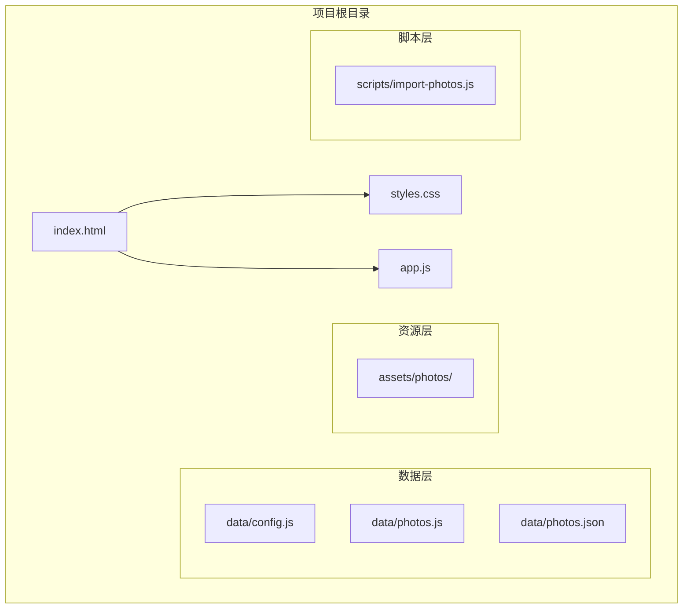
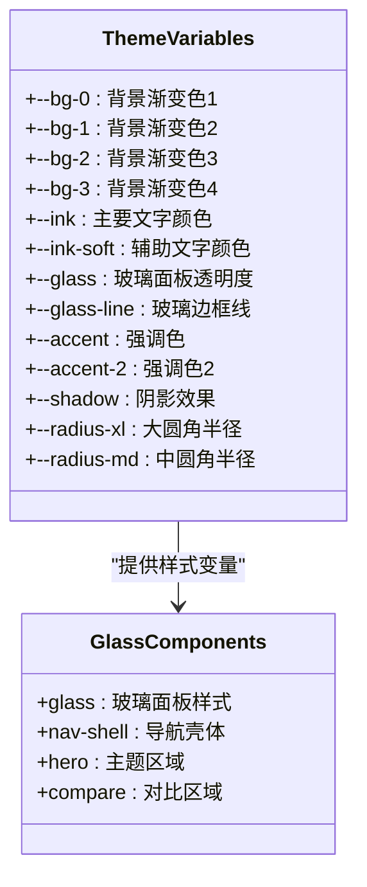
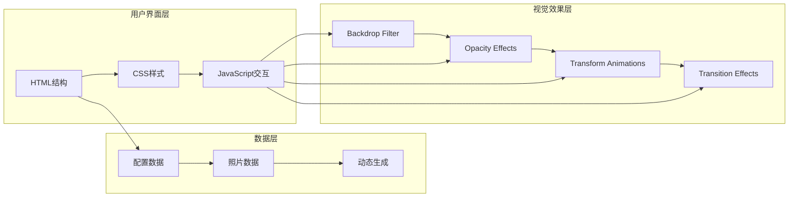
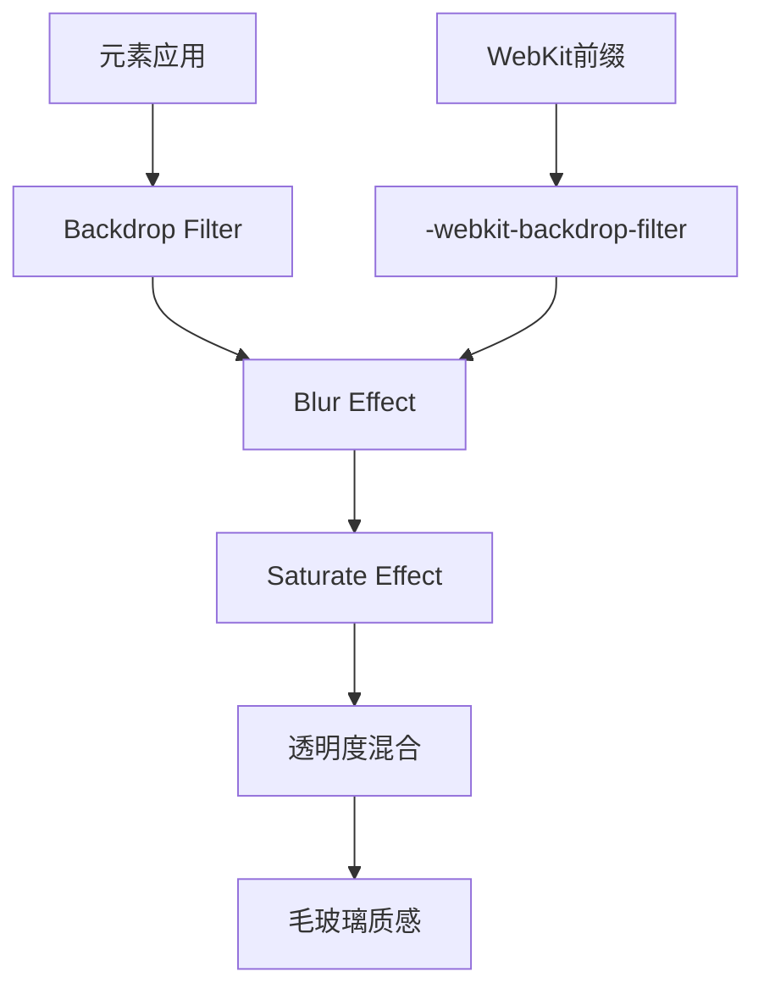
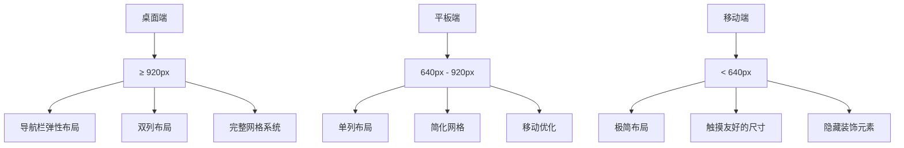
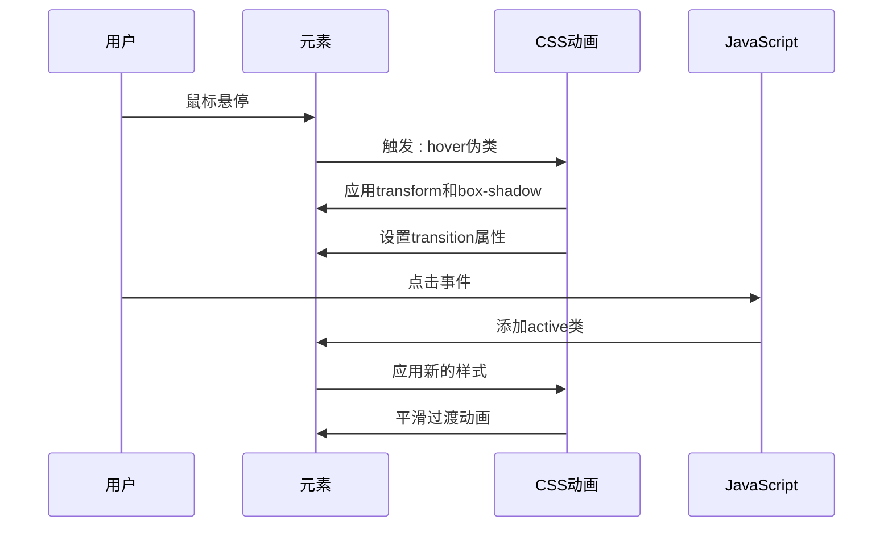
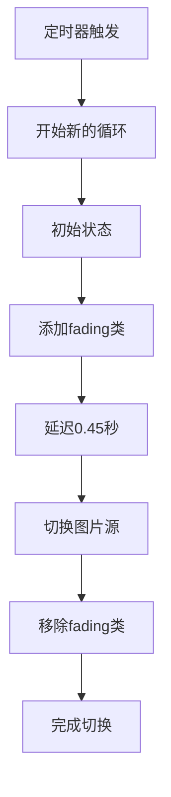
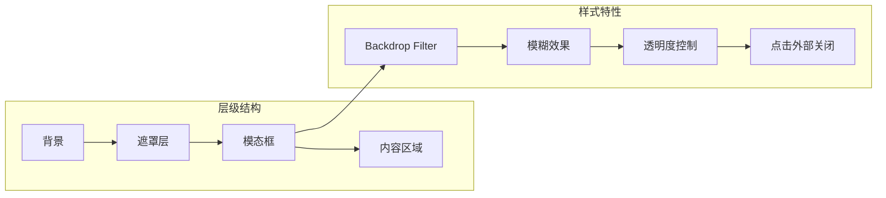
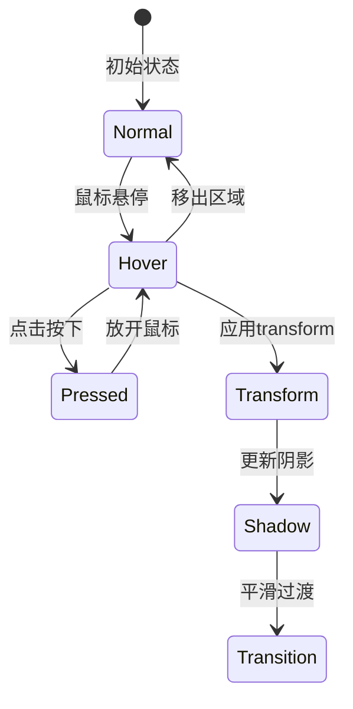
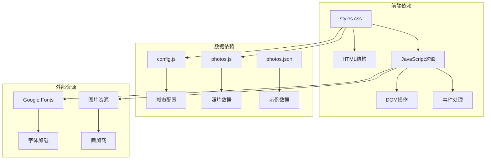

# 液态玻璃界面设计

<cite>
**本文档引用的文件**
- [styles.css](file://styles.css)
- [index.html](file://index.html)
- [app.js](file://app.js)
- [README.md](file://README.md)
- [data/config.js](file://data/config.js)
- [data/photos.js](file://data/photos.js)
- [data/photos.json](file://data/photos.json)
</cite>

## 目录
1. [项目概述](#项目概述)
2. [项目结构](#项目结构)
3. [核心组件](#核心组件)
4. [架构概览](#架构概览)
5. [详细组件分析](#详细组件分析)
6. [依赖关系分析](#依赖关系分析)
7. [性能考虑](#性能考虑)
8. [故障排除指南](#故障排除指南)
9. [结论](#结论)

## 项目概述

这是一个基于苹果风格设计理念的液态玻璃界面设计项目，通过CSS特效和JavaScript交互实现了一个沉浸式的恋爱纪念站。该项目采用现代化的视觉设计语言，结合backdrop-filter、opacity和transform等CSS属性的巧妙组合，营造出如液体般流动的视觉效果。

### 主要特性
- **液态玻璃效果**：通过backdrop-filter实现毛玻璃质感
- **动态背景**：渐变背景与粒子效果相结合
- **响应式设计**：多断点适配不同屏幕尺寸
- **交互动画**：平滑的过渡动画和交互动效
- **模态窗口**：层级管理与遮罩效果

## 项目结构

**图表来源**
- [index.html:1-140](file://index.html#L1-L140)
- [styles.css:1-899](file://styles.css#L1-L899)
- [app.js:1-690](file://app.js#L1-L690)

**章节来源**
- [index.html:1-140](file://index.html#L1-L140)
- [README.md:1-87](file://README.md#L1-L87)

## 核心组件

### CSS变量系统

项目采用了完整的CSS变量体系，实现了主题化和可定制的设计系统：

**图表来源**
- [styles.css:1-15](file://styles.css#L1-L15)
- [styles.css:129-140](file://styles.css#L129-L140)

### 动态背景系统

项目实现了多层次的动态背景效果，包括：

1. **径向渐变背景**：多个位置的彩色光晕效果
2. **模糊滤镜**：通过backdrop-filter实现的毛玻璃效果
3. **粒子动画**：浮动的彩色光斑
4. **纹理叠加**：细微的颗粒纹理增强质感

**章节来源**
- [styles.css:27-32](file://styles.css#L27-L32)
- [styles.css:53-85](file://styles.css#L53-L85)
- [styles.css:87-127](file://styles.css#L87-L127)

## 架构概览

**图表来源**
- [index.html:19-139](file://index.html#L19-L139)
- [styles.css:129-140](file://styles.css#L129-L140)
- [app.js:71-89](file://app.js#L71-L89)

## 详细组件分析

### 液态玻璃效果实现

#### Backdrop Filter技术

项目中backdrop-filter的应用是实现液态玻璃效果的核心技术：

**图表来源**
- [styles.css:138-139](file://styles.css#L138-L139)
- [styles.css:273-274](file://styles.css#L273-L274)
- [styles.css:528-529](file://styles.css#L528-L529)

#### Opacity与Transform组合

项目巧妙地将opacity和transform属性结合，创造出层次丰富的视觉效果：

**章节来源**
- [styles.css:138-140](file://styles.css#L138-L140)
- [styles.css:262-264](file://styles.css#L262-L264)
- [styles.css:535-538](file://styles.css#L535-L538)

### 响应式布局策略

#### 断点设计

项目采用了精心设计的响应式断点策略：

**图表来源**
- [styles.css:807-846](file://styles.css#L807-L846)
- [styles.css:848-898](file://styles.css#L848-L898)

#### 媒体查询实现

项目使用了两层主要的媒体查询：

1. **桌面端优化**（max-width: 920px）
   - 导航栏改为弹性布局
   - 主题区域调整为单列
   - 对比区域重新排列

2. **移动端优化**（max-width: 640px）
   - 减少内边距
   - 缩小河流高度
   - 简化对比面板布局

**章节来源**
- [styles.css:807-898](file://styles.css#L807-L898)

### 动画效果系统

#### 过渡动画

项目实现了多种类型的过渡动画：

**图表来源**
- [styles.css:183-188](file://styles.css#L183-L188)
- [styles.css:238-240](file://styles.css#L238-L240)
- [styles.css:535-538](file://styles.css#L535-L538)

#### 交叉淡入淡出效果

项目实现了精美的交叉淡入淡出动画：

**图表来源**
- [styles.css:262-264](file://styles.css#L262-L264)
- [app.js:577-586](file://app.js#L577-L586)

#### 折射扫光动画

项目中的折射扫光效果是一个复杂的动画序列：

**章节来源**
- [styles.css:790-805](file://styles.css#L790-L805)
- [app.js:492-512](file://app.js#L492-L512)

### 模态窗口系统

#### 层级管理

模态窗口实现了完整的层级管理系统：

**图表来源**
- [styles.css:732-743](file://styles.css#L732-L743)
- [app.js:455-460](file://app.js#L455-L460)

#### 遮罩效果

模态窗口的遮罩效果通过backdrop-filter实现：

**章节来源**
- [styles.css:739-743](file://styles.css#L739-L743)
- [app.js:481-489](file://app.js#L481-L489)

### 交互动画实现

#### 按钮交互

项目中的按钮组件实现了丰富的交互动画：

**图表来源**
- [styles.css:183-188](file://styles.css#L183-L188)
- [styles.css:535-538](file://styles.css#L535-L538)

#### 滚动动画

河流区域的滚动动画通过IntersectionObserver实现：

**章节来源**
- [app.js:41-51](file://app.js#L41-L51)
- [app.js:492-512](file://app.js#L492-L512)

## 依赖关系分析

**图表来源**
- [index.html:11-16](file://index.html#L11-L16)
- [app.js:14-16](file://app.js#L14-L16)
- [app.js:39](file://app.js#L39)

**章节来源**
- [index.html:135-137](file://index.html#L135-L137)
- [app.js:14-39](file://app.js#L14-L39)

## 性能考虑

### 优化策略

1. **CSS变量缓存**：所有颜色和尺寸都通过CSS变量定义，便于维护和优化
2. **硬件加速**：大量使用transform和opacity属性，利用GPU加速
3. **懒加载机制**：图片资源采用懒加载，减少初始加载压力
4. **媒体查询优化**：针对不同设备优化布局和动画复杂度

### 浏览器兼容性

项目采用了渐进增强的策略：

- **现代浏览器**：完整支持backdrop-filter和CSS Grid
- **旧版浏览器**：提供降级方案，确保基本功能可用
- **移动设备**：针对触摸设备优化交互体验

## 故障排除指南

### 常见问题

1. **backdrop-filter不生效**
   - 检查是否添加了-webkit前缀
   - 确认元素有适当的背景透明度

2. **动画性能问题**
   - 使用transform替代position属性
   - 避免频繁的重排重绘

3. **响应式布局异常**
   - 检查媒体查询断点设置
   - 验证CSS优先级冲突

### 调试技巧

- 使用浏览器开发者工具检查CSS变量值
- 监控GPU使用情况和帧率
- 测试不同设备和浏览器的兼容性

**章节来源**
- [styles.css:138-139](file://styles.css#L138-L139)
- [styles.css:807-898](file://styles.css#L807-L898)

## 结论

这个液态玻璃界面设计项目展示了现代Web开发中视觉设计与技术实现的完美结合。通过精心设计的CSS变量系统、创新的backdrop-filter技术应用、智能的响应式布局策略，以及流畅的交互动画效果，创造出了令人印象深刻的用户体验。

项目的主要优势包括：

1. **技术先进性**：充分利用了现代CSS特性和JavaScript API
2. **设计美感**：实现了苹果风格的极简美学
3. **用户体验**：提供了流畅自然的交互体验
4. **可扩展性**：模块化的架构便于功能扩展

这个项目为类似的视觉设计项目提供了优秀的参考模板，展示了如何在保持技术可行性的同时实现卓越的视觉效果。