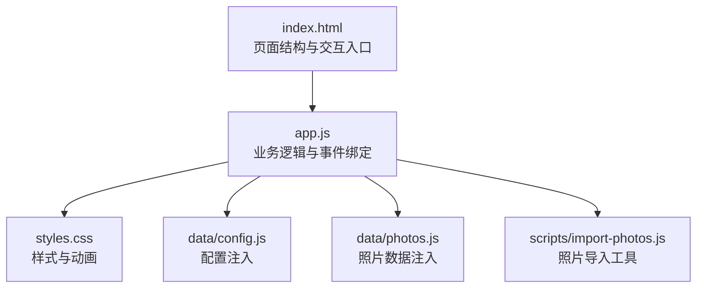
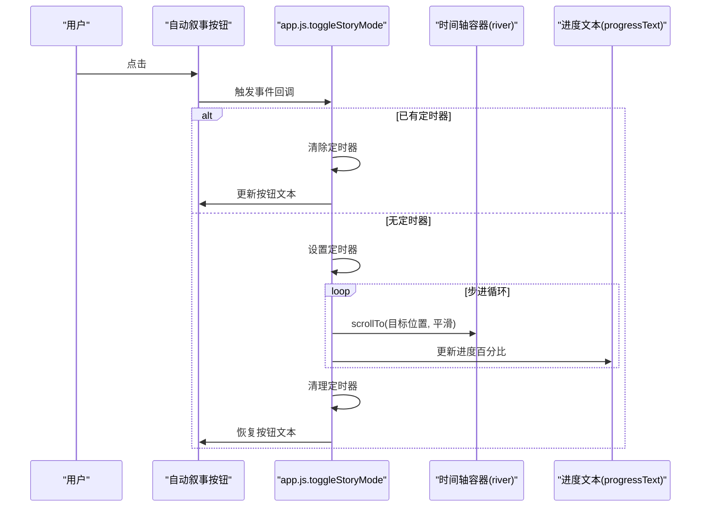
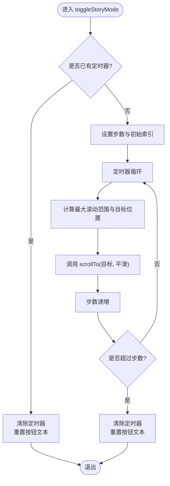
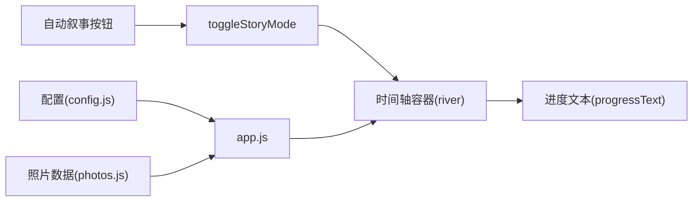

# 自动叙事模式

<cite>
**本文引用的文件列表**
- [app.js](file://app.js)
- [index.html](file://index.html)
- [styles.css](file://styles.css)
- [data/config.js](file://data/config.js)
- [data/photos.js](file://data/photos.js)
- [README.md](file://README.md)
- [scripts/import-photos.js](file://scripts/import-photos.js)
</cite>

## 目录
1. [简介](#简介)
2. [项目结构](#项目结构)
3. [核心组件](#核心组件)
4. [架构总览](#架构总览)
5. [详细组件分析](#详细组件分析)
6. [依赖关系分析](#依赖关系分析)
7. [性能考量](#性能考量)
8. [故障排查指南](#故障排查指南)
9. [结论](#结论)
10. [附录](#附录)

## 简介
本文件面向“自动叙事模式”的实现与使用，围绕 toggleStoryMode 函数展开，系统性说明其工作机制、定时器控制与平滑滚动算法、执行流程（含 scrollTo 参数计算与滚动步进策略）、定时器生命周期管理（启动、暂停、清理）、进度更新与用户界面反馈、配置项与可调参数、性能与体验优化建议，以及扩展不同播放模式的思路。文档同时结合项目实际代码与资源文件进行可视化呈现，帮助开发者快速理解与二次开发。

## 项目结构
该项目采用前端三件套：HTML 页面承载结构与交互入口，CSS 提供液态玻璃风格与动画，JavaScript 负责业务逻辑与 DOM 操作。自动叙事模式位于主应用脚本中，通过按钮触发，驱动时间轴容器的横向滚动。

图表来源
- [index.html:1-140](file://index.html#L1-L140)
- [app.js:1-120](file://app.js#L1-L120)
- [styles.css:1-120](file://styles.css#L1-L120)
- [data/config.js:1-27](file://data/config.js#L1-L27)
- [data/photos.js:1-315](file://data/photos.js#L1-L315)
- [scripts/import-photos.js:1-50](file://scripts/import-photos.js#L1-L50)

章节来源
- [index.html:1-140](file://index.html#L1-L140)
- [app.js:1-120](file://app.js#L1-L120)
- [styles.css:1-120](file://styles.css#L1-L120)
- [data/config.js:1-27](file://data/config.js#L1-L27)
- [data/photos.js:1-315](file://data/photos.js#L1-L315)
- [README.md:1-87](file://README.md#L1-L87)
- [scripts/import-photos.js:1-50](file://scripts/import-photos.js#L1-L50)

## 核心组件
- 自动叙事开关按钮：位于页面头部导航区，点击后切换自动叙事状态。
- 时间轴容器：横向滚动的“记忆河道”，承载照片卡片与轨迹路径。
- 进度文本：显示当前滚动进度百分比。
- 定时器变量：全局保存自动叙事的定时器句柄，用于启动、暂停与清理。

章节来源
- [index.html:27-31](file://index.html#L27-L31)
- [app.js:18-39](file://app.js#L18-L39)
- [app.js:514-538](file://app.js#L514-L538)
- [app.js:540-544](file://app.js#L540-L544)

## 架构总览
自动叙事模式的控制流如下：用户点击“自动叙事”按钮，进入 toggleStoryMode；若已有定时器则清除并恢复按钮文案；否则启动定时器，按固定步进推进滚动，直至完成或被手动中断。

图表来源
- [index.html:27-31](file://index.html#L27-L31)
- [app.js:478-478](file://app.js#L478-L478)
- [app.js:514-538](file://app.js#L514-L538)
- [app.js:540-544](file://app.js#L540-L544)

## 详细组件分析

### toggleStoryMode：自动叙事主控函数
- 功能定位：根据是否存在定时器决定启动或停止自动叙事。
- 启动条件：无定时器时启动，设置步进步数与初始索引。
- 步进策略：固定间隔触发，按等分目标位置推进滚动。
- 结束条件：达到设定步数后自动清理定时器并重置按钮文本。
- 中断能力：若中途再次点击按钮，将清除定时器并立即停止。

图表来源
- [app.js:514-538](file://app.js#L514-L538)

章节来源
- [app.js:514-538](file://app.js#L514-L538)

### scrollTo 参数计算与滚动步进策略
- 最大滚动范围：基于容器宽度与可视宽度之差，避免无效滚动。
- 目标位置计算：按步数比例线性插值到最大滚动范围，确保均匀推进。
- 平滑滚动：使用原生 scrollTo 的平滑行为，保证视觉流畅。
- 步进频率：固定间隔触发，步数与频率共同决定整体时长与节奏。

章节来源
- [app.js:526-530](file://app.js#L526-L530)

### 定时器生命周期管理
- 启动：首次点击时创建定时器，记录句柄于全局变量。
- 暂停/中断：再次点击时清除定时器，立即停止后续滚动。
- 清理：完成一轮滚动后清除定时器，释放资源。
- 文案同步：根据定时器状态动态更新按钮文本，提供明确反馈。

章节来源
- [app.js:514-538](file://app.js#L514-L538)

### 进度更新逻辑与用户界面反馈
- 进度计算：基于当前滚动位置与最大滚动范围的比例，换算百分比。
- 反馈方式：进度文本实时显示百分比，直观反映浏览进度。
- 事件联动：时间轴滚动事件触发进度更新，保持与用户操作一致。

章节来源
- [app.js:540-544](file://app.js#L540-L544)

### 用户交互与事件绑定
- 自动叙事按钮绑定点击事件，调用主控函数。
- 时间轴容器绑定滚动事件，更新进度文本。
- 其他交互（如模态框、筛选、对比）与自动叙事互不干扰。

章节来源
- [app.js:476-490](file://app.js#L476-L490)
- [index.html:27-31](file://index.html#L27-L31)

### 样式与动画配合
- 液态玻璃风格与过渡动画提升滚动体验。
- 按钮 hover、焦点与激活态提供清晰的交互反馈。
- 进度文本定位在时间轴右上角，不影响内容阅读。

章节来源
- [styles.css:129-193](file://styles.css#L129-L193)
- [styles.css:463-473](file://styles.css#L463-L473)

## 依赖关系分析
自动叙事模式依赖以下模块与资源：
- DOM 元素：自动叙事按钮、时间轴容器、进度文本。
- 数据：照片数据与配置，影响时间轴布局与渲染。
- 事件：按钮点击与滚动事件，驱动控制流与进度更新。

图表来源
- [index.html:27-31](file://index.html#L27-L31)
- [app.js:18-39](file://app.js#L18-L39)
- [app.js:514-544](file://app.js#L514-L544)
- [data/config.js:1-27](file://data/config.js#L1-L27)
- [data/photos.js:1-315](file://data/photos.js#L1-L315)

章节来源
- [index.html:27-31](file://index.html#L27-L31)
- [app.js:18-39](file://app.js#L18-L39)
- [app.js:514-544](file://app.js#L514-L544)
- [data/config.js:1-27](file://data/config.js#L1-L27)
- [data/photos.js:1-315](file://data/photos.js#L1-L315)

## 性能考量
- 滚动平滑：使用原生平滑滚动，减少自定义动画开销。
- 步进策略：固定步数与间隔，避免频繁计算导致抖动。
- 事件节流：滚动事件仅更新进度文本，不参与滚动控制。
- 资源释放：定时器完成后及时清理，防止内存泄漏。
- 可视区域：容器可视宽度与滚动范围计算避免无效滚动。

章节来源
- [app.js:526-530](file://app.js#L526-L530)
- [app.js:540-544](file://app.js#L540-L544)

## 故障排查指南
- 按钮点击无响应
  - 检查按钮元素是否存在且事件绑定成功。
  - 确认全局变量与 DOM 查询正确。
- 滚动无效或卡顿
  - 检查时间轴容器的滚动范围是否大于零。
  - 确认 scrollTo 的目标位置在有效范围内。
- 进度文本不更新
  - 检查滚动事件是否绑定到时间轴容器。
  - 确认进度文本元素存在且可写。
- 定时器无法停止
  - 确认按钮点击时正确清除定时器。
  - 检查定时器句柄是否被覆盖或意外重置。

章节来源
- [index.html:27-31](file://index.html#L27-L31)
- [app.js:476-490](file://app.js#L476-L490)
- [app.js:514-538](file://app.js#L514-L538)
- [app.js:540-544](file://app.js#L540-L544)

## 结论
自动叙事模式通过简洁的定时器步进与原生平滑滚动，实现了流畅、可控的横向浏览体验。其设计遵循低耦合、高内聚原则，易于扩展与维护。结合配置与数据注入机制，可进一步定制播放节奏与交互细节，满足多样化的叙事需求。

## 附录

### 自动叙事配置与自定义参数
- 步数与间隔
  - 步数：控制总步进次数，影响整体时长与节奏。
  - 间隔：控制定时器触发周期，影响滚动平滑度与总时长。
- 播放模式扩展建议
  - 加速/减速：在步进序列中引入非线性插值。
  - 回放：支持反向滚动与回弹效果。
  - 跳转：允许用户在播放过程中跳转到指定位置。
  - 暂停/恢复：在播放中提供暂停与恢复功能。
- 交互增强
  - 键盘快捷键：空格键暂停/恢复，左右箭头微调。
  - 手势支持：移动端滑动触发播放或暂停。
  - 声音与提示：播放时伴随轻音效或提示。

章节来源
- [app.js:523-537](file://app.js#L523-L537)

### 使用与集成要点
- 照片数据与配置
  - 通过配置文件与数据文件注入，确保时间轴布局与渲染正确。
  - 导入工具可自动生成数据文件，便于快速接入。
- 页面结构
  - 确保按钮、时间轴容器与进度文本元素存在且 ID 正确。
- 样式适配
  - 移动端与不同分辨率下，注意容器尺寸与滚动范围的计算。

章节来源
- [README.md:31-87](file://README.md#L31-L87)
- [data/config.js:1-27](file://data/config.js#L1-L27)
- [data/photos.js:1-315](file://data/photos.js#L1-L315)
- [scripts/import-photos.js:1-50](file://scripts/import-photos.js#L1-L50)