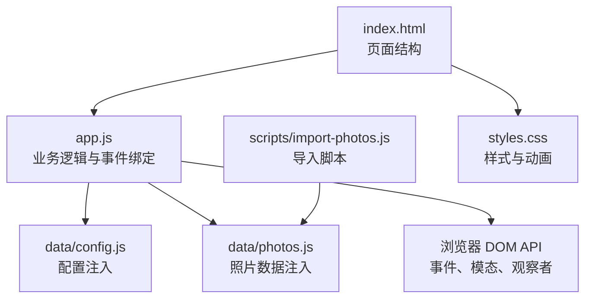
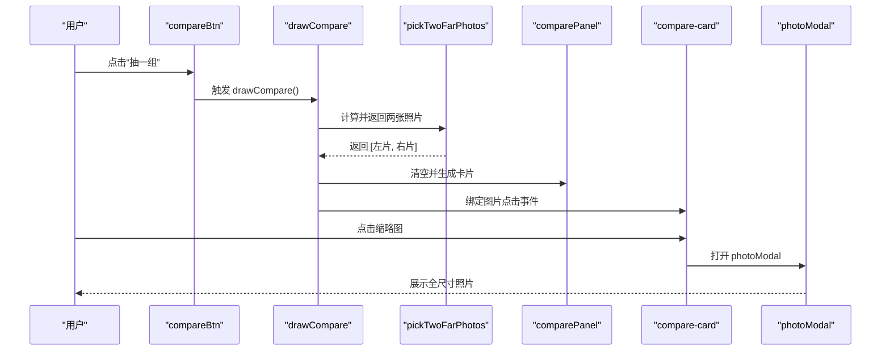
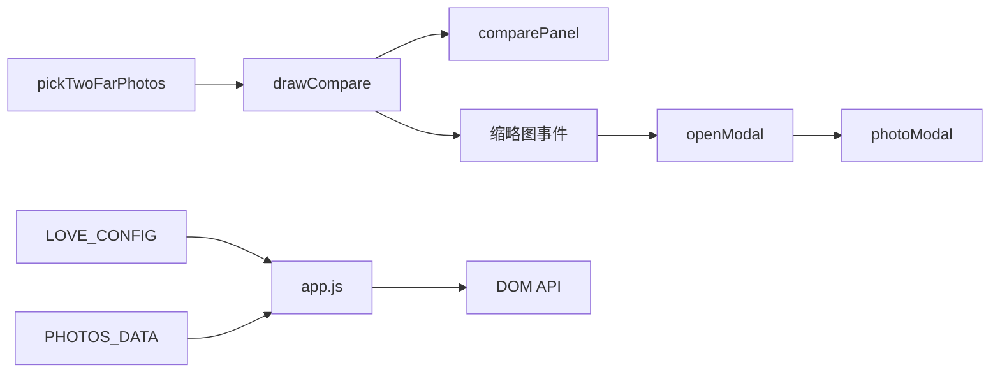

# 随机时空对照

<cite>
**本文引用的文件**
- [app.js](file://app.js)
- [index.html](file://index.html)
- [styles.css](file://styles.css)
- [data/config.js](file://data/config.js)
- [data/photos.js](file://data/photos.js)
- [README.md](file://README.md)
- [scripts/import-photos.js](file://scripts/import-photos.js)
</cite>

## 目录
1. [简介](#简介)
2. [项目结构](#项目结构)
3. [核心组件](#核心组件)
4. [架构总览](#架构总览)
5. [详细组件分析](#详细组件分析)
6. [依赖分析](#依赖分析)
7. [性能考虑](#性能考虑)
8. [故障排查指南](#故障排查指南)
9. [结论](#结论)
10. [附录](#附录)

## 简介
本技术文档聚焦于“随机时空对照”功能，系统性解析以下内容：
- pickTwoFarPhotos 函数的算法设计：时间距离计算、左右区间采样策略与随机选择逻辑
- drawCompare 函数的对比面板渲染：HTML 结构生成、事件绑定与交互行为
- 照片选择的统计学原理：左半区与右半区的选择概率分布与偏差来源
- 对比卡片的交互设计与模态展示机制：点击放大、键盘操作与遮罩层交互
- 算法优化建议与扩展方案：多组对比、自定义选择规则、大数据集下的高效随机策略
- 性能优化策略：排序成本、随机采样与 DOM 更新的权衡
- 自定义对比算法：如何替换或扩展现有策略以满足特定需求

## 项目结构
该站点采用前端单页应用结构，核心逻辑集中在 app.js 中，UI 结构由 index.html 定义，样式由 styles.css 提供，照片元数据通过 data/photos.js 注入，配置由 data/config.js 提供。导入脚本 scripts/import-photos.js 负责从 assets/photos 目录批量生成数据文件。

图表来源
- [index.html](file://index.html)
- [app.js](file://app.js)
- [data/config.js](file://data/config.js)
- [data/photos.js](file://data/photos.js)
- [styles.css](file://styles.css)
- [scripts/import-photos.js](file://scripts/import-photos.js)

章节来源
- [index.html](file://index.html)
- [app.js](file://app.js)
- [data/config.js](file://data/config.js)
- [data/photos.js](file://data/photos.js)
- [styles.css](file://styles.css)
- [scripts/import-photos.js](file://scripts/import-photos.js)

## 核心组件
- 随机时空对照入口与触发器
  - 触发按钮：compareBtn
  - 对话框容器：comparePanel
- 关键函数
  - pickTwoFarPhotos：从已排序时间序列中抽取两张相距较远的照片
  - drawCompare：渲染对比面板，绑定图片点击事件
- 模态展示
  - photoModal：点击卡片缩略图弹出全尺寸照片
  - openModal：设置模态内容并显示

章节来源
- [index.html](file://index.html)
- [app.js](file://app.js)

## 架构总览
随机时空对照功能的调用链路如下：用户点击“抽一组”，触发 drawCompare；drawCompare 调用 pickTwoFarPhotos 获取两张照片，然后动态生成对比卡片并绑定事件；点击卡片缩略图打开 photoModal 展示详情。

图表来源
- [app.js](file://app.js)
- [index.html](file://index.html)

## 详细组件分析

### pickTwoFarPhotos 算法设计
- 输入：照片数组（对象列表）
- 输出：长度为 2 的数组，包含两张相距较远的照片
- 关键步骤
  1) 时间排序：对输入数组按日期升序复制并排序，确保时间轴严格递增
  2) 左侧随机采样：从排序后的前 18% 区间内随机选取一张照片
  3) 右侧随机采样：从排序后的后 28% 区间内随机选取一张照片
  4) 返回：[左侧样本, 右侧样本]

- 时间距离计算
  - 通过排序后的索引差衡量时间跨度，左侧与右侧分别来自时间轴两端，自然形成“远”的效果
  - 该策略不直接计算绝对天数差，而是利用时间顺序的相对位置作为距离度量

- 左右区间选择概率分布
  - 左半区采样范围：[0, 0.18×N)
  - 右半区采样范围：[0.72×N, N)
  - 两区间均采用均匀离散采样，即每个候选索引被选中的概率相同
  - 分布特征：两端采样概率一致，但受区间长度影响，实际被选中的绝对数量取决于 N 与区间占比

- 边界与异常处理
  - 当照片数量少于 2 时，直接返回原数组（可能少于 2）
  - 当 N 较小时，区间可能退化为单点，仍能保证返回有效索引

- 复杂度分析
  - 时间复杂度：O(N log N)，主要消耗在排序
  - 空间复杂度：O(N)，复制数组进行排序

- 统计学原理
  - 该策略基于“时间端点采样”，通过限制采样区间，确保两张照片分别位于时间轴的起始与结束区域
  - 由于区间长度不同（左端 18%，右端 28%），在小样本情况下，右端样本的绝对数量可能更多
  - 若需更均衡的分布，可在区间内引入权重或分层采样

章节来源
- [app.js](file://app.js)

### drawCompare 对比面板渲染逻辑
- 功能目标：根据 pickTwoFarPhotos 的结果生成对比卡片，并绑定交互事件
- 渲染流程
  1) 调用 pickTwoFarPhotos 获取两张照片
  2) 清空 comparePanel 内容
  3) 为每张照片创建 article 元素，设置类名 compare-card
  4) 内部包含 img 与文本信息（标题、日期、地点）
  5) 为缩略图绑定点击事件，点击后打开 photoModal 并传入对应照片对象
  6) 将卡片追加到 comparePanel

- HTML 结构生成
  - 使用字符串模板拼接，包含图片、标题与时间地点信息
  - 文本信息通过工具函数 prettyDate 格式化日期

- 事件绑定
  - 图片元素上绑定 click 事件，回调 openModal
  - openModal 设置模态内容并调用 showModal

- 无障碍与可访问性
  - 模态容器使用 dialog 元素，具备原生可访问性语义
  - 模态外点击关闭、键盘 Esc 关闭等行为由浏览器默认行为提供

章节来源
- [app.js](file://app.js)
- [index.html](file://index.html)

### 对比卡片交互与模态展示机制
- 对比卡片
  - 类名 compare-card，悬停时有轻微旋转与阴影变化，增强交互反馈
  - 缩略图高度固定，适配不同屏幕尺寸
- 模态展示
  - photoModal 为原生 dialog，点击外部区域或点击关闭按钮可关闭
  - openModal 设置模态图片、日期与标题，随后 showModal
  - 模态背景具有模糊与透明度，提升视觉层次

章节来源
- [app.js](file://app.js)
- [index.html](file://index.html)
- [styles.css](file://styles.css)

### 算法优化建议与扩展方案
- 多组对比
  - 扩展 pickTwoFarPhotos 返回多对样本，例如返回 k 组 [left_i, right_i]
  - drawCompare 循环渲染多个对比面板，每组卡片独立绑定事件
- 自定义选择规则
  - 支持按地点/城市分层采样：先按 place 过滤，再在各子集中执行 pickTwoFarPhotos
  - 支持按 visitKey（出行次数）分层：确保左右样本来自不同 visit
  - 支持时间窗口采样：在固定时间范围内随机抽取，避免极端端点
- 大数据集下的随机选择效率
  - 当 N 很大时，排序成本 O(N log N) 成为主要瓶颈
  - 优化策略
    - 使用快速选择（Quickselect）或分治思想，仅需 O(N) 时间即可找到分位数边界
    - 对于超大数据集，可采用分块采样：先对数据进行分桶（按日期区间），再在桶内随机采样
    - 使用缓存：对已排序数组进行缓存，避免重复排序
- 自定义对比算法
  - 替换 pickTwoFarPhotos：提供新的函数签名，保持 drawCompare 的调用方式不变
  - 示例思路：基于时间距离矩阵或滑动窗口，寻找最大时间间隔的样本对
  - 与 UI 解耦：通过接口抽象，便于单元测试与 A/B 对比

章节来源
- [app.js](file://app.js)

## 依赖分析
- 组件耦合
  - drawCompare 依赖 pickTwoFarPhotos 与 DOM 查询（comparePanel）
  - openModal 依赖 photoModal 及其子元素（图片、标题、日期）
  - 事件绑定集中在 bindEvents，负责过滤导航、滚动进度、故事模式与模态关闭
- 外部依赖
  - 浏览器原生 API：IntersectionObserver、dialog、fetch、URL.createObjectURL 等
  - 样式与动画：CSS 动画与响应式布局
- 数据来源
  - 照片数据：window.PHOTOS_DATA 或本地生成的 mock 数据
  - 配置：window.LOVE_CONFIG（开始日期、目标数量、地点集合）

图表来源
- [app.js](file://app.js)
- [index.html](file://index.html)
- [data/config.js](file://data/config.js)
- [data/photos.js](file://data/photos.js)

章节来源
- [app.js](file://app.js)
- [index.html](file://index.html)
- [data/config.js](file://data/config.js)
- [data/photos.js](file://data/photos.js)

## 性能考虑
- 排序成本
  - pickTwoFarPhotos 对输入数组进行排序，时间复杂度 O(N log N)
  - 在 N 较大时，可通过缓存或增量更新减少重复排序
- 随机采样
  - 左右区间采用均匀采样，时间复杂度 O(1)
  - 区间长度与样本数量相关，建议在 UI 上提示当前样本规模
- DOM 更新
  - drawCompare 清空 comparePanel 后重建所有卡片，适合小规模对比
  - 对于大规模对比，建议采用虚拟滚动或分页渲染
- 懒加载与资源优化
  - 缩略图使用懒加载（loading="lazy"），减少初始渲染压力
  - 建议使用 WebP/AVIF 格式与合适的分辨率，降低带宽占用

章节来源
- [app.js](file://app.js)
- [styles.css](file://styles.css)

## 故障排查指南
- 照片数量不足
  - 现象：drawCompare 返回少于 2 张照片
  - 处理：检查 data/photos.js 是否正确注入，或确认是否启用 mock 数据
- 模态无法打开
  - 现象：点击缩略图无反应
  - 处理：确认 photoModal 存在且 openModal 正确设置内容；检查事件绑定是否生效
- 对比面板不刷新
  - 现象：点击“抽一组”后界面无变化
  - 处理：确认 compareBtn 的 click 事件已绑定；检查 drawCompare 是否被调用
- 时间排序异常
  - 现象：左右样本出现在中间而非两端
  - 处理：检查 pickTwoFarPhotos 的区间参数与数组长度；确认输入数组已按日期排序

章节来源
- [app.js](file://app.js)
- [index.html](file://index.html)

## 结论
随机时空对照功能通过“时间端点采样”实现了直观的时间跨度对比，算法简洁、易于理解且具备良好的可扩展性。在实际应用中，建议结合业务需求引入分层采样与自定义规则，并针对大数据集优化排序与采样策略，以获得更佳的性能与用户体验。

## 附录
- 配置说明
  - 开始日期：用于计算“在一起天数”
  - 地点集合：用于城市筛选与地点映射
  - 目标数量：用于生成 mock 数据
- 数据结构
  - 照片对象包含 id、src、title、date、place、placeName、visit、visitKey 等字段
- 导入流程
  - 使用 scripts/import-photos.js 从 assets/photos 目录批量生成 data/photos.js 与 PHOTOS_META

章节来源
- [README.md](file://README.md)
- [data/config.js](file://data/config.js)
- [data/photos.js](file://data/photos.js)
- [scripts/import-photos.js](file://scripts/import-photos.js)