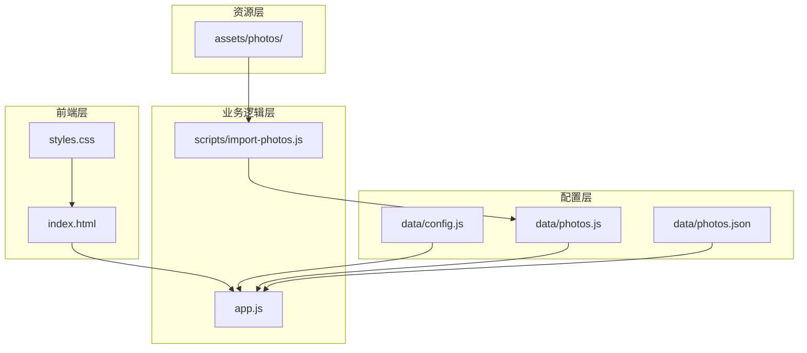
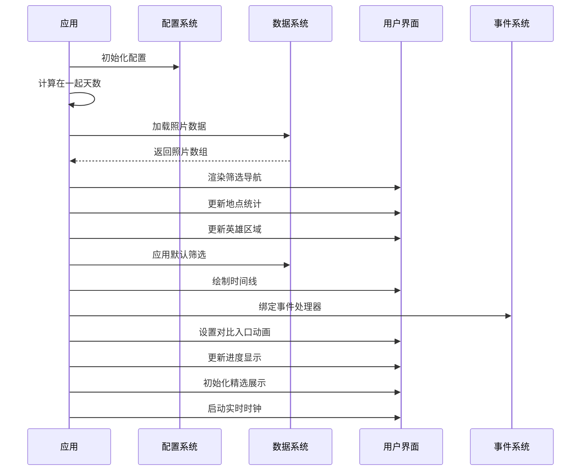
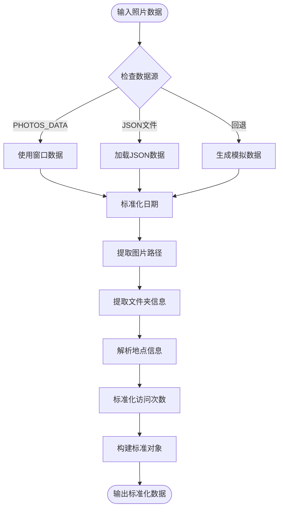
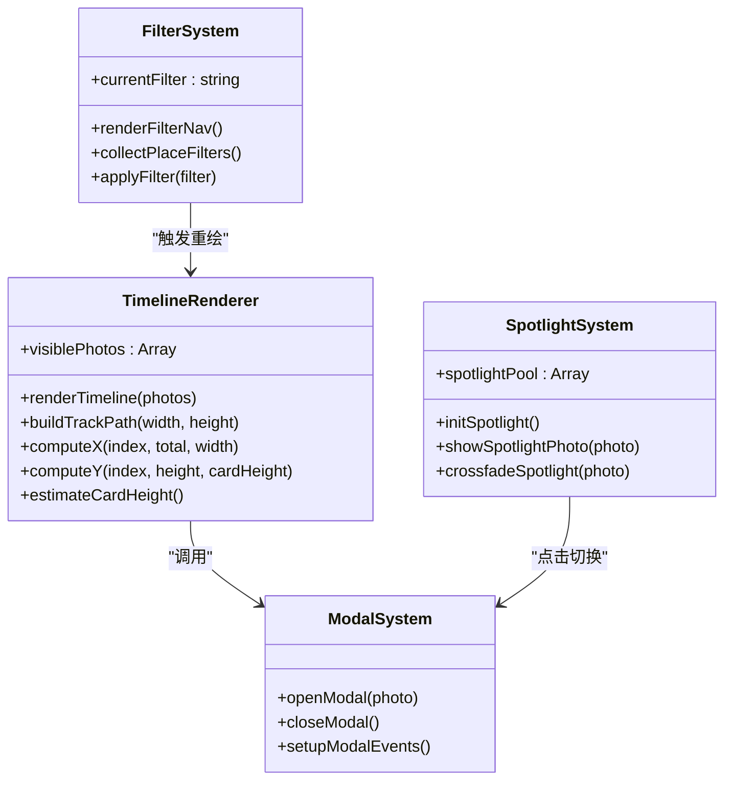
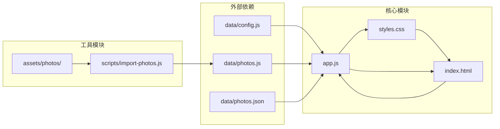

# 功能增强

<cite>
**本文引用的文件**
- [app.js](file://app.js)
- [index.html](file://index.html)
- [styles.css](file://styles.css)
- [config.js](file://data/config.js)
- [photos.js](file://data/photos.js)
- [photos.json](file://data/photos.json)
- [import-photos.js](file://scripts/import-photos.js)
- [README.md](file://README.md)
</cite>

## 目录
1. [简介](#简介)
2. [项目结构](#项目结构)
3. [核心组件](#核心组件)
4. [架构总览](#架构总览)
5. [详细组件分析](#详细组件分析)
6. [依赖分析](#依赖分析)
7. [性能考虑](#性能考虑)
8. [故障排除指南](#故障排除指南)
9. [结论](#结论)
10. [附录](#附录)

## 简介
本指南面向希望在现有恋爱纪念站基础上进行功能增强的高级用户。项目采用苹果风格的液态玻璃设计，通过时间潮汐的方式展示500张照片的记忆旅程。本文档将深入解析app.js中的核心函数结构，提供新功能模块的开发模式，以及第三方功能集成、动画与交互、性能优化等方面的最佳实践。

## 项目结构
项目采用简洁的三层架构：HTML负责结构、CSS负责样式、JavaScript负责逻辑。核心文件组织如下：



**图表来源**
- [index.html:1-140](file://index.html#L1-L140)
- [app.js:1-690](file://app.js#L1-L690)
- [config.js:1-27](file://data/config.js#L1-L27)

**章节来源**
- [index.html:1-140](file://index.html#L1-L140)
- [README.md:1-87](file://README.md#L1-L87)

## 核心组件
项目的核心组件围绕app.js中的主要函数构建，形成了完整的记忆展示系统：

### 初始化系统
应用通过init()函数完成整个系统的启动流程，包括日期计算、照片加载、UI渲染和事件绑定。

### 数据处理系统
normalizePhoto()函数负责照片数据的标准化处理，支持多种数据源和格式转换。

### 渲染系统
renderTimeline()和renderFilterNav()分别负责时间线的绘制和筛选导航的生成。

### 交互系统
bindEvents()集中处理所有用户交互事件，包括筛选、滚动、模态框等。

**章节来源**
- [app.js:71-89](file://app.js#L71-L89)
- [app.js:91-105](file://app.js#L91-L105)
- [app.js:331-376](file://app.js#L331-L376)
- [app.js:462-490](file://app.js#L462-L490)

## 架构总览
项目采用模块化设计，各组件职责清晰，耦合度低，便于功能扩展。

```mermaid
graph TB
subgraph "应用入口"
INIT[init() 初始化]
LOAD[loadPhotos() 加载数据]
end
subgraph "数据处理"
NORMALIZE[normalizePhoto() 标准化]
STATS[collectPlaceStats() 统计分析]
FILTER[applyFilter() 筛选]
end
subgraph "界面渲染"
RENDER[renderTimeline() 渲染时间线]
FILTER_NAV[renderFilterNav() 渲染筛选]
MODAL[openModal() 打开模态框]
end
subgraph "交互处理"
EVENTS[bindEvents() 绑定事件]
STORY[toggleStoryMode() 自动叙事]
SPOTLIGHT[initSpotlight() 精选展示]
end
INIT --> LOAD
LOAD --> NORMALIZE
NORMALIZE --> STATS
STATS --> FILTER
FILTER --> RENDER
RENDER --> MODAL
INIT --> EVENTS
EVENTS --> STORY
EVENTS --> SPOTLIGHT
```

**图表来源**
- [app.js:71-89](file://app.js#L71-L89)
- [app.js:91-105](file://app.js#L91-L105)
- [app.js:283-324](file://app.js#L283-L324)
- [app.js:331-376](file://app.js#L331-L376)
- [app.js:462-490](file://app.js#L462-L490)

## 详细组件分析

### 初始化流程分析
初始化流程是整个应用的核心，展示了典型的异步数据加载和UI渲染模式。



**图表来源**
- [app.js:71-89](file://app.js#L71-L89)
- [app.js:91-105](file://app.js#L91-L105)
- [app.js:156-176](file://app.js#L156-L176)
- [app.js:248-281](file://app.js#L248-L281)
- [app.js:331-376](file://app.js#L331-L376)
- [app.js:462-490](file://app.js#L462-L490)

### 数据标准化流程
normalizePhoto()函数展示了复杂的数据处理逻辑，需要扩展时重点关注此部分。



**图表来源**
- [app.js:91-105](file://app.js#L91-L105)
- [app.js:107-133](file://app.js#L107-L133)
- [app.js:206-231](file://app.js#L206-L231)
- [app.js:604-617](file://app.js#L604-L617)

### 界面渲染架构
渲染系统采用分层设计，确保UI的响应性和性能。



**图表来源**
- [app.js:337-376](file://app.js#L337-L376)
- [app.js:156-176](file://app.js#L156-L176)
- [app.js:331-335](file://app.js#L331-L335)
- [app.js:455-460](file://app.js#L455-L460)
- [app.js:546-586](file://app.js#L546-L586)

**章节来源**
- [app.js:71-89](file://app.js#L71-L89)
- [app.js:107-133](file://app.js#L107-L133)
- [app.js:337-376](file://app.js#L337-L376)
- [app.js:455-460](file://app.js#L455-L460)

## 依赖分析
项目依赖关系清晰，主要依赖于配置文件和数据文件。



**图表来源**
- [app.js:14](file://app.js#L14)
- [config.js:1-27](file://data/config.js#L1-L27)
- [photos.js:1-315](file://data/photos.js#L1-L315)
- [photos.json:1-67](file://data/photos.json#L1-L67)

**章节来源**
- [app.js:14](file://app.js#L14)
- [config.js:1-27](file://data/config.js#L1-L27)
- [photos.js:1-315](file://data/photos.js#L1-L315)

## 性能考虑
项目已经实现了多项性能优化措施，为功能增强提供了良好的基础。

### 懒加载机制
IntersectionObserver实现了智能的图片懒加载，只有进入视口的图片才会加载真实资源。

### 内存管理
- 使用WeakMap避免DOM节点引用导致的内存泄漏
- 及时清理定时器和事件监听器
- 合理使用requestAnimationFrame进行动画更新

### 事件委托
所有事件绑定都采用事件委托模式，减少事件监听器数量，提高性能。

**章节来源**
- [app.js:41-51](file://app.js#L41-L51)
- [app.js:462-490](file://app.js#L462-L490)

## 故障排除指南
常见问题及解决方案：

### 数据加载失败
当photos.json无法访问时，系统会自动降级到模拟数据生成模式。

### 图片加载缓慢
检查网络连接和图片尺寸，建议使用WebP或AVIF格式。

### 移动端显示异常
项目已提供完整的响应式设计，主要关注触摸交互的优化。

**章节来源**
- [app.js:96-104](file://app.js#L96-L104)
- [styles.css:807-899](file://styles.css#L807-L899)

## 结论
该项目展现了优秀的前端架构设计，通过模块化的函数设计和清晰的职责分离，为功能增强提供了坚实的基础。建议在扩展新功能时遵循以下原则：
- 保持现有架构不变，通过组合而非继承扩展功能
- 重视性能优化，特别是在图片处理和动画方面
- 注重用户体验，确保交互的流畅性和一致性
- 考虑移动端适配，提供一致的跨平台体验

## 附录

### 新功能模块开发模式

#### 事件绑定最佳实践
```javascript
// 推荐的事件绑定模式
function bindCustomEvents() {
    // 使用事件委托
    document.body.addEventListener('click', handleClick);
    
    // 为每个功能模块维护独立的事件处理器
    const handlers = {
        click: handleClick,
        scroll: handleScroll,
        resize: handleResize
    };
    
    // 清理时统一移除
    return function cleanup() {
        Object.keys(handlers).forEach(eventType => {
            document.removeEventListener(eventType, handlers[eventType]);
        });
    };
}
```

#### 状态管理模式
```javascript
// 简化的状态管理示例
class StateManager {
    constructor() {
        this.state = {
            currentView: 'timeline',
            selectedPhoto: null,
            filters: {},
            animations: {}
        };
    }
    
    update(newState) {
        this.state = { ...this.state, ...newState };
        this.notify();
    }
    
    subscribe(callback) {
        this.listeners.push(callback);
    }
    
    notify() {
        this.listeners.forEach(listener => listener(this.state));
    }
}
```

#### DOM操作最佳实践
```javascript
// 推荐的DOM操作模式
function createDOMElement(tag, attributes, children) {
    const element = document.createElement(tag);
    
    // 批量设置属性
    Object.entries(attributes).forEach(([key, value]) => {
        element[key] = value;
    });
    
    // 批量添加子元素
    children.forEach(child => element.appendChild(child));
    
    return element;
}

// 使用DocumentFragment批量更新
function batchUpdate(elements) {
    const fragment = document.createDocumentFragment();
    elements.forEach(element => fragment.appendChild(element));
    container.appendChild(fragment);
}
```

### 第三方功能集成指南

#### 社交媒体分享
```javascript
// 分享功能集成示例
function integrateSocialSharing() {
    // 检查Web Share API支持
    if ('share' in navigator) {
        return function shareContent(content) {
            return navigator.share({
                title: content.title,
                text: content.description,
                url: content.url
            });
        };
    }
    
    // 降级到传统分享方式
    return function fallbackShare(content) {
        // 实现传统分享逻辑
    };
}
```

#### 图片编辑功能
```javascript
// 图片编辑集成示例
function integrateImageEditor() {
    // 检查Canvas API支持
    if (!('OffscreenCanvas' in window)) {
        console.warn('图片编辑功能不可用');
        return null;
    }
    
    return {
        crop(image, cropArea) {
            const canvas = new OffscreenCanvas(
                cropArea.width, 
                cropArea.height
            );
            const ctx = canvas.getContext('2d');
            ctx.drawImage(image, cropArea.x, cropArea.y, ...);
            return canvas.transferToImageBitmap();
        },
        
        adjust(image, adjustments) {
            // 实现图片调整功能
        }
    };
}
```

#### 音频播放集成
```javascript
// 音频播放功能集成
function integrateAudioPlayer() {
    const audioContext = new (window.AudioContext || window.webkitAudioContext)();
    const audioElements = new Map();
    
    return {
        async play(url, options = {}) {
            // 检查是否已有实例
            if (audioElements.has(url)) {
                return audioElements.get(url);
            }
            
            const audio = new Audio(url);
            audio.preload = 'metadata';
            
            if (options.loop) {
                audio.loop = true;
            }
            
            audioElements.set(url, audio);
            return audio;
        },
        
        pause(url) {
            const audio = audioElements.get(url);
            if (audio) {
                audio.pause();
            }
        },
        
        cleanup() {
            audioElements.forEach(audio => {
                audio.pause();
                audio.remove();
            });
            audioElements.clear();
        }
    };
}
```

### CSS动画与JavaScript交互结合

#### 模态框动画系统
```css
/* 模态框基础样式 */
.modal {
    opacity: 0;
    transform: scale(0.9);
    transition: all 0.3s cubic-bezier(0.25, 0.8, 0.25, 1);
}

.modal[open] {
    opacity: 1;
    transform: scale(1);
}

.modal::backdrop {
    opacity: 0;
    transition: opacity 0.3s ease;
}

.modal[open]::backdrop {
    opacity: 1;
}
```

```javascript
// JavaScript控制模态框动画
function animateModal(modal, isOpen) {
    if (isOpen) {
        modal.showModal();
        // 等待浏览器渲染完成
        requestAnimationFrame(() => {
            modal.classList.add('animate-open');
        });
    } else {
        modal.classList.remove('animate-open');
        modal.close();
    }
}
```

#### 对比面板动画
```css
/* 对比面板折射效果 */
.compare.refract-run .compare-refraction {
    animation: refractSweep 1600ms cubic-bezier(0.18, 0.9, 0.22, 1) 1 both;
}

@keyframes refractSweep {
    0% { opacity: 0; transform: translateX(-18%) rotate(-6deg); }
    18% { opacity: 0.4; }
    70% { opacity: 0.16; }
    100% { opacity: 0; transform: translateX(24%) rotate(-4deg); }
}
```

```javascript
// JavaScript控制对比动画
function setupCompareAnimation() {
    const observer = new IntersectionObserver((entries) => {
        entries.forEach(entry => {
            if (entry.isIntersecting) {
                compareSection.classList.add('in-view');
                compareSection.classList.remove('refract-run');
                // 强制重排
                compareSection.offsetWidth;
                compareSection.classList.add('refract-run');
            } else {
                compareSection.classList.remove('in-view');
            }
        });
    }, { threshold: 0.38 });
    
    observer.observe(compareSection);
}
```

### 性能优化建议

#### 懒加载改进
```javascript
// 更精确的懒加载策略
const lazyLoadObserver = new IntersectionObserver((entries) => {
    entries.forEach(entry => {
        if (entry.isIntersecting) {
            const img = entry.target;
            const src = img.dataset.src;
            
            // 预加载图片
            const preload = new Image();
            preload.onload = () => {
                img.src = src;
                img.classList.remove('loading');
                img.classList.add('loaded');
            };
            preload.src = src;
            
            // 停止观察
            lazyLoadObserver.unobserve(img);
        }
    });
}, {
    rootMargin: '0px 0px 200px 0px'
});
```

#### 内存管理最佳实践
```javascript
// 内存友好的事件处理
class MemoryEfficientHandler {
    constructor() {
        this.handlers = new WeakMap();
    }
    
    addListener(element, event, handler) {
        // 使用WeakMap避免内存泄漏
        if (!this.handlers.has(element)) {
            this.handlers.set(element, new Map());
        }
        
        const elementHandlers = this.handlers.get(element);
        elementHandlers.set(event, handler);
        
        element.addEventListener(event, handler);
    }
    
    removeListener(element, event) {
        const elementHandlers = this.handlers.get(element);
        if (elementHandlers && elementHandlers.has(event)) {
            const handler = elementHandlers.get(event);
            element.removeEventListener(event, handler);
            elementHandlers.delete(event);
        }
    }
    
    cleanup() {
        this.handlers = new WeakMap();
    }
}
```

#### 事件委托优化
```javascript
// 高效的事件委托实现
class EventDelegator {
    constructor() {
        this.delegates = new Map();
        this.setupGlobalListener();
    }
    
    setupGlobalListener() {
        document.addEventListener('click', (e) => {
            const delegates = this.delegates.get(e.target);
            if (delegates) {
                delegates.forEach(handler => handler(e));
            }
        });
    }
    
    delegate(selector, handler) {
        // 为选择器注册处理器
        if (!this.delegates.has(selector)) {
            this.delegates.set(selector, []);
        }
        this.delegates.get(selector).push(handler);
    }
    
    cleanup() {
        this.delegates.clear();
    }
}
```

### 具体功能增强示例

#### 添加相册收藏功能
```javascript
// 收藏功能实现
class PhotoCollection {
    constructor() {
        this.collection = new Set();
        this.loadFromStorage();
        this.bindEvents();
    }
    
    add(photoId) {
        this.collection.add(photoId);
        this.saveToStorage();
        this.updateUI(photoId, true);
    }
    
    remove(photoId) {
        this.collection.delete(photoId);
        this.saveToStorage();
        this.updateUI(photoId, false);
    }
    
    contains(photoId) {
        return this.collection.has(photoId);
    }
    
    saveToStorage() {
        localStorage.setItem('photoCollection', JSON.stringify([...this.collection]));
    }
    
    loadFromStorage() {
        const saved = localStorage.getItem('photoCollection');
        if (saved) {
            this.collection = new Set(JSON.parse(saved));
        }
    }
    
    updateUI(photoId, isFavorite) {
        const button = document.querySelector(`[data-favorite="${photoId}"]`);
        if (button) {
            button.classList.toggle('favorite', isFavorite);
        }
    }
}
```

#### 添加主题切换功能
```javascript
// 主题切换实现
class ThemeManager {
    constructor() {
        this.themes = {
            romantic: {
                '--bg-0': '#dbe8f7',
                '--bg-1': '#c7d9f0',
                '--bg-2': '#bcd2ed',
                '--bg-3': '#cde0f5',
                '--accent': '#57a8ff',
                '--accent-2': '#8ce7ff'
            },
            vintage: {
                '--bg-0': '#f5f0e6',
                '--bg-1': '#e8dfd2',
                '--bg-2': '#d8cec0',
                '--bg-3': '#e0d5c5',
                '--accent': '#d4a76a',
                '--accent-2': '#e6c9a8'
            }
        };
        
        this.currentTheme = 'romantic';
        this.loadTheme();
    }
    
    switchTheme(themeName) {
        if (this.themes[themeName]) {
            this.currentTheme = themeName;
            this.applyTheme(this.themes[themeName]);
            this.saveTheme();
        }
    }
    
    applyTheme(theme) {
        const root = document.documentElement;
        Object.entries(theme).forEach(([property, value]) => {
            root.style.setProperty(property, value);
        });
    }
    
    saveTheme() {
        localStorage.setItem('themePreference', this.currentTheme);
    }
    
    loadTheme() {
        const saved = localStorage.getItem('themePreference');
        if (saved && this.themes[saved]) {
            this.switchTheme(saved);
        }
    }
}
```

#### 添加搜索功能
```javascript
// 搜索功能实现
class PhotoSearch {
    constructor(photos) {
        this.photos = photos;
        this.searchIndex = this.buildSearchIndex();
        this.setupInput();
    }
    
    buildSearchIndex() {
        const index = new Map();
        
        this.photos.forEach((photo, id) => {
            const terms = this.extractTerms(photo);
            terms.forEach(term => {
                if (!index.has(term)) {
                    index.set(term, new Set());
                }
                index.get(term).add(id);
            });
        });
        
        return index;
    }
    
    extractTerms(photo) {
        const terms = [];
        if (photo.title) terms.push(...photo.title.toLowerCase().split(/\s+/));
        if (photo.placeName) terms.push(photo.placeName.toLowerCase());
        if (photo.date) terms.push(photo.date.replace(/-/g, ''));
        return terms;
    }
    
    search(query) {
        const terms = query.toLowerCase().split(/\s+/);
        let results = null;
        
        for (const term of terms) {
            const termResults = this.searchIndex.get(term) || new Set();
            if (results === null) {
                results = new Set(termResults);
            } else {
                results = new Set([...results].filter(id => termResults.has(id)));
            }
        }
        
        return results ? Array.from(results).map(id => this.photos[id]) : [];
    }
    
    setupInput() {
        const input = document.getElementById('searchInput');
        let timeout;
        
        input.addEventListener('input', (e) => {
            clearTimeout(timeout);
            timeout = setTimeout(() => {
                const results = this.search(e.target.value);
                this.displayResults(results);
            }, 300);
        });
    }
}
```

这些增强示例展示了如何在不破坏原有架构的前提下添加新功能，同时保持代码的可维护性和性能。建议在实施任何新功能前，先评估其对现有功能的影响，并确保提供适当的回退机制和错误处理。