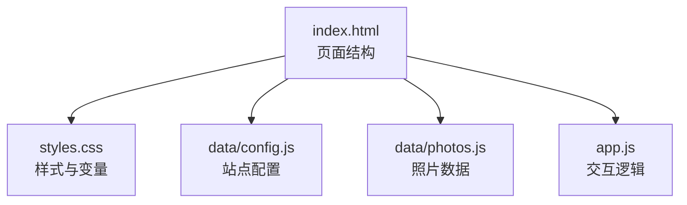
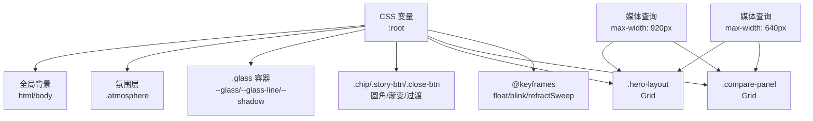
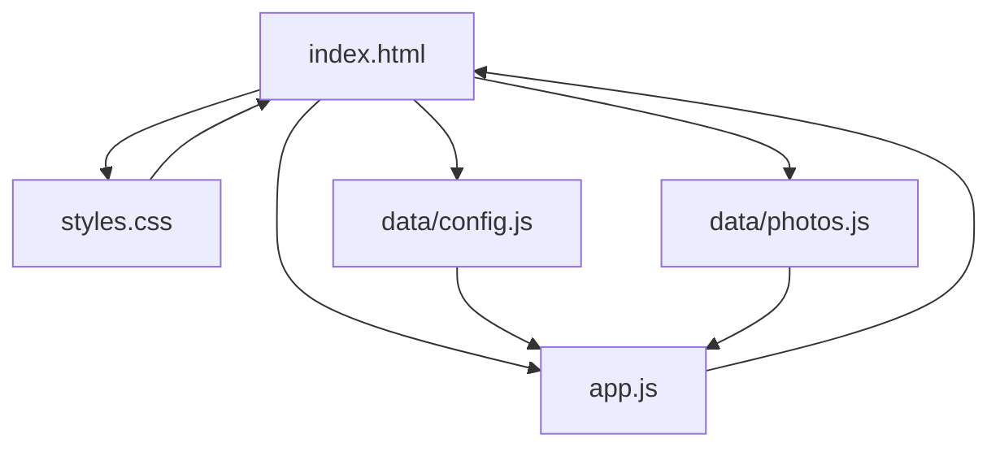

# 样式定制

<cite>
**本文引用的文件**
- [styles.css](file://styles.css)
- [index.html](file://index.html)
- [config.js](file://data/config.js)
- [photos.js](file://data/photos.js)
- [app.js](file://app.js)
- [README.md](file://README.md)
</cite>

## 目录
1. [简介](#简介)
2. [项目结构](#项目结构)
3. [核心组件](#核心组件)
4. [架构总览](#架构总览)
5. [详细组件分析](#详细组件分析)
6. [依赖分析](#依赖分析)
7. [性能考量](#性能考量)
8. [故障排查指南](#故障排查指南)
9. [结论](#结论)
10. [附录](#附录)

## 简介
本指南面向希望深度定制恋爱纪念站（Liquid Glass）样式的用户，聚焦于以下方面：
- CSS 变量系统：--bg-0 到 --bg-3 背景色系、--ink 色彩体系、--glass 透明度与边缘线、--accent 主题色、--shadow 阴影、--radius-* 圆角等。
- 主题色彩自定义：背景渐变、文字颜色、按钮样式、玻璃质感容器等。
- 布局系统：CSS Grid 与 Flexbox 的应用，如 .hero-layout、.compare-panel 等网格系统的定制要点。
- 响应式设计：断点与移动端适配策略，媒体查询覆盖范围。
- 动画效果：关键帧动画 float、blink、refractSweep 的行为与触发方式。
- 视觉元素：圆角半径、阴影、模糊滤镜等的调优建议。
- 示例与对比：通过变量路径定位与媒体查询位置，帮助理解每项定制对整体视觉的影响。

## 项目结构
该站点采用极简结构：HTML 页面引入样式表与脚本，样式集中在单一 CSS 文件中，数据通过 JS 配置与照片数据注入。

图表来源
- [index.html:1-140](file://index.html#L1-L140)
- [styles.css:1-15](file://styles.css#L1-L15)
- [config.js:1-27](file://data/config.js#L1-L27)
- [photos.js:1-315](file://data/photos.js#L1-L315)
- [app.js:1-690](file://app.js#L1-L690)

章节来源
- [index.html:1-140](file://index.html#L1-L140)
- [styles.css:1-15](file://styles.css#L1-L15)
- [README.md:1-87](file://README.md#L1-L87)

## 核心组件
本节梳理样式系统的关键变量与组件，便于快速定位定制入口。

- CSS 变量系统（根作用域）
  - 背景色系：--bg-0、--bg-1、--bg-2、--bg-3
  - 文字与辅助色：--ink、--ink-soft
  - 玻璃质感：--glass、--glass-line
  - 主题强调色：--accent、--accent-2
  - 阴影：--shadow
  - 圆角：--radius-xl、--radius-md
- 全局背景与氛围层
  - html/body 背景由径向渐变与线性渐变组合构成，使用变量作为色阶。
  - .atmosphere 提供动态背景层，含径向渐变、锥形渐变与模糊滤镜。
- 容器与按钮
  - .glass 为通用玻璃质感容器，使用 --glass、--glass-line、--shadow。
  - .chip、.story-btn、.close-btn 等按钮使用统一圆角、渐变与过渡。
- 布局网格
  - .hero-layout 使用 CSS Grid 控制主副区布局。
  - .compare-panel 使用 CSS Grid 控制左右卡片对比布局。
- 动画与过渡
  - @keyframes float、blink、refractSweep；部分元素通过类名触发动画。
- 响应式断点
  - 以 920px 与 640px 为主要断点，覆盖导航、网格、卡片尺寸与对比面板布局。

章节来源
- [styles.css:1-15](file://styles.css#L1-L15)
- [styles.css:21-32](file://styles.css#L21-L32)
- [styles.css:53-85](file://styles.css#L53-L85)
- [styles.css:129-140](file://styles.css#L129-L140)
- [styles.css:205-210](file://styles.css#L205-L210)
- [styles.css:659-679](file://styles.css#L659-L679)
- [styles.css:774-805](file://styles.css#L774-L805)
- [styles.css:807-899](file://styles.css#L807-L899)

## 架构总览
下图展示样式变量与组件之间的关系，以及媒体查询对布局的干预点。

图表来源
- [styles.css:1-15](file://styles.css#L1-L15)
- [styles.css:21-32](file://styles.css#L21-L32)
- [styles.css:53-85](file://styles.css#L53-L85)
- [styles.css:129-140](file://styles.css#L129-L140)
- [styles.css:205-210](file://styles.css#L205-L210)
- [styles.css:659-679](file://styles.css#L659-L679)
- [styles.css:774-805](file://styles.css#L774-L805)
- [styles.css:807-899](file://styles.css#L807-L899)

## 详细组件分析

### CSS 变量系统与主题色彩定制
- 背景色系与背景渐变
  - 背景色系通过 --bg-0 至 --bg-3 定义，配合径向与线性渐变，形成柔和的背景层次。
  - 修改建议：调整这些变量值可改变整体基调；若需冷暖差异，可将相邻色阶互换或增加饱和度差异。
- 文字与辅助色
  - --ink 为主文字色，--ink-soft 为弱化文字色；用于标题、说明、标签等。
  - 修改建议：保持对比度，确保可读性；深色背景下提高 --ink-soft 的明度。
- 玻璃质感与透明度
  - --glass 与 --glass-line 控制容器的背景与边框透明度；--shadow 控制投影强度。
  - 修改建议：降低 --glass 的不透明度或增大 backdrop-filter 模糊半径，可增强“液态玻璃”通透感。
- 主题强调色
  - --accent 与 --accent-2 用于高亮元素，如按钮、时钟强调色等。
  - 修改建议：根据品牌色选择相近色系，避免与背景产生冲突。
- 圆角与阴影
  - --radius-xl、--radius-md 控制大卡片与小卡片圆角；--shadow 控制投影。
  - 修改建议：增大圆角半径可营造更柔和的视觉，但需注意在密集布局中的空间占用。

章节来源
- [styles.css:1-15](file://styles.css#L1-L15)
- [styles.css:21-32](file://styles.css#L21-L32)
- [styles.css:25](file://styles.css#L25)
- [styles.css:129-140](file://styles.css#L129-L140)
- [styles.css:137-139](file://styles.css#L137-L139)

### 布局系统：CSS Grid 与 Flexbox
- .hero-layout（网格）
  - 使用两列网格：minmax(0, 1.14fr) 与 minmax(260px, 0.86fr)，主区与侧区宽度比固定。
  - 定制要点：调整列宽比例或断点处的 grid-template-columns，可改变主副区占比。
- .compare-panel（网格）
  - 使用两列等分网格，中间竖线作为视觉分割；断点下变为单列堆叠。
  - 定制要点：通过 grid-template-columns 与 ::before 分割线的可见性控制，平衡对比与信息密度。
- 导航与按钮（Flexbox）
  - .nav-shell 使用 Flex 布局，wrap 与 gap 控制紧凑排列。
  - 定制要点：在窄屏下通过 flex-wrap 与 gap 调整按钮拥挤程度。

章节来源
- [styles.css:205-210](file://styles.css#L205-L210)
- [styles.css:659-679](file://styles.css#L659-L679)
- [styles.css:807-846](file://styles.css#L807-L846)
- [styles.css:848-898](file://styles.css#L848-L898)
- [styles.css:142-152](file://styles.css#L142-L152)

### 响应式设计与断点调整
- 断点策略
  - 920px：导航圆角与 wrap、.hero-layout 切换为单列、.compare 切换单列、侧区网格重排。
  - 640px：整体内边距减少、河流高度与卡片宽度调整、对比面板移除分割线、主副区与侧区均改为单列。
- 移动端适配建议
  - 减少阴影与模糊以提升渲染性能。
  - 适当增大触摸目标尺寸，保证按钮与卡片点击区域。
  - 在窄屏下优先保证信息层级清晰，避免过度复杂的网格嵌套。

章节来源
- [styles.css:807-846](file://styles.css#L807-L846)
- [styles.css:848-898](file://styles.css#L848-L898)

### 动画效果定制
- 关键帧动画
  - float：气泡类元素的上下漂移动画，适合背景装饰。
  - blink：时钟冒号闪烁，强调时间跳变。
  - refractSweep：折射扫光动画，用于 .compare 区域进入视口时的视觉引导。
- 触发方式
  - .blob 类使用 animation: float；.live-clock em 使用 animation: blink；.compare.refract-run 触发折射扫光。
- 定制建议
  - 调整动画时长与缓动函数可改变节奏感；对低端设备可禁用或简化模糊与投影。

章节来源
- [styles.css:87-119](file://styles.css#L87-L119)
- [styles.css:303-322](file://styles.css#L303-L322)
- [styles.css:595-610](file://styles.css#L595-L610)
- [styles.css:774-805](file://styles.css#L774-L805)

### 视觉元素：圆角、阴影、模糊滤镜
- 圆角
  - 使用 --radius-xl（30px）、--radius-md（18px）控制大卡片与小卡片圆角。
- 阴影
  - --shadow 控制整体投影；各容器独立叠加 inset 高光，提升玻璃质感。
- 模糊滤镜
  - .glass 使用 backdrop-filter 与 -webkit-backdrop-filter；.blob、.grain、.compare-refraction 等使用 filter: blur。
- 定制建议
  - 在浅色主题下适度降低模糊半径，避免“虚化”影响可读性；在深色主题下可适度增强投影。

章节来源
- [styles.css:13-15](file://styles.css#L13-L15)
- [styles.css:129-140](file://styles.css#L129-L140)
- [styles.css:87-119](file://styles.css#L87-L119)
- [styles.css:595-610](file://styles.css#L595-L610)

### 按钮与交互元素样式
- .chip、.story-btn、.close-btn
  - 统一圆角、渐变背景、边框与过渡；hover 时提升阴影与位移。
- .spotlight-frame、.compare-card
  - 边框、内发光与阴影叠加，营造立体感；hover 时位移与阴影增强。
- 定制建议
  - 保持按钮状态一致性，避免不同按钮的 hover 效果差异过大。

章节来源
- [styles.css:169-192](file://styles.css#L169-L192)
- [styles.css:242-260](file://styles.css#L242-L260)
- [styles.css:681-707](file://styles.css#L681-L707)

## 依赖分析
样式系统与页面结构、数据配置的耦合关系如下：

图表来源
- [index.html:1-140](file://index.html#L1-L140)
- [styles.css:1-15](file://styles.css#L1-L15)
- [config.js:1-27](file://data/config.js#L1-L27)
- [photos.js:1-315](file://data/photos.js#L1-L315)
- [app.js:1-690](file://app.js#L1-L690)

章节来源
- [index.html:1-140](file://index.html#L1-L140)
- [config.js:1-27](file://data/config.js#L1-L27)
- [photos.js:1-315](file://data/photos.js#L1-L315)
- [app.js:1-690](file://app.js#L1-L690)

## 性能考量
- 渲染优化
  - 在移动端减少 backdrop-filter 与 filter: blur 的使用频率，避免频繁合成。
  - 合理使用 transform 与 opacity 动画，减少强制同步布局。
- 布局优化
  - 在窄屏断点下减少复杂网格嵌套，优先使用 Flexbox 与简单 Grid。
- 数据与资源
  - 照片尺寸建议控制在 1800px 长边以内，优先 WebP/AVIF，有助于加载与渲染性能。

章节来源
- [README.md:84-87](file://README.md#L84-L87)

## 故障排查指南
- 变量未生效
  - 确认变量定义在 :root 中且未被局部覆盖；检查是否拼写错误或大小写问题。
- 动画异常
  - 检查是否正确添加触发类名（如 .refract-run）；确认关键帧名称一致。
- 响应式布局错乱
  - 检查媒体查询断点是否与预期一致；确认 grid-template-columns 与 flex 属性在断点下的切换逻辑。
- 玻璃质感不明显
  - 调整 --glass 与 --glass-line 的透明度与颜色；适当增大 backdrop-filter 模糊半径。

章节来源
- [styles.css:1-15](file://styles.css#L1-L15)
- [styles.css:595-610](file://styles.css#L595-L610)
- [styles.css:807-899](file://styles.css#L807-L899)

## 结论
通过合理利用 CSS 变量系统与媒体查询，结合 Grid/Flexbox 布局与关键帧动画，可以高效地完成恋爱纪念站的主题定制。建议从变量与背景入手，逐步细化按钮、卡片与动画细节，并在移动端进行重点优化，以获得最佳的视觉与性能平衡。

## 附录
- 变量与组件定位参考
  - 背景色系与背景渐变：[styles.css:21-32](file://styles.css#L21-L32)
  - 玻璃质感容器：[styles.css:129-140](file://styles.css#L129-L140)
  - 主题强调色与阴影：[styles.css:1-15](file://styles.css#L1-L15)
  - .hero-layout 网格：[styles.css:205-210](file://styles.css#L205-L210)
  - .compare-panel 网格：[styles.css:659-679](file://styles.css#L659-L679)
  - 动画关键帧：[styles.css:774-805](file://styles.css#L774-L805)
  - 响应式断点：[styles.css:807-899](file://styles.css#L807-L899)