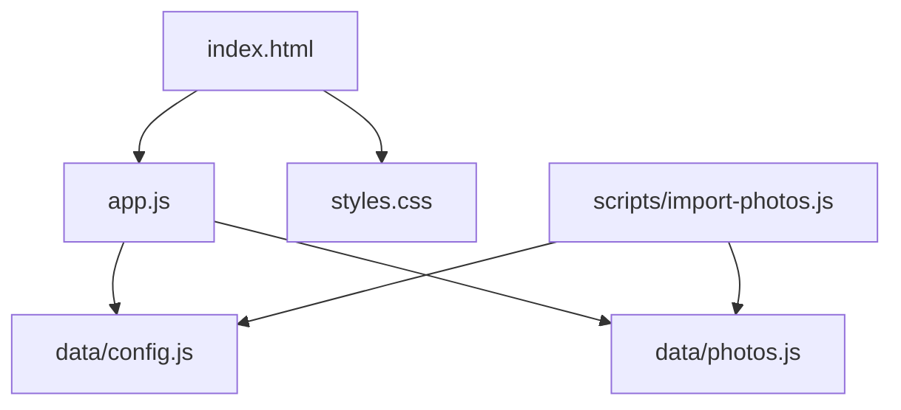
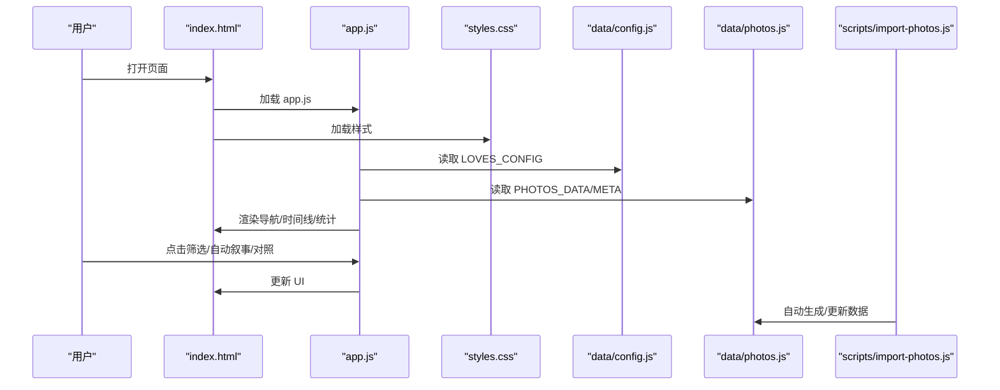
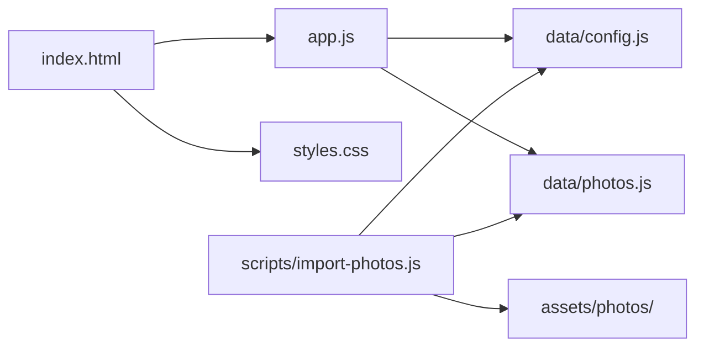

# 自定义指南

<cite>
**本文引用的文件**
- [index.html](file://index.html)
- [styles.css](file://styles.css)
- [app.js](file://app.js)
- [data/config.js](file://data/config.js)
- [data/photos.js](file://data/photos.js)
- [data/photos.json](file://data/photos.json)
- [scripts/import-photos.js](file://scripts/import-photos.js)
- [README.md](file://README.md)
</cite>

## 目录
1. [简介](#简介)
2. [项目结构](#项目结构)
3. [核心组件](#核心组件)
4. [架构总览](#架构总览)
5. [详细组件分析](#详细组件分析)
6. [依赖关系分析](#依赖关系分析)
7. [性能与优化](#性能与优化)
8. [故障排查](#故障排查)
9. [结论](#结论)
10. [附录](#附录)

## 简介
本指南面向希望深度定制恋爱纪念站的用户，涵盖主题样式、字体与动画、CSS 变量、地点筛选扩展、配置参数、响应式与移动端适配、图片格式与性能优化、功能扩展与行为修改、以及部署与 SEO 建议。文档基于仓库现有代码进行分析，提供可操作的步骤与最佳实践。

## 项目结构
项目采用“静态页面 + 数据脚本”的轻量架构：
- 入口页面：index.html
- 样式层：styles.css（含 CSS 变量与动画）
- 逻辑层：app.js（配置合并、数据加载、渲染与交互）
- 数据层：data/config.js（站点配置）、data/photos.js（照片数据）、data/photos.json（示例数据）
- 导入工具：scripts/import-photos.js（自动扫描 assets/photos 并生成 data/photos.js）

图表来源
- [index.html:1-140](file://index.html#L1-L140)
- [app.js:1-120](file://app.js#L1-L120)
- [data/config.js:1-27](file://data/config.js#L1-L27)
- [data/photos.js:1-315](file://data/photos.js#L1-L315)
- [scripts/import-photos.js:1-120](file://scripts/import-photos.js#L1-L120)

章节来源
- [index.html:1-140](file://index.html#L1-L140)
- [README.md:1-87](file://README.md#L1-L87)

## 核心组件
- 主题与样式系统
  - 使用 CSS 变量集中管理颜色、阴影、圆角等，便于全局替换。
  - 提供玻璃拟态（backdrop-filter、高斯模糊）与动画（浮动、闪烁、折射）。
- 数据与配置
  - 配置通过 window.LOVE_CONFIG 合并默认值，支持自定义起始日期、目标数量、导航标签与城市列表。
  - 照片数据可通过手动维护或自动导入生成。
- 交互与体验
  - 时间潮汐（横向滚动路径）、自动叙事、随机时空对照、模态查看、懒加载与进度指示。

章节来源
- [styles.css:1-16](file://styles.css#L1-L16)
- [app.js:1-120](file://app.js#L1-L120)
- [data/config.js:1-27](file://data/config.js#L1-L27)
- [data/photos.js:1-315](file://data/photos.js#L1-L315)

## 架构总览
整体流程：index.html 加载样式与脚本；app.js 初始化配置与数据，构建 UI；styles.css 提供视觉与动画；data/config.js 与 data/photos.js 提供运行期数据；scripts/import-photos.js 负责照片导入与元数据生成。

图表来源
- [index.html:135-137](file://index.html#L135-L137)
- [app.js:71-89](file://app.js#L71-L89)
- [data/config.js:1-27](file://data/config.js#L1-L27)
- [data/photos.js:1-315](file://data/photos.js#L1-L315)
- [scripts/import-photos.js:29-85](file://scripts/import-photos.js#L29-L85)

## 详细组件分析

### 主题样式与 CSS 变量
- CSS 变量集中于 :root，包含背景、文字、玻璃面板、阴影、圆角等。
- 样式层大量使用 var(--变量) 进行主题化，便于全局替换。
- 动画包括浮动 blob、闪烁冒号、折射扫光等，提升液态玻璃质感。
- 响应式通过 clamp、grid、aspect-ratio、backdrop-filter 等实现。

最佳实践
- 修改 :root 中的颜色变量即可快速切换主题色板。
- 新增变量时保持语义化命名，避免硬编码颜色。
- 动画时注意性能，必要时在低配设备上降级。

章节来源
- [styles.css:1-16](file://styles.css#L1-L16)
- [styles.css:774-800](file://styles.css#L774-L800)

### 字体与排版
- 正文字体：Manrope（现代无衬线），标题字体：Instrument Serif（衬线）。
- 通过 CSS 变量与媒体查询配合 clamp 实现响应式字号。
- 重要文本使用粗体与对比色，确保可读性。

章节来源
- [index.html:11-16](file://index.html#L11-L16)
- [styles.css:26-47](file://styles.css#L26-L47)

### 动画与过渡
- 浮动背景球：使用 @keyframes float，不同延迟与尺寸营造层次感。
- 时间轴冒号闪烁：@keyframes blink。
- 折射扫光：@keyframes refractSweep，配合类名触发。
- 卡片悬停与点击反馈：transform、box-shadow、transition。

章节来源
- [styles.css:87-127](file://styles.css#L87-L127)
- [styles.css:774-800](file://styles.css#L774-L800)

### 地点筛选与城市扩展
- 城市列表来源于 window.LOVE_CONFIG.places，支持 id/name/别名映射。
- 自动筛选按钮由收集到的城市动态生成，无需改动 HTML。
- 文件夹命名规则支持“城市-访问序号”，如 foshan1、foshan2，自动统计访问次数。

扩展步骤
- 在 data/config.js 的 places 数组中追加新城市对象（id 与 name 必填）。
- 将照片按 assets/photos/<城市>/<日期>-标题.ext 放置，或使用导入脚本自动识别。
- 如需别名，可在导入脚本中扩展别名匹配逻辑（见“功能扩展”）。

章节来源
- [app.js:156-176](file://app.js#L156-L176)
- [app.js:604-617](file://app.js#L604-L617)
- [data/config.js:6-26](file://data/config.js#L6-L26)
- [scripts/import-photos.js:206-237](file://scripts/import-photos.js#L206-L237)
- [scripts/import-photos.js:318-338](file://scripts/import-photos.js#L318-L338)

### 应用配置参数
- startDate：用于“在一起天数”计算。
- targetCount：占位图生成数量。
- navAllLabel：导航“全部足迹”标签文案。
- places：城市列表，支持字符串或对象（id/name/别名）。

自定义方法
- 在 index.html 中注入 window.LOVE_CONFIG，或在 data/config.js 中维护。
- 通过 buildConfig 合并默认配置与自定义配置，去重并规范化城市项。

章节来源
- [app.js:1-12](file://app.js#L1-L12)
- [app.js:619-635](file://app.js#L619-L635)
- [data/config.js:1-27](file://data/config.js#L1-L27)

### 数据加载与渲染
- 优先使用 window.PHOTOS_DATA，否则尝试 data/photos.json，最后生成占位图。
- 时间线卡片按时间排序，路径由 SVG 贝塞尔曲线绘制，卡片位置通过数学函数计算。
- 懒加载使用 IntersectionObserver，减少首屏压力。

章节来源
- [app.js:91-105](file://app.js#L91-L105)
- [app.js:337-376](file://app.js#L337-L376)
- [app.js:41-51](file://app.js#L41-L51)

### 响应式设计与移动端适配
- 使用 clamp、min/max、aspect-ratio、grid、backdrop-filter 等现代特性。
- 移动端建议
  - 控制卡片宽度与间距，避免过密导致滚动卡顿。
  - 降低动画复杂度（如减少 backdrop-filter 模糊半径）。
  - 适当增大触摸目标尺寸，提升可点触性。
  - 在 viewport 中限制最大宽度，避免横向滚动过大。

章节来源
- [styles.css:420-423](file://styles.css#L420-L423)
- [styles.css:477-488](file://styles.css#L477-L488)
- [styles.css:514-553](file://styles.css#L514-L553)
- [README.md:84-87](file://README.md#L84-L87)

### 图片格式优化与性能调优
- 推荐 WebP/AVIF，长边控制在 1800px 内，以平衡清晰度与体积。
- 懒加载与异步解码：img.loading="lazy"、decoding="async"、IntersectionObserver。
- 卡片尺寸按视口缩放，避免超大图片造成内存压力。
- 折射扫光与高斯模糊在低端设备上可能影响帧率，可按需禁用或降级。

章节来源
- [README.md:84-87](file://README.md#L84-L87)
- [app.js:358-362](file://app.js#L358-L362)
- [styles.css:138-140](file://styles.css#L138-L140)

### 功能扩展与行为修改
- 新增城市筛选：仅需在 places 中添加，无需改 HTML/JS。
- 新增导航标签：通过 navAllLabel 自定义“全部足迹”文案。
- 自动叙事：可调整步进数量与滚动间隔。
- 随机对照：可调整左右区间采样策略。
- 导入脚本增强：可扩展别名匹配、日期推断、标题清洗规则。

章节来源
- [app.js:514-538](file://app.js#L514-L538)
- [app.js:444-453](file://app.js#L444-L453)
- [scripts/import-photos.js:288-316](file://scripts/import-photos.js#L288-L316)
- [scripts/import-photos.js:458-489](file://scripts/import-photos.js#L458-L489)

### 自定义域名部署与 SEO 建议
- 部署：将项目根目录作为静态站点发布至任意静态托管（GitHub Pages、Vercel、Netlify 等）。
- SEO：在 index.html 中完善 meta 标签（title/description/keywords），可考虑结构化数据（如事件/图片）。
- 性能：启用 Gzip/Brotli 压缩，CDN 缓存，预连接字体与资源。

章节来源
- [index.html:7-16](file://index.html#L7-L16)

## 依赖关系分析
- index.html 依赖 app.js、styles.css、data/config.js、data/photos.js。
- app.js 依赖 data/config.js 与 data/photos.js，内部逻辑相互协作。
- scripts/import-photos.js 依赖 data/config.js 与 assets/photos 目录，生成 data/photos.js。

图表来源
- [index.html:135-137](file://index.html#L135-L137)
- [app.js:1-120](file://app.js#L1-L120)
- [data/config.js:1-27](file://data/config.js#L1-L27)
- [data/photos.js:1-315](file://data/photos.js#L1-L315)
- [scripts/import-photos.js:8-17](file://scripts/import-photos.js#L8-L17)

章节来源
- [index.html:135-137](file://index.html#L135-L137)
- [app.js:1-120](file://app.js#L1-L120)
- [scripts/import-photos.js:1-17](file://scripts/import-photos.js#L1-L17)

## 性能与优化
- 图片体积与格式：优先 WebP/AVIF，控制长边尺寸。
- 懒加载与解码：使用 lazy 与 async，减少主线程阻塞。
- 动画与滤镜：在低端设备上适度降级，避免过度模糊与复杂遮罩。
- 滚动性能：合理设置滚动容器高度与卡片密度，避免过多 DOM 节点同时渲染。
- 预渲染与缓存：利用浏览器缓存策略，减少重复请求。

章节来源
- [README.md:84-87](file://README.md#L84-L87)
- [app.js:358-362](file://app.js#L358-L362)
- [styles.css:138-140](file://styles.css#L138-L140)

## 故障排查
- 页面空白或无数据
  - 检查 data/config.js 是否正确注入 window.LOVE_CONFIG。
  - 确认 data/photos.js 是否存在且可被 app.js 读取。
  - 若无数据，页面会回退生成占位图，检查网络与缓存策略。
- 城市筛选不显示
  - 确认 places 列表中的 id 与照片文件夹命名一致（大小写与连字符）。
  - 使用导入脚本自动识别时，检查文件夹命名是否符合“城市-序号”规则。
- 自动叙事/对照无效
  - 检查是否存在足够照片（至少 2 张）。
  - 确认滚动容器与进度元素存在且未被隐藏。
- 图片加载慢或卡顿
  - 检查图片尺寸与格式，必要时压缩或转换。
  - 减少 backdrop-filter 模糊半径或在移动端禁用。

章节来源
- [app.js:91-105](file://app.js#L91-L105)
- [app.js:156-176](file://app.js#L156-L176)
- [app.js:425-453](file://app.js#L425-L453)
- [README.md:84-87](file://README.md#L84-L87)

## 结论
本项目以简洁的静态页面与可配置的数据层为核心，提供了高度可定制的主题、灵活的城市筛选、流畅的交互体验与完善的自动化导入能力。通过 CSS 变量与模块化 JS，用户可以低成本完成主题、布局与功能的深度定制，并在静态托管环境下实现快速部署与 SEO 优化。

## 附录

### 主题样式自定义步骤
- 修改 :root 中的颜色变量（如 --bg-0/--ink/--accent）以更换主色调。
- 调整 --radius 变量改变圆角风格。
- 控制玻璃面板与阴影变量以改变透明度与模糊程度。
- 如需禁用动画，可移除对应类或在低配设备上禁用关键动画。

章节来源
- [styles.css:1-16](file://styles.css#L1-L16)
- [styles.css:129-140](file://styles.css#L129-L140)

### 地点列表扩展与筛选
- 在 data/config.js 的 places 中添加新城市对象，字段包含 id 与 name。
- 将照片按 assets/photos/<城市>/<日期>-标题.ext 放置，或使用导入脚本。
- 导入脚本会自动统计访问次数并生成元数据。

章节来源
- [data/config.js:6-26](file://data/config.js#L6-L26)
- [scripts/import-photos.js:318-338](file://scripts/import-photos.js#L318-L338)
- [scripts/import-photos.js:359-398](file://scripts/import-photos.js#L359-L398)

### 配置参数说明
- startDate：起始日期，用于“在一起天数”计算。
- targetCount：占位图数量。
- navAllLabel：导航“全部足迹”标签文案。
- places：城市列表，支持字符串或对象（id/name/别名）。

章节来源
- [app.js:1-12](file://app.js#L1-L12)
- [data/config.js:1-27](file://data/config.js#L1-L27)

### 数据格式与导入
- 手动维护：在 data/photos.js 中填充每张照片的 id/src/title/date/place。
- 自动导入：运行 node scripts/import-photos.js，支持 --watch 实时监听。
- 示例数据：data/photos.json 展示了基本字段结构。

章节来源
- [README.md:31-75](file://README.md#L31-L75)
- [scripts/import-photos.js:29-85](file://scripts/import-photos.js#L29-L85)
- [data/photos.json:1-67](file://data/photos.json#L1-L67)