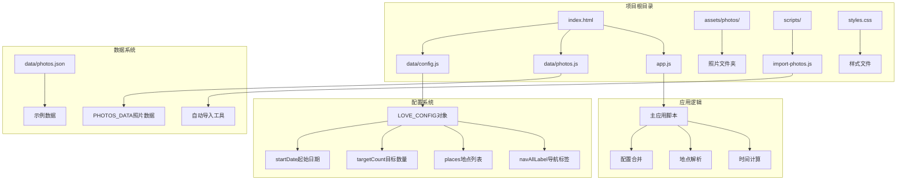
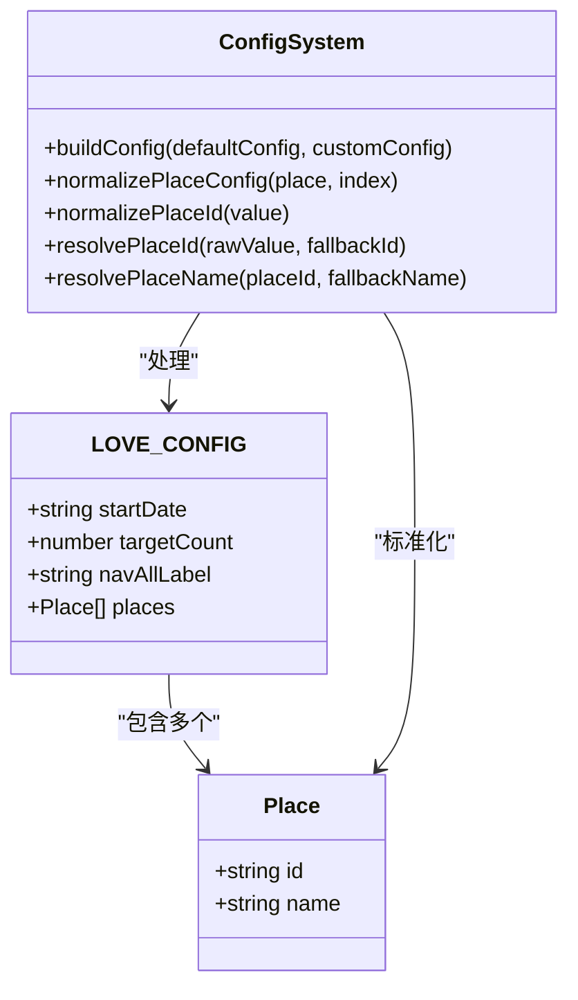
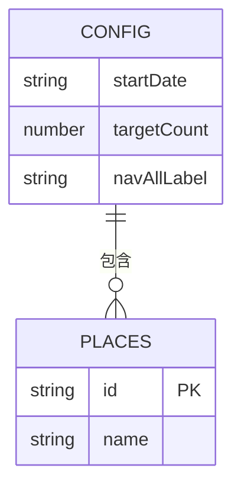
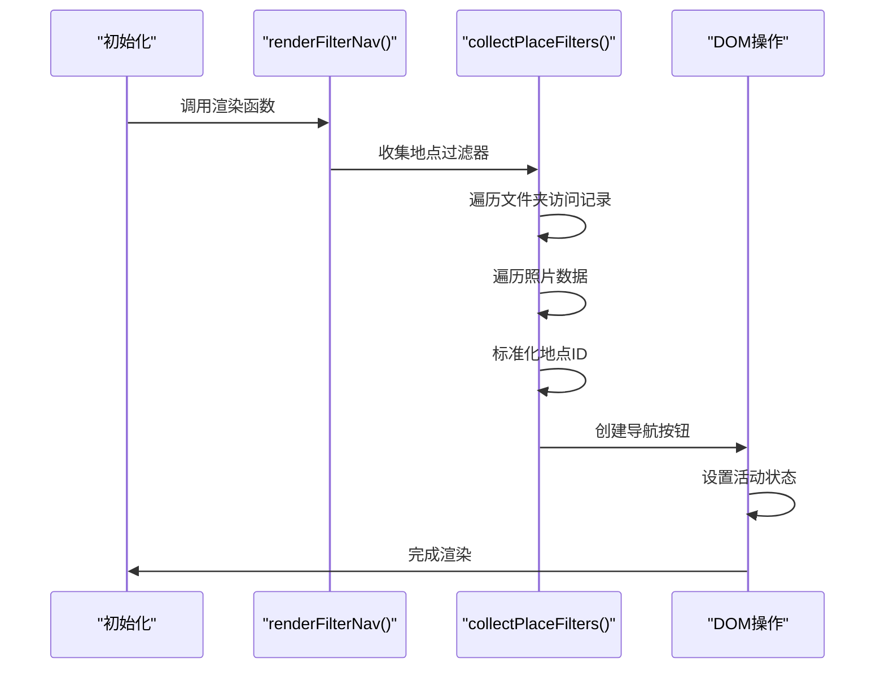
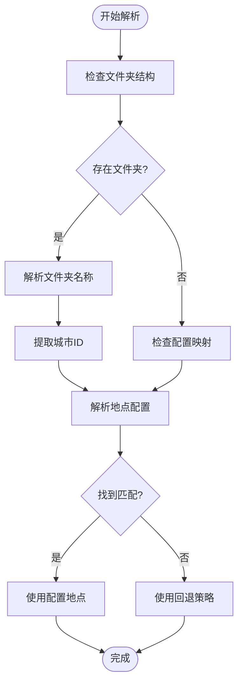
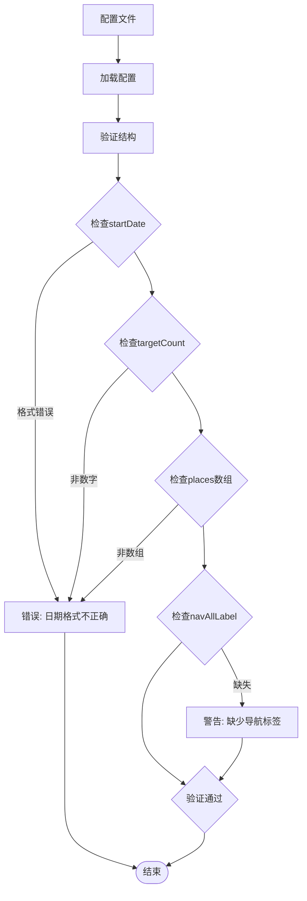
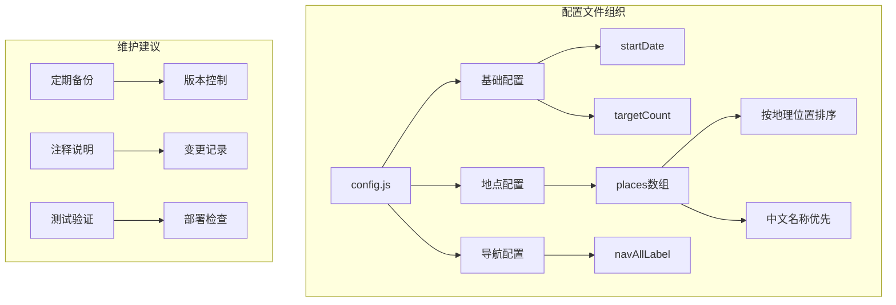

# 配置扩展

<cite>
**本文档引用的文件**
- [config.js](file://data/config.js)
- [app.js](file://app.js)
- [index.html](file://index.html)
- [README.md](file://README.md)
- [photos.js](file://data/photos.js)
- [photos.json](file://data/photos.json)
- [import-photos.js](file://scripts/import-photos.js)
- [styles.css](file://styles.css)
</cite>

## 目录
1. [简介](#简介)
2. [项目结构概览](#项目结构概览)
3. [核心配置参数详解](#核心配置参数详解)
4. [地点配置管理](#地点配置管理)
5. [地点筛选导航实现原理](#地点筛选导航实现原理)
6. [targetCount 参数影响分析](#targetcount-参数影响分析)
7. [配置验证与错误排查](#配置验证与错误排查)
8. [完整配置示例](#完整配置示例)
9. [最佳实践建议](#最佳实践建议)
10. [故障排除指南](#故障排除指南)

## 简介

恋爱纪念站是一个基于 Web 技术的苹果风格液态玻璃恋爱纪念应用。它通过"时间潮汐"的方式展示情侣的珍贵回忆，让用户能够以沉浸式体验穿越时光，感受彼此的美好瞬间。

本指南专注于配置系统的扩展，帮助用户深入了解如何定制和扩展应用的各种功能特性。

## 项目结构概览



**图表来源**
- [index.html:135-137](file://index.html#L135-L137)
- [config.js:1-27](file://data/config.js#L1-L27)
- [app.js:14-16](file://app.js#L14-L16)

**章节来源**
- [index.html:1-140](file://index.html#L1-L140)
- [config.js:1-27](file://data/config.js#L1-L27)
- [app.js:1-690](file://app.js#L1-L690)

## 核心配置参数详解

### LOVES_CONFIG 对象结构

应用的配置系统基于一个全局的 `LOVE_CONFIG` 对象，该对象包含以下核心参数：



**图表来源**
- [config.js:1-27](file://data/config.js#L1-L27)
- [app.js:619-660](file://app.js#L619-L660)

### startDate 起始日期配置

`startDate` 参数是应用的核心配置项，用于计算"在一起多少天"的统计数据。

**配置位置**: [config.js:3](file://data/config.js#L3)

**配置格式要求**:
- 必须是有效的日期字符串
- 格式: `"YYYY-MM-DD"`
- 示例: `"2025-11-15"`

**技术实现**:
- 应用启动时会解析该日期
- 计算当前日期与起始日期的差值
- 显示在页面的"在一起天数"区域

**章节来源**
- [config.js:2-3](file://data/config.js#L2-L3)
- [app.js:15](file://app.js#L15)
- [app.js:71-72](file://app.js#L71-L72)

### targetCount 目标数量配置

`targetCount` 参数决定了应用的默认行为和性能表现。

**配置位置**: [config.js:4](file://data/config.js#L4)

**功能作用**:
1. **占位图生成**: 当没有可用照片数据时，生成指定数量的占位图
2. **时间轴长度**: 影响时间潮汐的初始宽度和布局
3. **性能基准**: 作为应用性能优化的参考值

**默认值**: 500（在配置文件中定义）

**章节来源**
- [config.js:4](file://data/config.js#L4)
- [app.js:16](file://app.js#L16)
- [app.js:135-154](file://app.js#L135-L154)

### navAllLabel 导航标签配置

`navAllLabel` 参数自定义顶部导航栏的"全部足迹"按钮文本。

**配置位置**: [config.js:5](file://data/config.js#L5)

**默认值**: "全部足迹"

**使用场景**:
- 支持多语言环境
- 可以根据个人喜好自定义文案
- 影响用户体验的一致性

**章节来源**
- [config.js:5](file://data/config.js#L5)
- [app.js:162](file://app.js#L162)

## 地点配置管理

### 地点列表结构

`places` 数组定义了所有支持的城市/地点配置。每个地点包含以下字段：



**图表来源**
- [config.js:6-23](file://data/config.js#L6-L23)
- [app.js:619-635](file://app.js#L619-L635)

### 地点配置字段详解

#### placeId 命名规则

**字段**: `id` (必需)

**命名规范**:
1. **小写字母**: 全部转换为小写
2. **连字符分隔**: 使用连字符 `-` 连接单词
3. **去除特殊字符**: 移除所有非字母数字字符
4. **唯一性**: 在整个配置中必须唯一

**有效示例**:
- `"hongkong"` ✓
- `"shanghai"` ✓  
- `"beijing"` ✓
- `"guangzhou"` ✓

**无效示例**:
- `"Hong Kong"` ✗ (包含空格)
- `"shanghai-1"` ✗ (数字后缀可能被识别为访问次数)
- `"Beijing"` ✗ (包含大写字母)

#### placeName 显示名称

**字段**: `name` (必需)

**配置要求**:
- 中文名称，便于用户阅读
- 不需要与 `id` 完全一致
- 可以包含中文标点符号

**示例对比**:
- `id: "hongkong"` → `name: "香港"`
- `id: "guangzhou"` → `name: "广州"`
- `id: "shanghai"` → `name: "上海"`

#### 访问计数 visit 字段

**字段**: `visit` (可选)

**用途**: 表示某个地点的访问次数

**默认值**: 1

**应用场景**:
- 同一地点多次访问
- 区分不同行程
- 影响地点统计和筛选

**章节来源**
- [config.js:6-23](file://data/config.js#L6-L23)
- [app.js:637-652](file://app.js#L637-L652)

### 添加新城市地点的步骤

#### 步骤1: 准备照片文件夹

按照约定的文件夹命名规则创建照片目录：

```
assets/photos/
├── hongkong1/
├── hongkong2/
├── guangzhou1/
├── shanghai1/
└── 新城市名称1/
```

**命名规则**:
- 文件夹名必须与 `places` 配置中的 `id` 匹配
- 可选的数字后缀表示访问次数 (`1`, `2`, `3`...)
- 支持中文和英文混合命名

#### 步骤2: 更新配置文件

在 `data/config.js` 中添加新的地点配置：

```javascript
places: [
  // ... 现有地点 ...
  { id: "新城市", name: "新城市名称" }
]
```

#### 步骤3: 导入照片数据

运行自动导入工具：

```bash
node scripts/import-photos.js
```

或启用实时监听模式：

```bash
node scripts/import-photos.js --watch
```

**章节来源**
- [README.md:71-74](file://README.md#L71-L74)
- [README.md:48-60](file://README.md#L48-L60)

## 地点筛选导航实现原理

### 导航渲染机制

地点筛选导航是通过动态生成按钮来实现的，具有以下特点：



**图表来源**
- [app.js:156-176](file://app.js#L156-L176)
- [app.js:178-204](file://app.js#L178-L204)

### 地点过滤收集流程

应用通过以下方式收集可用的地点过滤器：

1. **文件夹访问记录**: 分析 `photosMeta.folderVisits` 中的地点统计
2. **照片数据遍历**: 扫描实际存在的照片记录
3. **ID标准化**: 使用 `normalizePlaceId()` 标准化地点标识符
4. **去重处理**: 使用 `Map` 确保每个地点只出现一次

**章节来源**
- [app.js:178-204](file://app.js#L178-L204)
- [app.js:654-660](file://app.js#L654-L660)

### 地点解析算法

应用实现了智能的地点解析机制：



**图表来源**
- [app.js:206-231](file://app.js#L206-L231)
- [app.js:604-617](file://app.js#L604-L617)

**章节来源**
- [app.js:206-231](file://app.js#L206-L231)
- [app.js:604-617](file://app.js#L604-L617)

## targetCount 参数影响分析

### 对时间潮汐长度的影响

`targetCount` 参数直接影响时间潮汐的初始布局和性能表现：

```mermaid
graph LR
A[targetCount] --> B[初始卡片宽度]
B --> C[时间轴总宽度]
C --> D[滚动区域大小]
D --> E[渲染性能]
A --> |"数值越大"| B --> |"更宽"| C --> |"更大"| D --> |"更耗资源"| E --> |"性能下降"}
A --> |"数值适中"| B --> |"合理"| C --> |"平衡"| D --> |"良好"| E --> |"流畅"}
A --> |"数值过小"| B --> |"较窄"| C --> |"较小"| D --> |"较少"| E --> |"可能不足"}
```

**影响机制**:
1. **卡片间距**: 基于 `targetCount` 计算卡片之间的距离
2. **时间轴长度**: 影响 SVG 路径的总长度
3. **内存占用**: 更大的 `targetCount` 需要更多内存存储照片数据
4. **首次渲染**: 影响页面初次加载的响应时间

### 对自动叙事节奏的影响

自动叙事模式的播放节奏与 `targetCount` 存在间接关系：

**计算公式**:
```javascript
const steps = 18; // 固定步数
const duration = 1800; // 毫秒间隔
const totalDuration = steps * duration; // 总时长
```

**影响分析**:
- `targetCount` 主要影响时间轴的物理长度
- 自动叙事的步数是固定的 (18步)
- 因此播放速度相对恒定，不受 `targetCount` 影响

**章节来源**
- [app.js:340](file://app.js#L340)
- [app.js:523-537](file://app.js#L523-L537)

## 配置验证与错误排查

### 配置文件验证方法

#### 语法验证

使用 JavaScript 引擎验证配置文件的语法正确性：

```javascript
// 验证步骤
1. 加载 config.js 文件内容
2. 使用 VM 上下文执行
3. 检查 window.LOVE_CONFIG 对象是否存在
4. 验证必需字段完整性
```

#### 数据类型验证



**图表来源**
- [import-photos.js:190-204](file://scripts/import-photos.js#L190-L204)
- [app.js:14-16](file://app.js#L14-L16)

### 常见错误及解决方案

#### 错误1: 日期格式不正确

**症状**: 页面显示 "在一起天数" 为异常值

**原因**: `startDate` 格式不符合 "YYYY-MM-DD"

**解决方案**:
```javascript
// 错误格式
startDate: "15/11/2025"  // ✗
startDate: "2025-11-15"  // ✓

// 验证格式
const dateRegex = /^\d{4}-\d{2}-\d{2}$/;
if (!dateRegex.test(config.startDate)) {
    throw new Error("startDate 格式必须为 YYYY-MM-DD");
}
```

#### 错误2: 地点ID重复

**症状**: 地点筛选导航显示异常或重复

**原因**: `places` 数组中存在重复的 `id`

**解决方案**:
```javascript
// 检查重复ID
const ids = places.map(place => place.id);
const hasDuplicates = ids.some((id, index) => ids.indexOf(id) !== index);

if (hasDuplicates) {
    throw new Error("places 数组中存在重复的 id");
}
```

#### 错误3: 文件夹命名不匹配

**症状**: 照片无法正确分类到对应地点

**原因**: 照片文件夹名称与配置中的 `id` 不匹配

**解决方案**:
```javascript
// 确保文件夹命名与配置一致
// assets/photos/hongkong1/  ← 对应 { id: "hongkong" }
// assets/photos/beijing2/   ← 对应 { id: "beijing" }
```

**章节来源**
- [import-photos.js:190-204](file://scripts/import-photos.js#L190-L204)
- [app.js:619-635](file://app.js#L619-L635)

## 完整配置示例

### 基础配置模板

```javascript
window.LOVE_CONFIG = {
  // 在一起开始日期（用于"在一起 xx 天"）
  startDate: "2025-11-15",
  
  // 目标照片数量（用于占位图生成和性能基准）
  targetCount: 500,
  
  // 导航栏"全部足迹"按钮的显示文本
  navAllLabel: "全部足迹",
  
  // 地点列表配置
  places: [
    { id: "hongkong", name: "香港" },
    { id: "guangzhou", name: "广州" },
    { id: "nanjing", name: "南京" },
    { id: "shanghai", name: "上海" },
    { id: "hangzhou", name: "杭州" },
    { id: "foshan", name: "佛山" },
    { id: "beijing", name: "北京" },
    { id: "shenzhen", name: "深圳" },
    { id: "chengdu", name: "成都" },
    { id: "xian", name: "西安" },
    { id: "wuhan", name: "武汉" },
    { id: "chongqing", name: "重庆" },
    { id: "tianjin", name: "天津" },
    { id: "nanning", name: "南宁" },
    { id: "kunming", name: "昆明" },
    { id: "suzhou", name: "苏州" },
    { id: "xining", name: "西宁" }
  ]
};
```

**章节来源**
- [config.js:1-27](file://data/config.js#L1-L27)

### 扩展配置示例

#### 添加新地点的完整流程

1. **更新配置文件**:
```javascript
places: [
  // ... 现有地点 ...
  { id: "paris", name: "巴黎" },
  { id: "tokyo", name: "东京" }
]
```

2. **创建照片文件夹**:
```
assets/photos/paris1/
assets/photos/paris2/
assets/photos/tokyo1/
```

3. **导入照片数据**:
```bash
node scripts/import-photos.js
```

#### 自定义导航标签

```javascript
window.LOVE_CONFIG = {
  startDate: "2025-11-15",
  targetCount: 500,
  navAllLabel: "所有回忆", // 自定义文本
  places: [
    { id: "hongkong", name: "香港" }
  ]
};
```

**章节来源**
- [README.md:16-29](file://README.md#L16-L29)

## 最佳实践建议

### 配置文件组织建议

#### 结构化配置管理



#### 地点配置最佳实践

1. **命名一致性**: 
   - 使用简洁明了的英文ID
   - 使用完整的中文名称
   - 避免特殊字符和空格

2. **排序策略**:
   - 按地理位置的拼音顺序排列
   - 或按访问频率降序排列

3. **扩展性考虑**:
   - 为未来扩展预留空间
   - 使用有意义的命名避免冲突

### 性能优化建议

#### targetCount 选择指南

| 场景类型 | 推荐值 | 说明 |
|---------|--------|------|
| 测试环境 | 100-200 | 快速加载和调试 |
| 小型收藏 | 300-500 | 日常使用平衡 |
| 大型相册 | 500-1000 | 丰富内容展示 |
| 极大型收藏 | 1000+ | 高性能需求 |

#### 内存使用优化

```javascript
// 优化建议
const OPTIMAL_TARGET_COUNT = 500; // 平衡点
const LAZY_LOAD_THRESHOLD = 1000; // 超过此值启用懒加载

if (TARGET_COUNT > LAZY_LOAD_THRESHOLD) {
    enableLazyLoading(); // 启用懒加载
}
```

### 数据导入最佳实践

#### 文件夹结构规范

```
assets/photos/
├── [城市ID]1/           # 第1次访问
├── [城市ID]2/           # 第2次访问
├── [城市ID]3/           # 第3次访问
└── [城市ID]N/           # 第N次访问
```

#### 照片命名建议

1. **日期前缀**: `YYYY-MM-DD-描述.jpg`
2. **描述性名称**: 包含有意义的信息
3. **避免特殊字符**: 使用连字符和下划线

**章节来源**
- [README.md:64-75](file://README.md#L64-L75)
- [import-photos.js:318-338](file://scripts/import-photos.js#L318-L338)

## 故障排除指南

### 常见问题诊断

#### 页面空白或加载缓慢

**可能原因**:
1. `targetCount` 设置过大
2. 照片文件过多导致内存压力
3. 网络连接问题影响资源加载

**解决步骤**:
```javascript
// 1. 降低 targetCount 值
targetCount: 300

// 2. 检查照片文件数量
// 3. 清理浏览器缓存
// 4. 检查网络连接
```

#### 地点筛选功能异常

**可能原因**:
1. 文件夹命名与配置不匹配
2. 照片元数据解析失败
3. 配置文件语法错误

**诊断步骤**:
```javascript
// 1. 验证文件夹命名
// assets/photos/hongkong1/  ✓
// assets/photos/hongkong2/  ✓

// 2. 检查配置文件语法
// 3. 重新运行导入工具
```

#### 自动导入工具错误

**错误类型**: `Cannot find module 'fs'`

**解决方案**:
```bash
# 确保使用 Node.js 运行
node --version

# 检查脚本权限
chmod +x scripts/import-photos.js

# 重新安装依赖
npm install
```

### 调试工具和技巧

#### 浏览器开发者工具使用

1. **控制台检查**: 查看配置加载错误
2. **网络面板**: 监控照片文件加载
3. **性能面板**: 分析渲染性能

#### 配置验证脚本

```javascript
// 简单的配置验证函数
function validateConfig(config) {
    const errors = [];
    
    // 验证日期格式
    if (!isValidDate(config.startDate)) {
        errors.push('startDate 格式不正确');
    }
    
    // 验证 places 数组
    if (!Array.isArray(config.places)) {
        errors.push('places 必须是数组');
    }
    
    return errors;
}

function isValidDate(dateString) {
    const regex = /^\d{4}-\d{2}-\d{2}$/;
    return regex.test(dateString);
}
```

### 紧急恢复方案

#### 回滚到默认配置

如果配置出现问题，可以临时移除自定义配置：

```javascript
// 临时注释掉自定义配置
/*
window.LOVE_CONFIG = {
  // ... 自定义配置 ...
};
*/
```

#### 重置照片数据

```bash
# 删除现有照片数据
rm data/photos.js

# 重新生成默认数据
node scripts/import-photos.js
```

**章节来源**
- [import-photos.js:87-135](file://scripts/import-photos.js#L87-L135)
- [app.js:96-104](file://app.js#L96-L104)