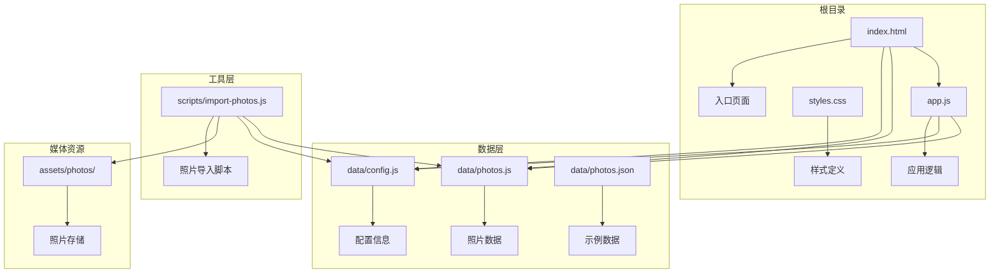
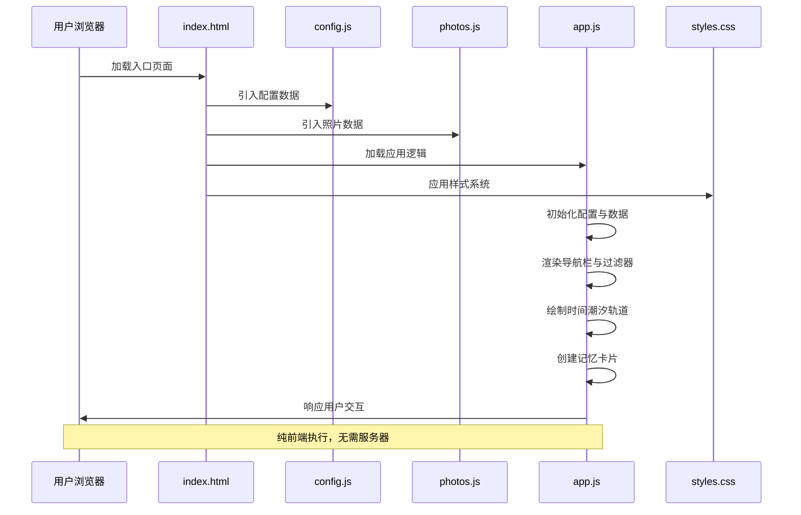
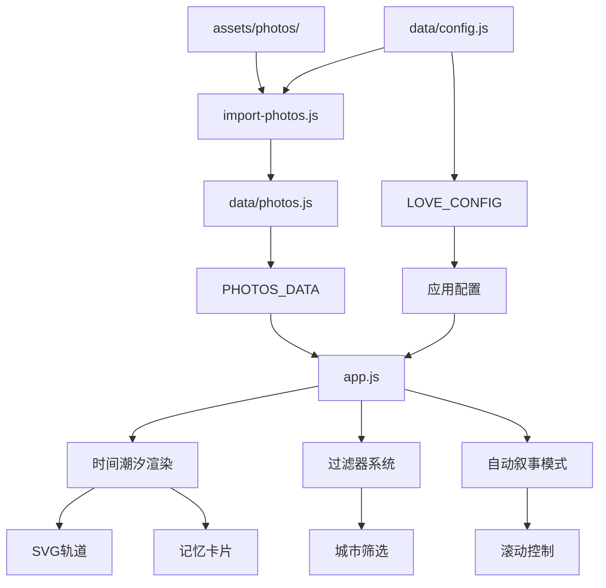
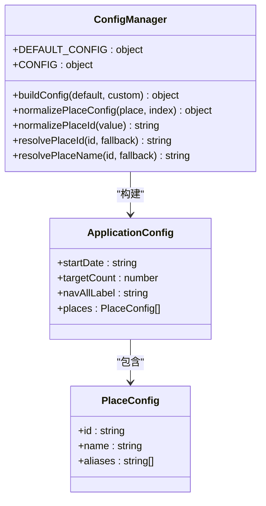
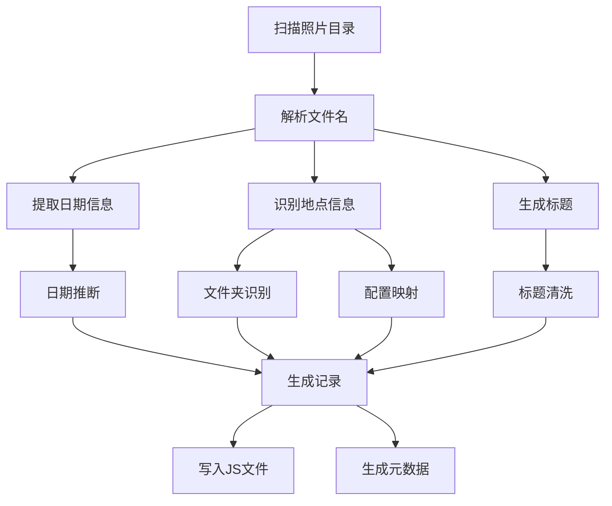
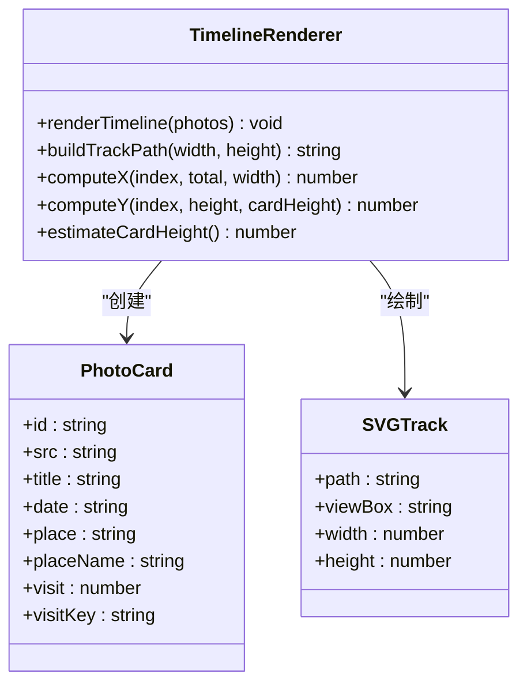
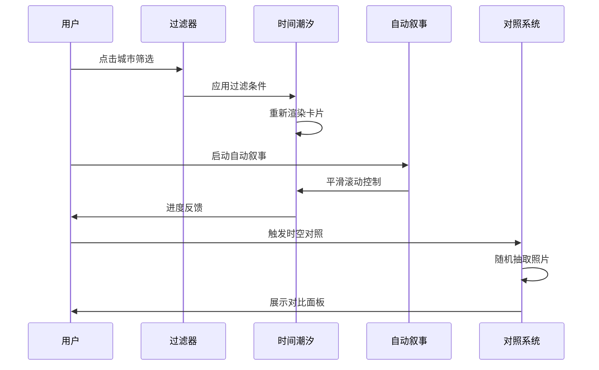
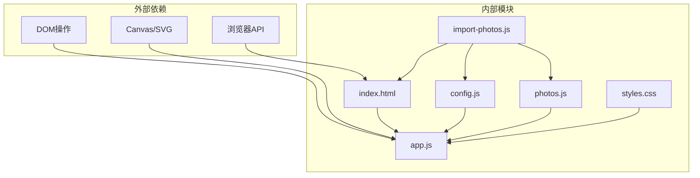

# 项目概述

<cite>
**本文档引用的文件**
- [README.md](file://README.md)
- [index.html](file://index.html)
- [app.js](file://app.js)
- [styles.css](file://styles.css)
- [data/config.js](file://data/config.js)
- [data/photos.js](file://data/photos.js)
- [data/photos.json](file://data/photos.json)
- [scripts/import-photos.js](file://scripts/import-photos.js)
</cite>

## 目录
1. [简介](#简介)
2. [项目结构](#项目结构)
3. [核心组件](#核心组件)
4. [架构总览](#架构总览)
5. [详细组件分析](#详细组件分析)
6. [依赖关系分析](#依赖关系分析)
7. [性能考量](#性能考量)
8. [故障排除指南](#故障排除指南)
9. [结论](#结论)
10. [附录](#附录)

## 简介

恋爱纪念站（Love Archive）是一个以「液态玻璃」界面风格为核心的纯前端恋爱纪念网站。项目通过「时间潮汐」的横向叙事体验，将500张照片转化为一段可游走的时间河流，让回忆不再是静态陈列，而是会呼吸的液态玻璃地貌。

### 核心理念
- **时间潮汐**：以时间为轴线，横向展开回忆，而非传统相册的垂直堆叠
- **液态玻璃**：苹果风格的半透明毛玻璃界面，营造柔和、梦幻的视觉氛围
- **自动叙事**：内置自动播放模式，引导用户沉浸式体验
- **随机时空对照**：一键抽取相隔最远的照片，见证关系变化轨迹
- **纯前端实现**：无需服务器，直接浏览器打开即可使用

### 设计理念
- **极简主义**：通过极简的界面元素承载丰富的情感表达
- **情感化交互**：卡片悬停、渐变过渡、折射扫光等细节增强沉浸感
- **可定制化**：通过配置文件轻松扩展城市列表、起始日期等参数
- **易用性**：提供一键导入脚本，自动化处理照片元数据

### 目标用户群体
- 情侣或夫妻：记录恋爱历程，重温美好时光
- 个人用户：整理成长回忆，构建个人时间档案
- 开发者：基于项目模板快速搭建自己的纪念网站
- 初学者：通过直观的配置和导入流程快速上手

## 项目结构

项目采用清晰的模块化组织结构，遵循「静态资源 + 动态逻辑」分离的设计原则：

**图表来源**
- [index.html:1-140](file://index.html#L1-L140)
- [app.js:1-690](file://app.js#L1-L690)
- [data/config.js:1-27](file://data/config.js#L1-L27)
- [scripts/import-photos.js:1-552](file://scripts/import-photos.js#L1-L552)

**章节来源**
- [index.html:1-140](file://index.html#L1-L140)
- [README.md:1-87](file://README.md#L1-L87)

## 核心组件

### 液态玻璃界面系统
项目采用苹果风格的液态玻璃设计语言，通过CSS backdrop-filter实现毛玻璃效果：

- **背景层次**：渐变背景 + 径向渐变 + 几何图案叠加
- **界面容器**：圆角矩形容器 + 半透明背景 + 模糊滤镜
- **交互反馈**：悬停动画 + 阴影变化 + 渐变过渡

### 时间潮汐渲染引擎
基于SVG路径的动态布局系统，创造流动的视觉效果：

- **轨道绘制**：正弦波 + 余弦波组合的复杂路径
- **卡片定位**：基于索引的X/Y坐标计算，带随机抖动
- **响应式适配**：根据屏幕宽度动态调整卡片尺寸

### 自动叙事模式
智能的滚动驱动系统，模拟自然的浏览节奏：

- **步进控制**：固定步数的平滑滚动动画
- **进度指示**：实时显示浏览进度百分比
- **状态管理**：定时器生命周期管理

**章节来源**
- [styles.css:1-800](file://styles.css#L1-L800)
- [app.js:378-423](file://app.js#L378-L423)
- [app.js:514-538](file://app.js#L514-L538)

## 架构总览

项目采用纯前端架构，所有逻辑都在浏览器端执行：

**图表来源**
- [index.html:135-137](file://index.html#L135-L137)
- [app.js:71-89](file://app.js#L71-L89)

### 数据流架构

**图表来源**
- [scripts/import-photos.js:29-85](file://scripts/import-photos.js#L29-L85)
- [app.js:91-105](file://app.js#L91-L105)

## 详细组件分析

### 配置管理系统

配置系统采用「默认配置 + 用户自定义」的合并策略：

**图表来源**
- [app.js:619-660](file://app.js#L619-L660)
- [data/config.js:1-27](file://data/config.js#L1-L27)

### 照片导入与处理系统

导入系统提供完整的自动化处理流程：

**图表来源**
- [scripts/import-photos.js:264-286](file://scripts/import-photos.js#L264-L286)
- [scripts/import-photos.js:458-489](file://scripts/import-photos.js#L458-L489)

### 时间潮汐渲染引擎

核心渲染系统负责将照片数据转换为视觉化的记忆河流：

**图表来源**
- [app.js:337-376](file://app.js#L337-L376)
- [app.js:378-418](file://app.js#L378-L418)

### 交互控制系统

多维度的用户交互系统：

**图表来源**
- [app.js:462-490](file://app.js#L462-L490)
- [app.js:514-538](file://app.js#L514-L538)
- [app.js:425-442](file://app.js#L425-L442)

**章节来源**
- [app.js:14-690](file://app.js#L14-L690)
- [scripts/import-photos.js:1-552](file://scripts/import-photos.js#L1-L552)

## 依赖关系分析

项目采用松耦合的模块化设计，各组件间依赖关系清晰：

**图表来源**
- [index.html:135-137](file://index.html#L135-L137)
- [app.js:14-690](file://app.js#L14-L690)

### 关键依赖点
- **index.html**：作为唯一入口，依赖所有其他模块
- **app.js**：核心业务逻辑，依赖配置和数据模块
- **import-photos.js**：独立的命令行工具，不依赖主应用
- **styles.css**：纯粹的样式文件，无JavaScript依赖

**章节来源**
- [README.md:3-6](file://README.md#L3-L6)
- [app.js:14-690](file://app.js#L14-L690)

## 性能考量

### 图片优化策略
- **懒加载机制**：IntersectionObserver实现延迟加载
- **响应式尺寸**：根据屏幕宽度动态调整卡片尺寸
- **格式建议**：优先使用WebP/AVIF格式，控制单图长边不超过1800px

### 渲染性能优化
- **虚拟滚动**：仅渲染可见区域内的卡片
- **CSS动画**：使用transform属性避免重排
- **事件节流**：滚动事件防抖处理

### 内存管理
- **定时器清理**：自动叙事模式结束后及时清理定时器
- **观察者解绑**：组件销毁时解除IntersectionObserver绑定

## 故障排除指南

### 常见问题与解决方案

**问题1：照片无法显示**
- 检查照片路径是否正确
- 确认文件权限设置
- 验证图片格式是否受支持

**问题2：导入脚本运行失败**
- 确认Node.js版本兼容性
- 检查配置文件语法错误
- 验证照片命名规范

**问题3：界面显示异常**
- 清除浏览器缓存
- 检查网络连接状态
- 验证CSS文件完整性

**问题4：自动叙事不工作**
- 检查浏览器JavaScript启用状态
- 验证定时器权限设置
- 确认容器高度设置

**章节来源**
- [README.md:84-86](file://README.md#L84-L86)
- [scripts/import-photos.js:171-180](file://scripts/import-photos.js#L171-L180)

## 结论

恋爱纪念站（Love Archive）通过创新的「液态玻璃」界面设计和「时间潮汐」浏览体验，成功地将技术与情感结合，创造出独特的数字纪念空间。项目具有以下突出优势：

### 技术优势
- **纯前端实现**：无需服务器，部署简单
- **高度可定制**：通过配置文件灵活扩展
- **自动化工具**：完善的照片导入和处理流程
- **性能优化**：针对移动端和桌面端的优化设计

### 创新特色
- **时间叙事**：打破传统相册模式，创造沉浸式时间体验
- **情感化设计**：通过视觉细节传递情感温度
- **交互创新**：自动叙事、随机对照等新颖功能
- **易用性**：降低技术门槛，让每个人都能轻松使用

### 应用价值
该项目不仅是一个实用的纪念工具，更是情感数字化表达的典范。其设计理念和技术实现为类似项目提供了宝贵的参考，展现了纯前端技术在情感产品领域的巨大潜力。

## 附录

### 快速开始指南

**直接使用方式**
1. 下载项目文件到本地
2. 双击打开 `index.html`
3. 页面会自动从 `data/config.js` 和 `data/photos.js` 读取数据
4. 如无照片数据，页面会自动生成500张占位图演示

**基本配置选项**
- 起始日期：在 `data/config.js` 中设置 `startDate`
- 目标数量：设置 `targetCount` 控制生成照片数量
- 城市列表：在 `places` 数组中添加新的城市配置
- 导航标签：通过 `navAllLabel` 自定义"全部足迹"文本

**接入照片数据**
1. 将照片放入 `assets/photos/` 目录
2. 使用 `node scripts/import-photos.js` 一键导入
3. 支持实时监听模式：`node scripts/import-photos.js --watch`
4. 照片命名建议：`YYYY-MM-DD-描述.jpg`

### 实际使用场景示例

**情侣纪念**
- 记录恋爱历程中的重要时刻
- 展示共同旅行的足迹
- 分享日常生活的温馨瞬间

**个人回忆**
- 整理成长过程中的珍贵回忆
- 构建个人时间档案
- 传承家庭记忆

**团队纪念**
- 记录项目开发的重要节点
- 展示团队建设活动
- 保存共同奋斗的足迹